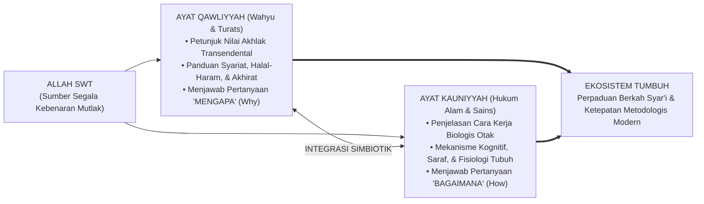
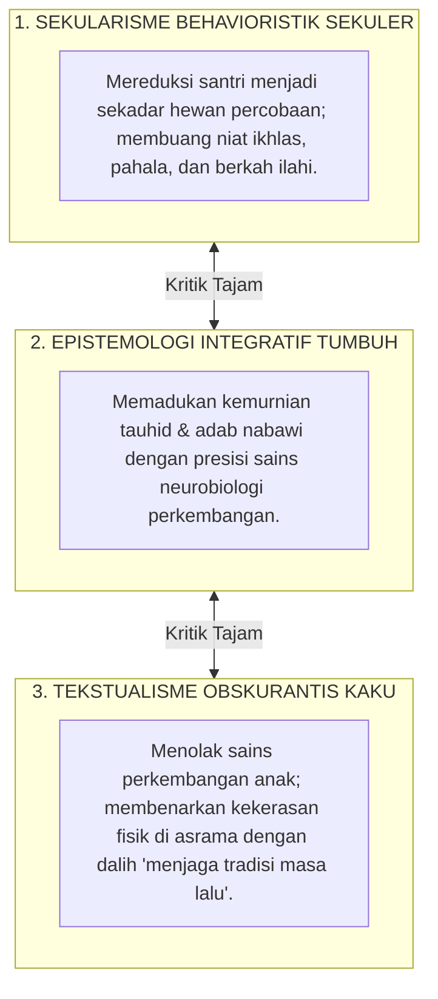

# SUB-BAB 3.1: INTEGRASI AYAT QAWLIYYAH & KAUNIYYAH
## *Menyulam Kebenaran Transendental Wahyu dan Konsensus Empiris Sains Perkembangan Manusia*

**Kode Klasifikasi**: `BOOK-01/BAB-03/SUB-01/MONOGRAF-MASTER-VIBRANT`  
**Disiplin Ilmu**: Epistemologi Islam Integratif, Filsafat Ilmu (*Falsafat al-'Ilm*), Hermeneutika Sains, & Neurosains Kognitif  
**Penanggung Jawab Keilmuan**: Dewan Pakar Ekosistem TUMBUH (*Master Author, Pakar Epistemologi Turats, & Pakar Neurosains Perkembangan*)

---

### Runtuhnya Tembok Pemisah Dua Kitab Allah

Selama berabad-abad lamanya, dunia pendidikan Islam terbelenggu oleh sebuah ilusi perpecahan: **pemisahan kaku antara "Ilmu Agama" di satu sisi dan "Ilmu Sains Modern" di sisi lain**.

Di sebagian pondok pesantren, muncul sikap curiga terhadap penemuan sains kontemporer—seperti psikologi perkembangan atau neurosains otak—karena dianggap berasal dari Barat yang sekuler. Akibatnya, metode pengasuhan santri tetap dipertahankan secara turun-temurun tanpa evaluasi, bahkan Ketika metode tersebut terbukti secara medis merusak saraf otak anak.

Sebaliknya, sains modern sekuler kerap membuang dimensi wahyu dan tauhid, memandang manusia hanya sebagai organisme biologis tanpa jiwa spiritual.

Ekosistem **TUMBUH** meruntuhkan sekat dikotomi semu ini dengan menegaskan sebuah kebenaran fundamental sebagaimana dirumuskan oleh Prof. Syed Muhammad Naquib al-Attas[^2], **Wahyu (*Ayat Qawliyyah*) dan Alam Semesta (*Ayat Kauniyyah*) berasal dari satu Dzat yang sama, yaitu Allah SWT**.

<b>Gambar 3.1.1:</b> Integrasi Epistemologis Dua Jalur Wahyu (Qawliyyah) dan Sains (Kauniyyah) dalam Ekosistem TUMBUH.

---

### Dua Kitab Terbuka: Harmoni Tanpa Kontradiksi

Pakar filsafat Islam klasik seperti **Ibnu Rusyd (Averroes)** dalam karyanya *Fashl al-Maqal fima bayna al-Hikmati wash-Syari'ati min al-Ittishal*[^1] menegaskan bahwa:

$$\text{الْحَقُّ لَا يُضَادُّ الْحَقَّ، بَلْ يُوَافِقُهُ وَيَشْهَدُ لَهُ}$$
*"Kebenaran sejati (Wahyu) tidak akan pernah bertentangan dengan kebenaran nyata (Sains dan Akal Sehat), melainkan keduanya akan saling menguatkan dan saling bersaksi satu sama lain."*

1. **Ayat Qawliyyah (Al-Qur'an, Hadits, & Turats Ulama)**:  
   Memberikan kompas moral, landasan tauhid, dan tujuan akhir kehidupan (*Ghayah al-Wujud*). Wahyu memberi tahu kita **mengapa** adab harus ditegakkan dan **ke mana** jiwa santri harus diarahkan.
2. **Ayat Kauniyyah (Hukum Biologi, Psikologi, & Neurosains)**:  
   Memberikan pemahaman empiris tentang mekanisme biologis tubuh dan otak yang diciptakan Allah. Sains memberi tahu kita **bagaimana** otak santri merespons rasa takut, **bagaimana** memori hafalan terbentuk, dan **bagaimana** kebiasaan adab mendarah daging secara fisik.

Ketika seorang ustadz memahami kedua ayat ini secara terpadu, ia tidak akan lagi mendidik santri dengan emosi buta. Ia menghafal firman Allah tentang kelembutan akhlak, sekaligus memahami bahwa secara biologis, suara bentakan keras membanjiri otak santri dengan racun hormon kortisol yang mematikan nalar.

---

### Kritik atas Dua Ekstrem: Sekularisme Kering vs Tekstualisme Kaku

Epistemologi TUMBUH berdiri kokoh di jalan tengah (*Wasathiyyah*), menolak dua jebakan ekstrem:

<b>Gambar 3.1.2:</b> Posisi Wasathiyyah Epistemologi Integratif TUMBUH di Antara Dua Ekstrem Pendidikan.

* **Kritik atas Sekularisme**: Sains tanpa bimbingan wahyu melahirkan sistem pendidikan yang dingin, mekanis, dan mematikan keikhlasan beramal.
* **Kritik atas Tekstualisme Kaku**: Beragama tanpa memahami sunnatullah biologis anak melahirkan pola asuh yang zalim dan merusak masa depan generasi santri.

---

### Solusi Sistemik TUMBUH: Arsitektur Pedagogi Berbasis Dua Cahaya

Dalam Ekosistem TUMBUH, sains bukanlah "tuan" yang mengatur wahyu, dan wahyu bukanlah "musuh" dari ilmu pengetahuan. Sains adalah alat bantu teknis untuk menjalankan amanah wahyu secara lebih presisi dan penuh kasih sayang.

Setiap SOP pengasuhan di asrama TUMBUH selalu memenuhi dua syarat mutlak:
1. **Shahih secara Syar'i**: Selaras dengan Al-Qur'an, Sunnah Nabawiyyah, dan panduan ulama Turats mu'tabar.
2. **Shahih secara Saintifik**: Terbukti secara neurobiologis tidak merusak kesehatan mental dan perkembangan otak anak.

---

## 📌 Catatan Kaki & Rujukan Primer

[^1]: **Al-Qadhi Abu al-Walid Muhammad Ibnu Rusyd (Averroes)**, *Fashl al-Maqal fima bayna al-Hikmati wash-Syari'ati min al-Ittishal*, Tahqiq: Dr. Muhammad Imarah (Kairo: Dar al-Ma'arif, 1999), hlm. 31–35.
[^2]: **Prof. Dr. Syed Muhammad Naquib al-Attas**, *Prolegomena to the Metaphysics of Islam: An Exposition of the Underlying Foundations of Islam and Modernity* (Kuala Lumpur: ISTAC, 1995), Bab 1: "Islam: The Concept of Religion and the Foundation of Ethics and Morality", hlm. 1–40.
