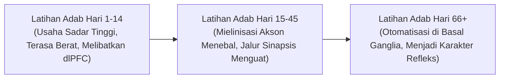

# SUB-BAB 3.2: NEUROSAINS PEMBIASAAN ADAB & NEUROPLASTISITAS
## *Mekanisme Mielinisasi Akson, Sirkuit Kebiasaan Otak, dan Transformasi Usaha Sadar Menjadi Refleks Adab*

**Kode Modul**: `BOOK-01/BAB-03/SUB-02`  
**Kategori**: Neurosains Kognitif Pembiasaan  
**Fokus Keilmuan**: Neurobiologi Seluler & Pembentukan Karakter

---

### 1. Neuroplastisitas: Otak Santri Bersifat Plastis dan Dapat Dibentuk
Otak remaja pesantren memiliki tingkat kelenturan (*neuroplasticity*) yang sangat tinggi. Setiap pengalaman, instruksi, dan latihan yang dialami santri secara berulang akan membentuk jejak fisik berupa jalur sinaptik baru di otak:

---

### 2. Peran Mielinisasi dalam Pembentukan Karakter Otomatis
* **Mielin sebagai Isolator Saraf**: Mielin adalah selubung lemak yang membungkus serabut saraf (akson). Semakin sering suatu tindakan adab dilatih (misal: merapikan tempat tidur setiap bangun tidur), semakin tebal lapisan mielin yang terbentuk.
* **Peningkatan Kecepatan Sinyal**: Mielinisasi meningkatkan kecepatan transmisi impuls saraf dari $2\text{ m/detik}$ menjadi lebih dari $100\text{ m/detik}$, mengubah perilaku yang tadinya lambat dan penuh keraguan menjadi respons adab yang spontan, cepat, dan tanpa beban (*effortless virtue*).
