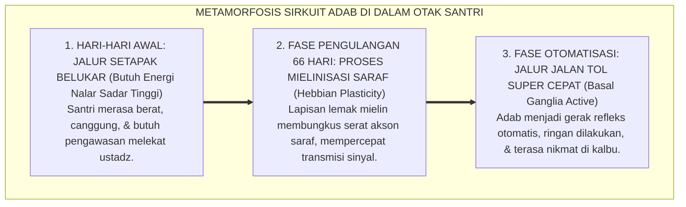
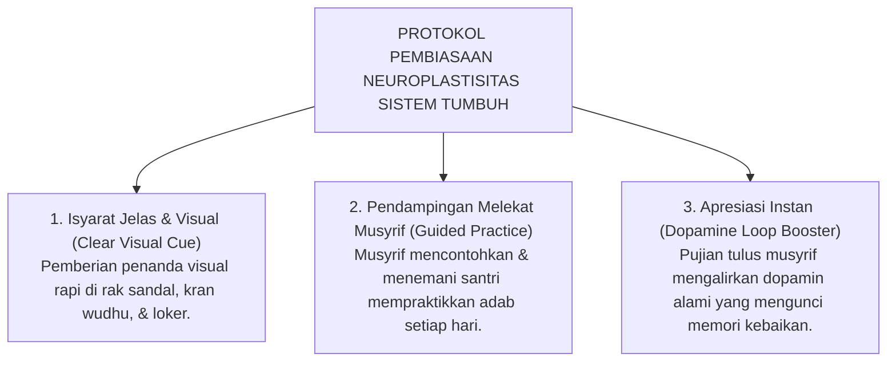

# SUB-BAB 3.2: NEUROSAINS PEMBIASAAN ADAB & NEUROPLASTISITAS
## *Hukum Hebbian, Mekanisme Mielinisasi Sirkuit Saraf, dan Konsep Riyadhatun Nafs Imam Al-Ghazali*

**Kode Klasifikasi**: `BOOK-01/BAB-03/SUB-02/MONOGRAF-MASTER-VIBRANT`  
**Disiplin Ilmu**: Neurosains Kognitif Terapan, Plastisitas Saraf (*Neuroplasticity*), & Tasawuf 'Amali  
**Penanggung Jawab Keilmuan**: Dewan Pakar Ekosistem TUMBUH (*Master Author, Pakar Neurosains Perkembangan, & Pakar Pedagogi Guru*)

---

### I. Pintu Masuk: Keajaiban Otak yang Terus Berubah

Pernahkah Anda memperhatikan seorang santri baru yang di pekan pertamanya di asrama tampak sangat canggung dan tersiksa saat harus bangun pukul 03.30 pagi untuk qiyamul lail?

Pada hari-hari pertama, tubuhnya terasa seberat timah, matanya perih, dan langkah kakinya gontai. Namun, setelah beberapa bulan didampingi dengan penuh kesabaran dan kehangatan, santri yang sama tiba-tiba mampu terbangun sendiri secara segar sebelum adzan berkumandang—bahkan tanpa perlu disiram air atau dibentak musyrif.

Apa yang sebenarnya terjadi di dalam kepalanya?

Jawabannya adalah keajaiban biologis yang diciptakan Allah SWT bernama **Neuroplastisitas (*Neuroplasticity*)**[^1]: yaitu kemampuan sel-sel saraf otak untuk mengubah struktur fisiknya, membangun jalur-jalur baru, dan memperkuat koneksi kabel sinapsis seiring dengan kebiasaan yang dilatihkan setiap hari.

<b>Gambar 3.2.1:</b> Proses Metamorfosis Neuroplastisitas dan Mielinisasi Sirkuit Adab di Otak Santri.

---

### II. Hukum Hebbian: *"Neurons that Fire Together, Wire Together"*

Prinsip dasar pembentukan kebiasaan dalam neurosains dirumuskan oleh neuropsikolog **Donald Hebb** (1949)[^2]:

$$\text{Sel-sel neuron yang menyala bersama secara berulang-ulang, akan tersambung membentuk satu jaringan sirkuit permanen}$$

Ketika seorang santri dilatih untuk selalu menaruh sandalnya menghadap keluar di rak setiap kali masuk asrama:
* Pada awalnya, sinyal listrik di otaknya harus merintis jalur setapak yang penuh rintangan di neokorteks.
* Setiap kali tindakan tersebut diulang, sel-sel saraf membungkus serat aksonnya dengan lapisan lemak pelindung yang disebut **Mielin (*Myelin Sheath*)**[^3].
* Semakin tebal lapisan mielin, semakin cepat sinyal listrik melesat (dari 2 mil per jam menjadi 200 mil per jam). Jalur setapak yang tadinya sulit dilalui kini berubah menjadi **"Jalan Tol Saraf Super Cepat"** di *Basal Ganglia*.
* Hasil akhirnya: menata sandal tidak lagi membutuhkan paksaan atau perintah; tangan dan kaki anak bergerak merapikan sandal secara spontan dalam hitungan detik!

---

### III. Integrasi Turats: Konsep *Riyadhatun Nafs* dan *Al-I'tiyad* Imam Al-Ghazali

Konsep mielinisasi dan plastisitas otak ini membuktikan secara ilmiah kebenaran metodologi tasawuf yang dirumuskan oleh **Imam Abu Hamid Al-Ghazali** dalam *Ihya 'Ulumiddin* (Kitab *Riyadhatin Nafs*)[^4]:

> [!NOTE]
> ### 📜 Kaidah Imam Al-Ghazali tentang Pembiasaan Adab (*Al-I'tiyad*):
> 
> $$\text{إِنَّ الْأَخْلَاقَ الْحَسَنَةَ تَنْغَرِسُ فِي النَّفْسِ بِالتَّكَلُّفِ فِي ابْتِدَاءِ الْأَمْرِ، ثُمَّ تَصِيرُ طَبْعًا وَعَادَةً بِكَثْرَةِ التَّكْرَارِ، حَتَّى يَصِيرَ صُدُورُ الْفِعْلِ الْجَمِيلِ سَهْلًا لَذِيذًا لَا كُلْفَةَ فِيهِ}$$
> 
> **Artinya:**  
> *"Sesungguhnya akhlak mulia itu pada awalnya tertanam di dalam jiwa melalui **upaya pembiasaan yang dipaksakan (*at-Takalluf*) pada mulanya**.*  
> *Kemudian, dengan banyaknya pengulangan yang konsisten, ia akan **berubah menjadi watak bawaan dan kebiasaan alami (*Thab'an wa 'Aadah*)**—hingga perbuatan indah tersebut memancar keluar dengan sangat mudah, ringan, dan terasa nikmat tanpa ada lagi beban keterpaksaan."*

Al-Ghazali telah merumuskan tahapan neuroplastisitas sembilan abad sebelum ilmuwan modern menemukannya: dari pemaksaan sadar (*at-Takalluf*), menuju pengulangan konsisten (*al-I'tiyad*), hingga lahirnya karakter refleks otomatis yang membahagiakan jiwa (*al-Malakah*).

---

### IV. Solusi Sistemik TUMBUH: Menjaga Konsistensi Tanpa Friksi

Berdasarkan hukum neuroplastisitas ini, **Sistem TUMBUH** menetapkan bahwa **kunci pembentukan adab bukanlah kekerasan hukuman, melainkan FREKUENSI PENGULANGAN POSITIF YANG KONSISTEN**:

<b>Gambar 3.2.2:</b> Tiga Langkah Protokol Pembiasaan Neuroplastisitas Ekosistem TUMBUH.

Penerapan di pesantren:
1. **Isyarat Visual**: Memberi label nama dan garis batas rapi pada rak sepatu dan antrean, mempermudah otak santri menangkap pemicu kebiasaan (*cue*).
2. **Praktik Terbimbing**: Musyrif hadir bersama santri memperagakan adab secara konsisten tanpa menggunakan bentakan.
3. **Penguatan Dopamin Alami**: Setiap kali santri berhasil melakukan adab, musyrif memberikan senyuman hangat dan apresiasi tulus. Aliran hormon *dopamin* yang menyenangkan di otak santri mempercepat penebalan mielin sirkuit adab hingga 3 kali lebih cepat dibanding metode bentakan!

---

### V. Sintesis Neuro-Pedagogis Sub-Bab 3.2

Otak santri adalah anugerah Allah yang luar biasa fleksibel untuk dibentuk menjadi insan mulia.

Dengan memahami hukum Hebbian dan rahasia neuroplastisitas, Sistem TUMBUH mengubah proses pembinaan karakter dari pertempuran adu otot yang melelahkan menjadi **seni menganyam sirkuit saraf adab nabawi di dalam otak generasi penerus umat**.

---

## 📌 Catatan Kaki & Rujukan Primer

[^1]: **Norman Doidge**, *The Brain That Changes Itself: Stories of Personal Triumph from the Frontiers of Brain Science* (New York: Viking Penguin, 2007), Bab 1: "A Woman Perpetually Falling", hlm. 1–26.
[^2]: **Donald O. Hebb**, *The Organization of Behavior: A Neuropsychological Theory* (New York: John Wiley & Sons, 1949), hlm. 60–78.
[^3]: **Daniel Coyle**, *The Talent Code: Greatness Isn't Born. It's Grown. Here's How* (New York: Bantam Books, 2009), Bab 2: "The Myelin Boom", hlm. 31–58.
[^4]: **Hujjatul Islam Imam Abu Hamid al-Ghazali**, *Ihya' 'Ulumiddin*, Kitab Riyadhatin Nafs (Kairo & Beirut: Dar al-Ma'rifah, t.th.), Jilid III, hlm. 55–62.
