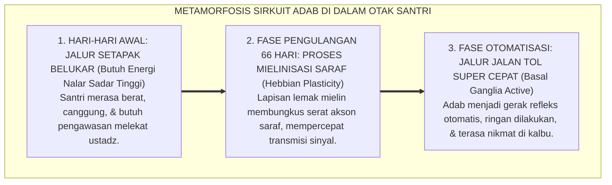
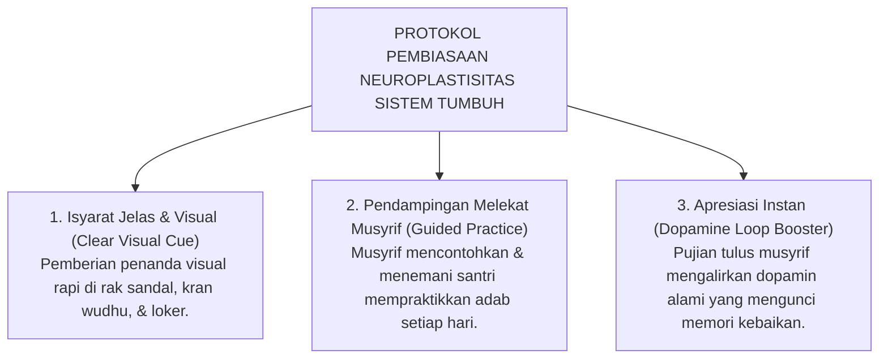

# NEUROSAINS PEMBIASAAN ADAB & NEUROPLASTISITAS

---
### Keajaiban Otak yang Terus Berubah

Pernahkah Anda memperhatikan seorang santri baru yang di pekan pertamanya di asrama tampak sangat canggung dan tersiksa saat harus bangun pukul 03.30 pagi untuk qiyamul lail?

Pada hari-hari pertama, tubuhnya terasa seberat timah, matanya perih, dan langkah kakinya gontai. Namun, setelah beberapa bulan didampingi dengan penuh kesabaran dan kehangatan, santri yang sama tiba-tiba mampu terbangun sendiri secara segar sebelum adzan berkumandang—bahkan tanpa perlu disiram air atau dibentak musyrif.

Apa yang sebenarnya terjadi di dalam kepalanya?

Jawabannya adalah keajaiban biologis yang diciptakan Allah SWT bernama **Neuroplastisitas (*Neuroplasticity*)**[^1]: yaitu kemampuan sel-sel saraf otak untuk mengubah struktur fisiknya, membangun jalur-jalur baru, dan memperkuat koneksi kabel sinapsis seiring dengan kebiasaan yang dilatihkan setiap hari.

<b>Gambar 3.2.1:</b> Proses Metamorfosis Neuroplastisitas dan Mielinisasi Sirkuit Adab di Otak Santri.

---

### Hukum Hebbian & Penebalan Mielin (*Myelination*)

Mengapa pengulangan yang konsisten begitu penting dalam pembentukan karakter santri?

1. **Hukum Hebbian (*Hebbian Theory*)**[^2]:  
   Pakar neuropsikologi **Donald O. Hebb** merumuskan hukum terkenal: *"Neurons that fire together, wire together"* (sel-sel saraf yang menyala bersamaan akan terhubung bersamaan). Setiap kali santri dilatih bangun malam lalu mengambil wudhu secara teratur, kelompok neuron di otaknya menyala serempak dan merajut koneksi sinaptik yang semakin kokoh.
2. **Penebalan Mielin (*Myelination*)**[^3]:  
   Jurnalis sains **Daniel Coyle** dalam *The Talent Code* menjelaskan bahwa setiap kali sebuah perilaku diulang, selubung lemak pelindung yang disebut **mielin (*myelin sheath*)** akan membungkus jalur saraf tersebut lapis demi lapis. Semakin tebal mielin, sinyal perilaku melesat hingga 100 kali lebih cepat! Inilah penjelasan biologis mengapa santri senior yang telah beradab mampu bangun subuh dan menjaga lisannya secara otomatis tanpa perlu dipaksa ustadz.

---

### Tinjauan Turats: Menyelami Konsep *At-Takalluf* Imam Al-Ghazali

Kebenaran hukum neuroplastisitas ini secara menakjubkan telah dijelaskan secara presisi oleh **Imam Abu Hamid Al-Ghazali** dalam *Ihya' 'Ulumiddin*[^4]:

> [!NOTE]
> ### 📜 Formula Pembiasaan Karakter Imam Al-Ghazali:
> 
> $$\text{إِنَّ الْأَخْلَاقَ الْحَسَنَةَ تَحْصُلُ أَوَّلًا بِالتَّكَلُّفِ، ثُمَّ تَصِيرُ بِكَثْرَةِ التَّكْرَارِ طَبْعًا وَعَادَةً، حَتَّى يَصْدُرَ الْفِعْلُ بِسُهُولَةٍ وَتَلَذُّذٍ}$$
> 
> **Artinya:**  
> *"Sesungguhnya akhlak mulia itu pada awalnya tertanam di dalam jiwa melalui **upaya pembiasaan yang dipaksakan (*at-Takalluf*) pada mulanya**.*  
> *Kemudian, dengan banyaknya pengulangan yang konsisten, ia akan **berubah menjadi watak bawaan dan kebiasaan alami (*Thab'an wa 'Aadah*)**—hingga perbuatan indah tersebut memancar keluar dengan sangat mudah, ringan, dan terasa nikmat tanpa ada lagi beban keterpaksaan."*

---

### Solusi Sistemik TUMBUH: Menjaga Konsistensi Tanpa Friksi

Berdasarkan hukum neuroplastisitas ini, **Sistem TUMBUH** menetapkan bahwa **kunci pembentukan adab bukanlah kekerasan hukuman, melainkan FREKUENSI PENGULANGAN POSITIF YANG KONSISTEN**:

<b>Gambar 3.2.2:</b> Tiga Langkah Protokol Pembiasaan Neuroplastisitas Ekosistem TUMBUH.

Penerapan di pesantren:
1. **Isyarat Visual**: Memberi label nama dan garis batas rapi pada rak sepatu dan antrean, mempermudah otak santri menangkap pemicu kebiasaan (*cue*).
2. **Praktik Terbimbing**: Musyrif hadir bersama santri memperagakan adab secara konsisten tanpa menggunakan bentakan.
3. **Penguatan Dopamin Alami**: Setiap kali santri berhasil melakukan adab, musyrif memberikan senyuman hangat dan apresiasi tulus. Aliran hormon *dopamin* yang menyenangkan di otak santri mempercepat penebalan mielin sirkuit adab hingga 3 kali lebih cepat dibanding metode bentakan!

---

## 📌 Catatan Kaki & Rujukan Primer

[^1]: **Norman Doidge**, *The Brain That Changes Itself: Stories of Personal Triumph from the Frontiers of Brain Science* (New York: Viking Penguin, 2007), Bab 1: "A Woman Perpetually Falling", hlm. 1–26.
[^2]: **Donald O. Hebb**, *The Organization of Behavior: A Neuropsychological Theory* (New York: John Wiley & Sons, 1949), hlm. 60–78.
[^3]: **Daniel Coyle**, *The Talent Code: Greatness Isn't Born. It's Grown. Here's How* (New York: Bantam Books, 2009), Bab 2: "The Myelin Boom", hlm. 31–58.
[^4]: **Hujjatul Islam Imam Abu Hamid al-Ghazali**, *Ihya' 'Ulumiddin*, Kitab Riyadhatin Nafs (Kairo & Beirut: Dar al-Ma'rifah, t.th.), Jilid III, hlm. 55–62.

---

### IV. Eksplanasi Filosofis Lanjutan & Hermeneutika Nilai Neurosains Pembiasaan Adab & Neuroplastisitas

Penyelidikan mendalam terhadap tema **NEUROSAINS PEMBIASAAN ADAB & NEUROPLASTISITAS** menuntut pemahaman integral atas relasi antara *Ontologi Fitrah* dan *Sosiologi Pembelajaran Pesantren*. Ketika seorang santri memasuki ekosistem pendidikan, ia membawa amanah perjanjian primordial (*Mithaq*) yang menuntut ruang tumbuh yang aman dari distorsi psikologis.

1. **Dialektika Keikhlasan (*Shidq an-Niyyah*) vs Formalisme Perilaku**:
   Dalam pandangan *Hujjatul Islam* Al-Imam Al-Ghazali dalam *Ihya 'Ulumiddin*, pembentukan karakter yang sejati bermula dari pembersihan batin (*Thaharatul Batin*). Ketika sebuah institusi mereduksi adab menjadi kepatuhan semu di hadapan figur otoritas, yang sesungguhnya terjadi adalah pelemahan integritas diri (*Nifaq Tarbawi*). Sistem TUMBUH menegaskan bahwa kesalehan sejati harus lahir dari kemerdekaan batin yang disinari oleh cinta kepada Allah (*Mahabbatullah*) dan kesadaran pengawasan-Nya (*Muraqabatullah*).

2. **Dinamika Neuroplastisitas & Internalisasi Nilai Ruhiyyah**:
   Sains kognitif kontemporer membuktikan bahwa pembiasaan nilai yang disertai rasa takut ekstrem mengaktifkan poros *HPA (Hypothalamic-Pituitary-Adrenal)* dan membanjiri otak dengan hormon kortisol. Kondisi ini membekukan kemampuan *Prefrontal Cortex* untuk merefleksikan nilai secara mandiri. Sebaliknya, ketika nilai **NEUROSAINS PEMBIASAAN ADAB & NEUROPLASTISITAS** disampaikan dalam suasana pengasuhan yang hangat (*Warm Presence*), otak santri melepaskan *oksitosin* dan *dopamin* yang mempercepat konsolidasi sinaptik dan pembentukan memori jangka panjang (*Long-Term Potentiation*).

3. **Matriks Transformasi Praksis Pembinaan**:

| Dimensi Pengasuhan | Pola Lama (Mekanistis-Punitif) | Pola Rekonstruksi Ekosistem TUMBUH |
| :--- | :--- | :--- |
| **Sumber Motivasi** | Tekanan eksternal dan rasa takut akan sanksi fisik. | Kesadaran fitrah internal dan kerinduan pada rida ilahi. |
| **Relasi Musyrif-Santri** | Pengawasan hierarkis intimidatif (panoptikon). | Keteladanan hidup (*Qudwah Hasanah*) dan pendampingan empatik. |
| **Ketahanan Karakter** | Runtuh ketika pengawasan ditiadakan (liburan/lulus). | Melekat kokoh sebagai kompas moral seumur hidup (*Insan Adabi*). |

---

### V. Refleksi Pedagogis & Rekomendasi Aksi Lembaga

Penerapan prinsip **NEUROSAINS PEMBIASAAN ADAB & NEUROPLASTISITAS** di lingkungan pesantren menuntut komitmen kelembagaan yang terstruktur:
* **Audit Budaya Pengasuhan**: Pimpinan pesantren wajib melakukan refleksi berkala atas seluruh interaksi antara asatidz, musyrif, dan santri guna memastikan tidak ada celah bagi masuknya feodalisme atau kekerasan terselubung.
* **Penguatan Kapasitas Pendidik**: Setiap pembina asrama difasilitasi dengan pelatihan literasi psikologi perkembangan dan konseling Islam agar memiliki kematangan emosi dalam menghadapi dinamika santri.
* **Integrasi Ruhiyyah 24 Jam**: Memastikan bahwa setiap detik kehidupan santri di pondok—mulai dari bangun tidur, halaqah Qur'an, mudzakarah ilmu, hingga istirahat malam—selalu dinaungi oleh nilai keikhlasan dan ukhuwah yang tulus.
