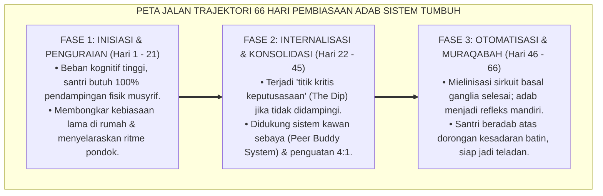
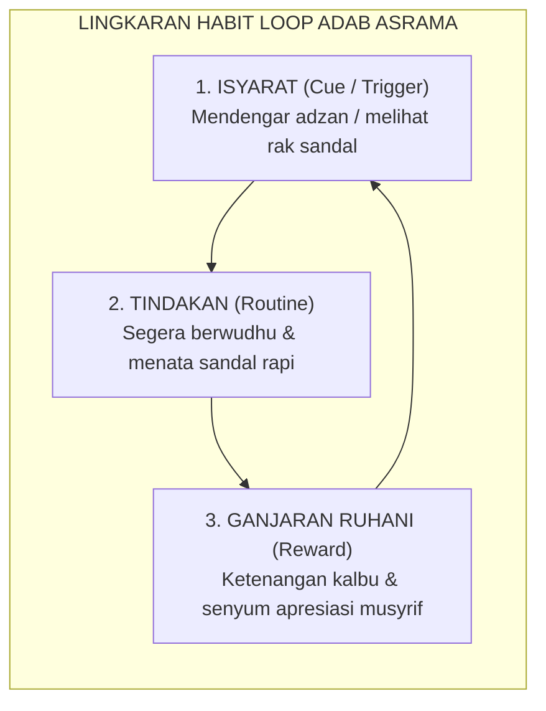
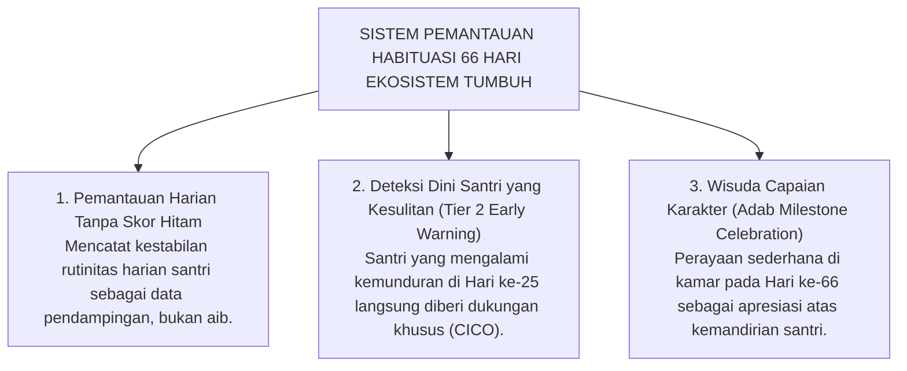

# SIKLUS HABIT LOOP & TRAJEKTORI 66-HARI

---

### 🧭 PETA POSISI PANDUAN DALAM SISTEM TUMBUH (DARI HULU KE HILIR)
* **Posisi Arsitektur**: `HULU EKOSISTEM (Akar Filosofis, Fitrah al-Munazzalah, & Worldview Islam)`
* **Peruntukan Pengguna**: Pimpinan Pesantren, Pengasuh Pondok, Kepala Madrasah, & Dewan Asatidz
* **Fokus Panduan**: Membangun cara pandang pengasuhan berbasis fitrah kesucian dan keteladanan nyata (Qudwah Hasanah), mengeliminasi tradisi kekerasan fisik dan feodalisme asrama.
* **Hasil Akhir yang Dituju**: Terwujudnya santri berkarakter *Insan Adabi* yang mandiri, musyrif yang mengasuh dengan kasih sayang tanpa *burnout*, dan pesantren yang aman berbasis data (*Safe Boarding School*).

---

### 🎯 Mengapa Panduan Ini Ada & Masalah Nyata yang Dipecahkan
1. **Latar Masalah di Lapangan**: Sering kali pengasuhan di pesantren berjalan tanpa SOP yang jelas atau terjebak dalam pola reaktif—menunggu santri berbuat salah baru dihukum dengan emosional.
2. **Solusi Sistem TUMBUH**: Panduan ini memberikan langkah preventif dan terstruktur agar setiap pembiasaan adab berjalan terencana, konsisten, dan terukur.
3. **Sasaran Perubahan**: Memastikan nilai-nilai Islam menyatu dalam perilaku harian santri melalui keteladanan nyata (*Qudwah Hasanah*).

---
### 🎯 Tujuan & Manfaat Panduan
Panduan ini dirancang sebagai petunjuk operasional terapan agar pendidik dan musyrif dapat:
1. Menjalankan pembinaan adab santri dengan pendekatan kasih sayang (*Rahmah*) dan ketegasan yang mendidik (*Firm & Kind*).
2. Menghindari cara-cara kekerasan fisik, bentakan verbal, maupun hukuman yang mempermalukan santri.
3. Menciptakan suasana asrama dan kelas yang aman, tertib, dan menumbuhkan kesadaran diri (*Bi'ah Shalihah*).

---

### 💡 Intisari Cepat (3 Menit Memahami Esensi)
* **Kunci Pengasuhan**: Karakter santri tumbuh melalui keteladanan nyata (*Qudwah Hasanah*), komunikasi empatik, dan pembiasaan terstruktur 24 jam.
* **Tindakan Utama**: Terapkan panduan langkah demi langkah di bawah ini secara konsisten, pantau perkembangan santri secara objektif, dan berikan apresiasi atas setiap perbaikan diri yang mereka capai.
* **Prinsip Disiplin**: Fokus pada pemulihan hubungan dan tanggung jawab nyata (*Restoratif*), bukan sekadar melampiaskan amarah atau menghukum.

---

---

### 💬 ILUSTRASI NYATA & ANALOGI SEDERHANA
Bayangkan sebuah skenario yang sering kita lihat sehari-hari di asrama:
* Ketika seorang santri baru melakukan kekeliruan (misalnya terlambat bangun Subuh atau kasurnya berantakan), respon pertama yang sering muncul adalah bentakan keras atau hukuman fisik (seperti push-up atau jemur di lapangan).
* **Hasilnya?** Santri tersebut mungkin tampak patuh seketika karena takut, tetapi di dalam hatinya tumbuh rasa dongkol, dendam tersembunyi, atau kebiasaan "bersandiwara"—hanya tertib ketika ada pengawas di dekatnya.

Dalam Sistem TUMBUH, kita menggunakan cara yang jauh lebih cerdas, sejuk, dan membumi:
1. **Analogi "Rem dan Pedal Gas Otak"**: Santri usia remaja (usia MTs dan Aliyah) memiliki bagian otak emosi (*Sistem Limbik*) yang sudah menyala sangat kuat seperti *pedal gas mobil sport*, namun otak pengendali logikanya (*Prefrontal Cortex*) masih dalam proses tumbuh seperti *sistem rem yang baru dipasang*. Tugas guru dan musyrif bukan memarahi mobilnya, melainkan menjadi **"Sopir Teladan & Sabuk Pengaman"** yang mendampingi santri belajar menginjak rem dengan bijak.
2. **Kekuatan Contoh Nyata (*Qudwah Hasanah*)**: Santri jauh lebih cepat meniru apa yang mereka **lihat** setiap hari daripada apa yang mereka **dengar** dari ribuan nasihat panjang. Jika musyrif datang tepat waktu, tersenyum ramah, dan kamarnya rapi, santri akan menirunya dengan sukarela.

---

### 🛠️ PANDUAN LANGKAH PRAKTIS LAPANGAN (BISA LANGSUNG DIPRAKTIKKAN HARI INI)

| Tahapan Aksi | Tindakan Nyata Musyrif / Guru di Lapangan | Hal yang Harus Diperhatikan |
| :--- | :--- | :--- |
| **1. Langkah Persiapan (Sebelum Kejadian)** | Sepakati aturan bersama santri di awal pekan dengan kalimat positif (contoh: *"Kamar rapi membuat istirahat kita berkah"*). | Buat poster visual sederhana yang mudah dibaca di dinding kamar. |
| **2. Langkah Respon (Saat Terjadi Masalah)** | Tarik napas, tenangkan diri, ajak santri berbicara empat mata tanpa mempermalukannya di depan teman-temannya. | Gunakan nada bicara yang tenang namun tegas (*Firm & Kind*). |
| **3. Langkah Perbaikan (Tanggung Jawab Nyata)** | Minta santri memperbaiki kesalahannya secara langsung (contoh: merapikan kembali barang yang berantakan atau meminta maaf). | Berikan apresiasi seketika santri telah menuntaskan perbaikannya. |

---

### 🗣️ CONTOH DIALOG LAPANGAN (YANG HARUS DIUCAPKAN VS DIHINDARI)

* ❌ **JANGAN UCAPKAN (Membuat Santri Menutup Diri & Dendam)**:
  > *"Kamu ini pemalas sekali ya, sudah dibilangi berkali-kali masih saja kasur berantakan! Push-up 50 kali sekarang!"*
* ✅ **UCAPKAN INI (Mendidik Tanggung Jawab & Kesadaran Diri)**:
  > *"Akhi, antum tahu kesepakatan kamar kita tentang kerapian tempat tidur setelah Subuh. Coba lihat kasur antum sekarang, apa yang perlu disempurnakan? Mari rapikan bersama sekarang agar kamar kita nyaman dan berkah."*

---

### 📋 3 POIN EMAS RANGKUMAN (UNTUK SANTRI SENIOR & MUSYRIF MUDA)
1. **Didik dengan Kasih Sayang, Tegakkan Batas dengan Adil**: Jangan pernah mencampuradukkan ketegasan aturan dengan pelampiasan amarah pribadi.
2. **Apresiasi 4x Lebih Banyak daripada Teguran (*Magic Ratio 4:1*)**: Jangan hanya bersuara ketika santri berbuat salah. Saat mereka berbuat baik (salat di shaf depan, menolong kawan, membaca Al-Qur'an), segera berikan pujian tulus.
3. **Fokus pada Perbaikan Hubungan (*Restoratif*)**: Masalah perilaku adalah peluang emas untuk mendidik santri menjadi pribadi yang lebih dewasa dan bertanggung jawab.

---

### 📖 Uraian Lengkap Landasan & Rujukan Sistem

---

### Berapa Lama Waktu yang Dibutuhkan untuk Menanam Adab?

Sebuah mitos populer di kalangan dunia pelatihan karakter sering menyatakan bahwa: *"Kebiasaan baru manusia dapat terbentuk sempurna hanya dalam waktu 21 hari."*

Akibat mempercayai mitos ini, banyak pengelola pesantren hanya mendampingi santri baru secara intensif pada tiga pekan pertama masa orientasi (MPLS). Begitu hari ke-22 tiba, pendampingan dilepas total karena mengira santri sudah "otomatis mandiri". Hasilnya bisa ditebak: pada pekan keempat, lorong asrama kembali berantakan, santri kembali terlambat shalat, dan konflik antar-kamar mulai meletus.

Mengapa hal ini terjadi?

Riset ilmiah terluas di dunia tentang pembentukan kebiasaan oleh **Dr. Phillippa Lally dan timnya di University College London (UCL)**[^1] membongkar mitos tersebut:

> [!IMPORTANT]
> ### ⏳ Fakta Ilmiah Pembentukan Karakter:
> Waktu rata-rata yang dibutuhkan oleh otak manusia agar sebuah perilaku baru mencapai **titik otomatisasi tertinggi (*Asymptote of Automaticity*)** bukanlah 21 hari, melainkan **66 HARI BERTURUT-TURUT**.

<b>Gambar 3.3.1:</b> Peta Jalan Tiga Fase Trajektori Habituasi Adab 66 Hari Ekosistem TUMBUH.

---

### Tiga Komponen Siklus Kebiasaan (*The Habit Loop*)

Pakar perilaku **Charles Duhigg**[^2] dan **James Clear**[^3] merumuskan bahwa setiap kebiasaan manusia digerakkan oleh lingkaran tiga elemen (*The Habit Loop*):

<b>Gambar 3.3.2:</b> Lingkaran Tiga Elemen Habit Loop dalam Pembiasaan Adab Santri.

1. **Isyarat (*Cue*)**: Pemicu sensorik yang memberi tahu otak untuk memulai perilaku (misal: penanda visual garis batas antrean wudhu).
2. **Rutinitas (*Routine*)**: Tindakan fisik yang dilakukan (misal: tertib mengantre tanpa menyerobot).
3. **Ganjaran (*Reward*)**: Umpan balik yang membuat otak mengunci kebiasaan tersebut. Dalam Sistem TUMBUH, ganjaran tidak berupa uang/token materiil, melainkan **pengakuan relasional yang tulus dari musyrif (*"Alhamdulillah, ustadz bangga antum sabar antre tadi"*)** serta **ketenteraman batin beribadah (*Halaawatul Iman*)**.

---

### Tiga Fase Trajektori 66-Hari Ekosistem TUMBUH

Sistem TUMBUH membagi masa adaptasi santri ke dalam tiga fase yang terukur secara neurobiologis:

#### Fase 1: Inisiasi & Penguraian (Hari 1 s.d. 21)
* **Kondisi Saraf**: Jalur saraf baru sedang dirintis; otak depan (*PFC*) membutuhkan energi sangat besar. Santri mudah lelah dan sering lupa.
* **Strategi Musyrif**: Pendampingan fisik 100% di jam-jam transisi (saat bangun tidur, mandi, makan, dan jam belajar malam). Memberikan instruksi yang jelas, hangat, dan tanpa kemarahan.

#### Fase 2: Internalisasi & Konsolidasi (Hari 22 s.d. 45)
* **Kondisi Saraf**: Memasuki fase kritis di mana antusiasme awal mulai menurun (*The Motivational Dip*). Godaan untuk kembali ke pola lama sangat kuat.
* **Strategi Musyrif**: Menerapkan sistem pasangan belajar (*Peer Buddy*), di mana dua santri saling mengingatkan dengan santun, serta meningkatkan rasio apresiasi positif 4:1.

#### Fase 3: Otomatisasi & Muraqabah (Hari 46 s.d. 66)
* **Kondisi Saraf**: Sirkuit adab telah terbungkus mielin tebal dan berpindah ke *Basal Ganglia*. 
* **Strategi Musyrif**: Mengurangi pengawasan eksternal secara bertahap (*fading support*), memberikan kepercayaan otonom kepada santri, dan menanamkan penghayatan ikhlas (*Muraqabatullah*).

---

### Solusi Sistemik TUMBUH: Logbook Pemantauan Habituasi Digital

Untuk memastikan tidak ada santri yang tertinggal selama 66 hari proses pembiasaan, Sistem TUMBUH melengkapi musyrif dengan **Logbook PBIS Digital**:

<b>Gambar 3.3.3:</b> Tiga Pilar Sistem Pemantauan Habituasi 66 Hari Ekosistem TUMBUH.

---

## 📌 Catatan Kaki & Rujukan Primer

[^1]: **Phillippa Lally et al.**, "How are habits formed: Modelling habit formation in the real world", *European Journal of Social Psychology*, Vol. 40, No. 6 (2010), hlm. 998–1009.
[^2]: **Charles Duhigg**, *The Power of Habit: Why We Do What We Do in Life and Business* (New York: Random House, 2012), Bab 1: "The Habit Loop", hlm. 3–30.
[^3]: **James Clear**, *Atomic Habits: An Easy & Proven Way to Build Good Habits & Break Bad Ones* (New York: Avery / Penguin Random House, 2018), hlm. 45–80.
