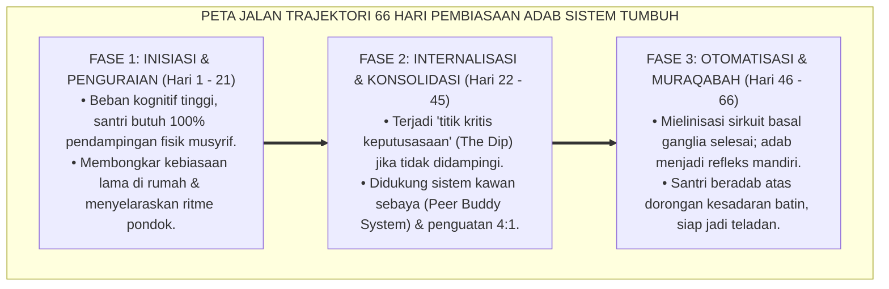
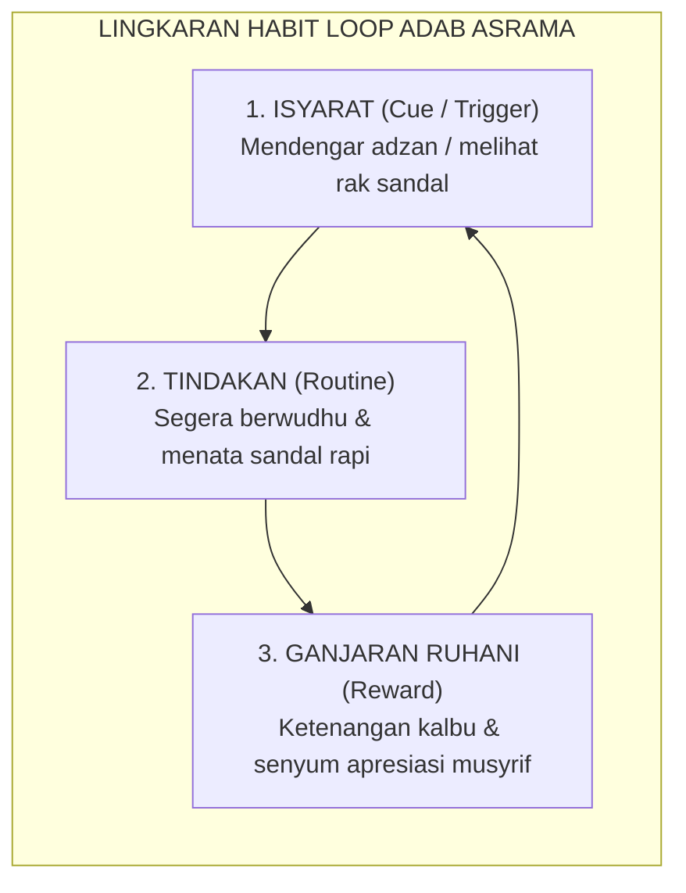
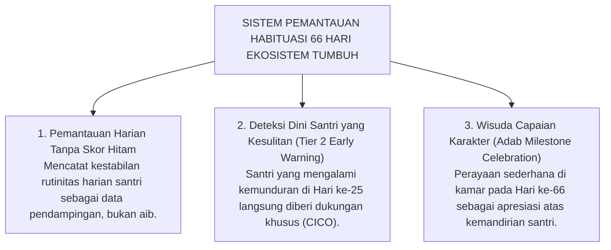

# SIKLUS HABIT LOOP & TRAJEKTORI 66-HARI

---
### Berapa Lama Waktu yang Dibutuhkan untuk Menanam Adab?

Sebuah mitos populer di kalangan dunia pelatihan karakter sering menyatakan bahwa: *"Kebiasaan baru manusia dapat terbentuk sempurna hanya dalam waktu 21 hari."*

Akibat mempercayai mitos ini, banyak pengelola pesantren hanya mendampingi santri baru secara intensif pada tiga pekan pertama masa orientasi (MPLS). Begitu hari ke-22 tiba, pendampingan dilepas total karena mengira santri sudah "otomatis mandiri". Hasilnya bisa ditebak: pada pekan keempat, lorong asrama kembali berantakan, santri kembali terlambat shalat, dan konflik antar-kamar mulai meletus.

Mengapa hal ini terjadi?

Riset ilmiah terluas di dunia tentang pembentukan kebiasaan oleh **Dr. Phillippa Lally dan timnya di University College London (UCL)**[^1] membongkar mitos tersebut:

> [!IMPORTANT]
> ### ⏳ Fakta Ilmiah Pembentukan Karakter:
> Waktu rata-rata yang dibutuhkan oleh otak manusia agar sebuah perilaku baru mencapai **titik otomatisasi tertinggi (*Asymptote of Automaticity*)** bukanlah 21 hari, melainkan **66 HARI BERTURUT-TURUT**.

<b>Gambar 3.3.1:</b> Peta Jalan Tiga Fase Trajektori Habituasi Adab 66 Hari Ekosistem TUMBUH.

---

### Tiga Komponen Siklus Kebiasaan (*The Habit Loop*)

Pakar perilaku **Charles Duhigg**[^2] dan **James Clear**[^3] merumuskan bahwa setiap kebiasaan manusia digerakkan oleh lingkaran tiga elemen (*The Habit Loop*):

<b>Gambar 3.3.2:</b> Lingkaran Tiga Elemen Habit Loop dalam Pembiasaan Adab Santri.

1. **Isyarat (*Cue*)**: Pemicu sensorik yang memberi tahu otak untuk memulai perilaku (misal: penanda visual garis batas antrean wudhu).
2. **Rutinitas (*Routine*)**: Tindakan fisik yang dilakukan (misal: tertib mengantre tanpa menyerobot).
3. **Ganjaran (*Reward*)**: Umpan balik yang membuat otak mengunci kebiasaan tersebut. Dalam Sistem TUMBUH, ganjaran tidak berupa uang/token materiil, melainkan **pengakuan relasional yang tulus dari musyrif (*"Alhamdulillah, ustadz bangga antum sabar antre tadi"*)** serta **ketenteraman batin beribadah (*Halaawatul Iman*)**.

---

### Tiga Fase Trajektori 66-Hari Ekosistem TUMBUH

Sistem TUMBUH membagi masa adaptasi santri ke dalam tiga fase yang terukur secara neurobiologis:

#### Fase 1: Inisiasi & Penguraian (Hari 1 s.d. 21)
* **Kondisi Saraf**: Jalur saraf baru sedang dirintis; otak depan (*PFC*) membutuhkan energi sangat besar. Santri mudah lelah dan sering lupa.
* **Strategi Musyrif**: Pendampingan fisik 100% di jam-jam transisi (saat bangun tidur, mandi, makan, dan jam belajar malam). Memberikan instruksi yang jelas, hangat, dan tanpa kemarahan.

#### Fase 2: Internalisasi & Konsolidasi (Hari 22 s.d. 45)
* **Kondisi Saraf**: Memasuki fase kritis di mana antusiasme awal mulai menurun (*The Motivational Dip*). Godaan untuk kembali ke pola lama sangat kuat.
* **Strategi Musyrif**: Menerapkan sistem pasangan belajar (*Peer Buddy*), di mana dua santri saling mengingatkan dengan santun, serta meningkatkan rasio apresiasi positif 4:1.

#### Fase 3: Otomatisasi & Muraqabah (Hari 46 s.d. 66)
* **Kondisi Saraf**: Sirkuit adab telah terbungkus mielin tebal dan berpindah ke *Basal Ganglia*. 
* **Strategi Musyrif**: Mengurangi pengawasan eksternal secara bertahap (*fading support*), memberikan kepercayaan otonom kepada santri, dan menanamkan penghayatan ikhlas (*Muraqabatullah*).

---

### Solusi Sistemik TUMBUH: Logbook Pemantauan Habituasi Digital

Untuk memastikan tidak ada santri yang tertinggal selama 66 hari proses pembiasaan, Sistem TUMBUH melengkapi musyrif dengan **Logbook PBIS Digital**:

<b>Gambar 3.3.3:</b> Tiga Pilar Sistem Pemantauan Habituasi 66 Hari Ekosistem TUMBUH.

---

## 📌 Catatan Kaki & Rujukan Primer

[^1]: **Phillippa Lally et al.**, "How are habits formed: Modelling habit formation in the real world", *European Journal of Social Psychology*, Vol. 40, No. 6 (2010), hlm. 998–1009.
[^2]: **Charles Duhigg**, *The Power of Habit: Why We Do What We Do in Life and Business* (New York: Random House, 2012), Bab 1: "The Habit Loop", hlm. 3–30.
[^3]: **James Clear**, *Atomic Habits: An Easy & Proven Way to Build Good Habits & Break Bad Ones* (New York: Avery / Penguin Random House, 2018), hlm. 45–80.

---

### IV. Eksplanasi Filosofis Lanjutan & Hermeneutika Nilai Siklus Habit Loop & Trajektori 66-Hari

Penyelidikan mendalam terhadap tema **SIKLUS HABIT LOOP & TRAJEKTORI 66-HARI** menuntut pemahaman integral atas relasi antara *Ontologi Fitrah* dan *Sosiologi Pembelajaran Pesantren*. Ketika seorang santri memasuki ekosistem pendidikan, ia membawa amanah perjanjian primordial (*Mithaq*) yang menuntut ruang tumbuh yang aman dari distorsi psikologis.

1. **Dialektika Keikhlasan (*Shidq an-Niyyah*) vs Formalisme Perilaku**:
   Dalam pandangan *Hujjatul Islam* Al-Imam Al-Ghazali dalam *Ihya 'Ulumiddin*, pembentukan karakter yang sejati bermula dari pembersihan batin (*Thaharatul Batin*). Ketika sebuah institusi mereduksi adab menjadi kepatuhan semu di hadapan figur otoritas, yang sesungguhnya terjadi adalah pelemahan integritas diri (*Nifaq Tarbawi*). Sistem TUMBUH menegaskan bahwa kesalehan sejati harus lahir dari kemerdekaan batin yang disinari oleh cinta kepada Allah (*Mahabbatullah*) dan kesadaran pengawasan-Nya (*Muraqabatullah*).

2. **Dinamika Neuroplastisitas & Internalisasi Nilai Ruhiyyah**:
   Sains kognitif kontemporer membuktikan bahwa pembiasaan nilai yang disertai rasa takut ekstrem mengaktifkan poros *HPA (Hypothalamic-Pituitary-Adrenal)* dan membanjiri otak dengan hormon kortisol. Kondisi ini membekukan kemampuan *Prefrontal Cortex* untuk merefleksikan nilai secara mandiri. Sebaliknya, ketika nilai **SIKLUS HABIT LOOP & TRAJEKTORI 66-HARI** disampaikan dalam suasana pengasuhan yang hangat (*Warm Presence*), otak santri melepaskan *oksitosin* dan *dopamin* yang mempercepat konsolidasi sinaptik dan pembentukan memori jangka panjang (*Long-Term Potentiation*).

3. **Matriks Transformasi Praksis Pembinaan**:

| Dimensi Pengasuhan | Pola Lama (Mekanistis-Punitif) | Pola Rekonstruksi Ekosistem TUMBUH |
| :--- | :--- | :--- |
| **Sumber Motivasi** | Tekanan eksternal dan rasa takut akan sanksi fisik. | Kesadaran fitrah internal dan kerinduan pada rida ilahi. |
| **Relasi Musyrif-Santri** | Pengawasan hierarkis intimidatif (panoptikon). | Keteladanan hidup (*Qudwah Hasanah*) dan pendampingan empatik. |
| **Ketahanan Karakter** | Runtuh ketika pengawasan ditiadakan (liburan/lulus). | Melekat kokoh sebagai kompas moral seumur hidup (*Insan Adabi*). |

---

### V. Refleksi Pedagogis & Rekomendasi Aksi Lembaga

Penerapan prinsip **SIKLUS HABIT LOOP & TRAJEKTORI 66-HARI** di lingkungan pesantren menuntut komitmen kelembagaan yang terstruktur:
* **Audit Budaya Pengasuhan**: Pimpinan pesantren wajib melakukan refleksi berkala atas seluruh interaksi antara asatidz, musyrif, dan santri guna memastikan tidak ada celah bagi masuknya feodalisme atau kekerasan terselubung.
* **Penguatan Kapasitas Pendidik**: Setiap pembina asrama difasilitasi dengan pelatihan literasi psikologi perkembangan dan konseling Islam agar memiliki kematangan emosi dalam menghadapi dinamika santri.
* **Integrasi Ruhiyyah 24 Jam**: Memastikan bahwa setiap detik kehidupan santri di pondok—mulai dari bangun tidur, halaqah Qur'an, mudzakarah ilmu, hingga istirahat malam—selalu dinaungi oleh nilai keikhlasan dan ukhuwah yang tulus.
