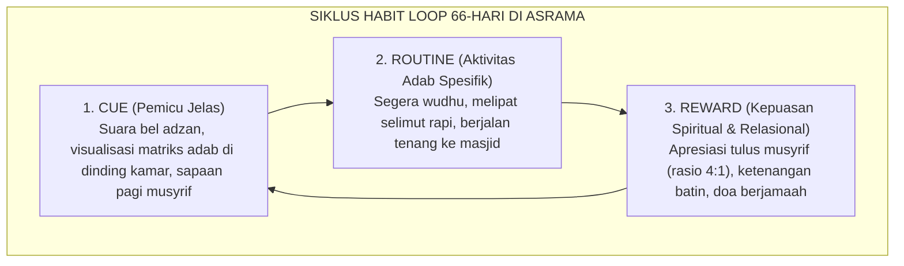

# SUB-BAB 3.3: SIKLUS HABIT LOOP 66-HARI
## *Protokol Tiga Elemen Pembiasaan (Cue, Routine, Reward) dan Mengapa 21 Hari Tidak Cukup di Asrama*

**Kode Modul**: `BOOK-01/BAB-03/SUB-03`  
**Kategori**: Metodologi Habituasi Adab  
**Fokus Keilmuan**: Behavioral Science & Pembiasaan 24-Jam

---

### 1. Dekonstruksi Mitos 21 Hari Menuju Standar Ilmiah 66 Hari
Banyak program pendidikan berasrama gagal karena berasumsi bahwa pembiasaan santri baru telah selesai dalam 21 hari masa orientasi. Riset empiris Dr. Phillippa Lally (University College London) membuktikan bahwa untuk membentuk kebiasaan kompleks (seperti bangun malam, disiplin antre, dan adab berbicara santun), otak manusia memerlukan rata-rata **66 hari pengulangan harian tanpa putus**.

---

### 2. Tiga Fase Kritis Siklus 66 Hari di Pesantren
1. **Fase Destruksi (Hari 1–22)**: Fase terberat di mana santri harus melawan pola lama dari rumah (*homesickness*, kebiasaan begadang). Butuh pendampingan intensif musyrif.
2. **Fase Instalasi (Hari 23–44)**: Sirkuit baru mulai terpasang di otak, santri mulai terbiasa namun masih rentan goyah jika tidak ada pengawasan.
3. **Fase Integrasi (Hari 45–66)**: Adab telah menyatu menjadi bagian dari identitas diri (*internalized automaticity*).
