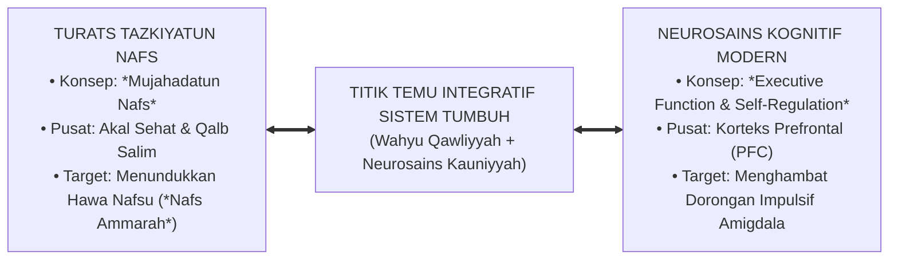
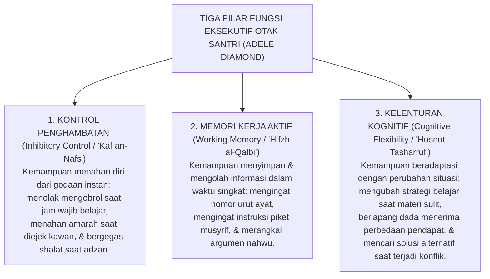
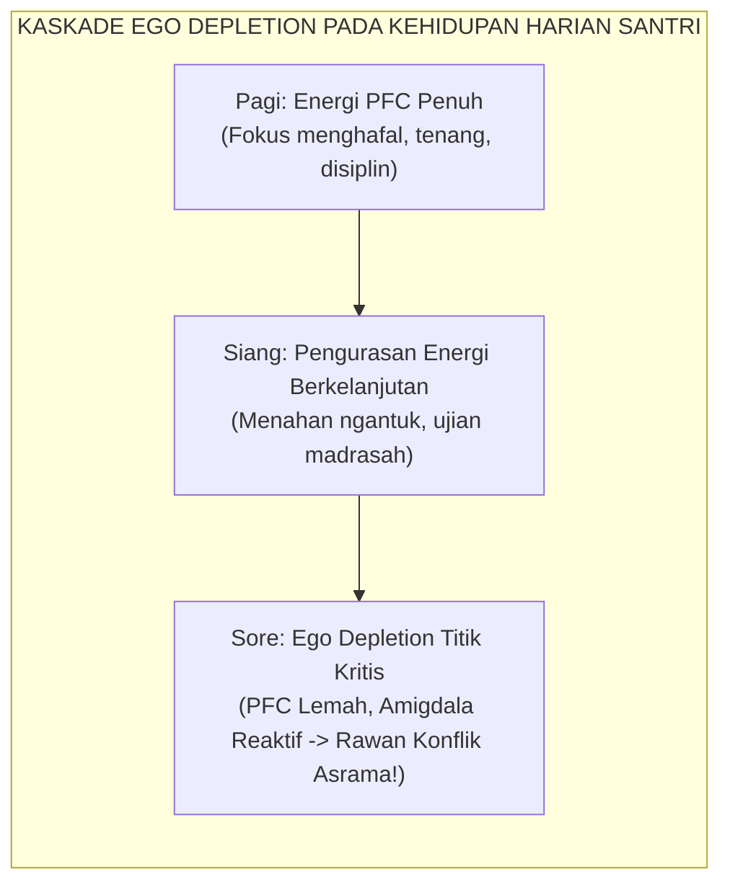
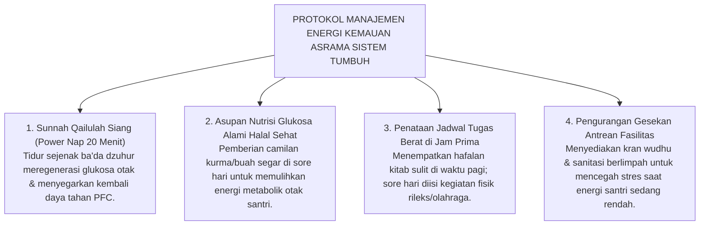

# MUJAHADATUN NAFS VS. EXECUTIVE FUNCTION

---

### 🧭 PETA POSISI PANDUAN DALAM SISTEM TUMBUH (DARI HULU KE HILIR)
* **Posisi Arsitektur**: `HULU EKOSISTEM (Akar Filosofis, Fitrah al-Munazzalah, & Worldview Islam)`
* **Peruntukan Pengguna**: Pimpinan Pesantren, Pengasuh Pondok, Kepala Madrasah, & Dewan Asatidz
* **Fokus Panduan**: Membangun cara pandang pengasuhan berbasis fitrah kesucian dan keteladanan nyata (Qudwah Hasanah), mengeliminasi tradisi kekerasan fisik dan feodalisme asrama.
* **Hasil Akhir yang Dituju**: Terwujudnya santri berkarakter *Insan Adabi* yang mandiri, musyrif yang mengasuh dengan kasih sayang tanpa *burnout*, dan pesantren yang aman berbasis data (*Safe Boarding School*).

---

### 🎯 Mengapa Panduan Ini Ada & Masalah Nyata yang Dipecahkan
1. **Latar Masalah di Lapangan**: Sering kali pengasuhan di pesantren berjalan tanpa SOP yang jelas atau terjebak dalam pola reaktif—menunggu santri berbuat salah baru dihukum dengan emosional.
2. **Solusi Sistem TUMBUH**: Panduan ini memberikan langkah preventif dan terstruktur agar setiap pembiasaan adab berjalan terencana, konsisten, dan terukur.
3. **Sasaran Perubahan**: Memastikan nilai-nilai Islam menyatu dalam perilaku harian santri melalui keteladanan nyata (*Qudwah Hasanah*).

---
### 🎯 Tujuan & Manfaat Panduan
Panduan ini dirancang sebagai petunjuk operasional terapan agar pendidik dan musyrif dapat:
1. Menjalankan pembinaan adab santri dengan pendekatan kasih sayang (*Rahmah*) dan ketegasan yang mendidik (*Firm & Kind*).
2. Menghindari cara-cara kekerasan fisik, bentakan verbal, maupun hukuman yang mempermalukan santri.
3. Menciptakan suasana asrama dan kelas yang aman, tertib, dan menumbuhkan kesadaran diri (*Bi'ah Shalihah*).

---

### 💡 Intisari Cepat (3 Menit Memahami Esensi)
* **Kunci Pengasuhan**: Karakter santri tumbuh melalui keteladanan nyata (*Qudwah Hasanah*), komunikasi empatik, dan pembiasaan terstruktur 24 jam.
* **Tindakan Utama**: Terapkan panduan langkah demi langkah di bawah ini secara konsisten, pantau perkembangan santri secara objektif, dan berikan apresiasi atas setiap perbaikan diri yang mereka capai.
* **Prinsip Disiplin**: Fokus pada pemulihan hubungan dan tanggung jawab nyata (*Restoratif*), bukan sekadar melampiaskan amarah atau menghukum.

---

### 📖 Uraian Panduan & Langkah Aksi Lapangan

---

### Titik Temu Antara Tirakat Batin dan Sirkuit Otak

Dalam literatur tasawuf klasik, konsep pengendalian diri dikenal dengan istilah agung: **Mujahadatun Nafs (Perjuangan Menundukkan Hawa Nafsu)**[^1].

Imam Al-Ghazali, Ibnu Qayyim al-Jauziyyah, dan para ulama sufi salaf menegaskan bahwa puncak kemuliaan manusia terletak pada kemampuannya untuk mengendalikan syahwat jasmaniah dan dorongan amarah di bawah kendali akal yang beriman kepada Allah SWT.

Menariknya, tatkala sains neurobiologi kognitif modern berkembang pesat di abad ke-21 melalui teknologi pemindaian otak *fMRI*, para ilmuwan saraf menemukan sirkuit biologis yang menjalankan fungsi tepat sebagaimana yang dijelaskan dalam kitab-kitab tasawuf tersebut: yaitu **Fungsi Eksekutif (*Executive Function*)** yang bermarkas di **Korteks Prefrontal (*Prefrontal Cortex / PFC*)**[^2].

<b>Gambar 3.4.1:</b> Titik Temu Integratif Antara Doktrin Mujahadatun Nafs Turats dan Neurosains Executive Function.

---

### Tiga Pilar Fungsi Eksekutif (*Executive Function*) di Otak Santri

Pakar neuropsikologi **Adele Diamond**[^2] merumuskan tiga pilar utama Fungsi Eksekutif yang mengendalikan perilaku manusia:

<b>Gambar 3.4.2:</b> Tiga Pilar Fungsi Eksekutif Otak Santri dalam Perspektif Sistem TUMBUH.

Pada usia remaja (usia santri MTs/MA atau SMP/SMA), bagian *Korteks Prefrontal* ini **belum matang sempurna** (proses maturasi biologisnya baru tuntas pada usia 25 tahun!). 

Sebaliknya, bagian otak emosi dan syahwat (*Amigdala dan Nukleus Akumbens*) telah aktif 100%. Inilah sebabnya mengapa santri remaja sangat mudah tergoda oleh dorongan impulsif, mudah terpancing emosi, dan rentan melanggar aturan jika tidak didampingi dengan sistem pendukung eksternal yang bijaksana.

---

### Riset *Ego Depletion*: Mengapa Disiplin Santri Runtuh di Sore Hari?

Pakar psikologi eksperimental **Roy Baumeister**[^3] menemukan fenomena krusial yang disebut sebagai **Kelelahan Energi Kemauan (*Ego Depletion*)**:

* Daya pengendalian diri manusia bukanlah sumber daya yang tak terbatas, melainkan bekerja layaknya **otot fisik yang bisa kelelahan**.
* Setiap kali santri menahan kantuk di kelas subuh, menahan lapar saat puasa sunnah, menahan diri untuk fokus menghafal Al-Qur'an selama berjam-jam, glukosa dan energi neurotransmitter di Korteks Prefrontal otaknya terkuras habis.
* Tatkala sore hari tiba menjelang ashar atau maghrib, santri mengalami *Ego Depletion*: energi pengendalian dirinya habis. Akibatnya, pada jam-jam inilah santri paling rentan bertengkar, saling mengejek saat antre mandi, atau melanggar aturan asrama!

<b>Gambar 3.4.3:</b> Dinamika Penurunan Energi Kemauan (Ego Depletion) Santri Sepanjang Hari.

Jika para musyrif tidak memahami sains ini, mereka akan menghakimi santri yang bertengkar di sore hari sebagai *"santri yang keras kepala dan tidak beradab"*. Padahal, anak tersebut sedang mengalami kelelahan biologis pada sistem saraf otaknya!

---

### Manajemen Energi Kemauan (*Willpower Management*) Sistem TUMBUH

Ekosistem TUMBUH merancang manajemen jadwal asrama yang secara cerdas menjaga cadangan energi *Korteks Prefrontal* santri:

<b>Gambar 3.4.4:</b> Empat Protokol Manajemen Energi Kemauan Ekosistem TUMBUH.

* **Menghidupkan Sunnah Qailulah Siang**: Santri diwajibkan tidur siang sejenak (*Power Nap*) selama 15–20 menit ba'da shalat dzuhur. Riset membuktikan tidur singkat ini mampu memulihkan kapasitas *Executive Function* otak hingga 90%!
* **Penataan Jadwal Berbasis Jam Prima**: Tugas-tugas yang membutuhkan daya konsentrasi tinggi (menghafal Al-Qur'an dan mengkaji nahwu sharaf) ditempatkan pada waktu pagi hari. Sore hari dialokasikan untuk kegiatan penyaluran energi fisik yang menyenangkan (olahraga sunnah dan seni Islam).
* **Mitigasi Titik Rawan Sore Hari**: Musyrif hadir berjaga secara aktif di lorong-lorong asrama dan kamar mandi pada pukul 16.30–17.30 WIB untuk menyapa santri dengan senyuman dan mengatur antrean dengan ramah, meredam potensi konflik sebelum terjadi.

Dengan memadukan kemuliaan ajaran mujahadatun nafs ulama salaf dengan keakuratan sains fungsi eksekutif, Sistem TUMBUH mendidik santri menguasai seni pengendalian diri sejati: menundukkan hawa nafsu dengan bimbingan iman, sembari merawat kesehatan biologis otak dengan penuh kebijaksanaan.

---

## 📌 Catatan Kaki & Rujukan Primer

[^1]: **Hujjatul Islam Imam Abu Hamid al-Ghazali**, *Ihya' 'Ulumiddin*, Kitab Riyadhatin Nafs wa Tahdzibil Akhlaq (Kairo: Dar al-Hadits, 2004), Jilid III, hlm. 65–85.
[^2]: **Adele Diamond**, "Executive functions", *Annual Review of Psychology*, Vol. 64 (2013), hlm. 135–168.
[^3]: **Roy F. Baumeister, Ellen Bratslavsky, Mark Muraven, & Dianne M. Tice**, "Ego depletion: Is the active self a limited resource?", *Journal of Personality and Social Psychology*, Vol. 74, No. 5 (1998), hlm. 1252–1265.
