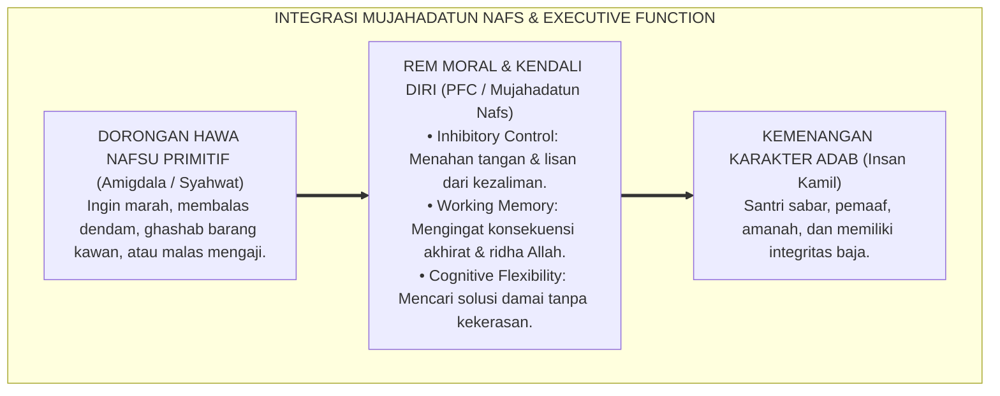
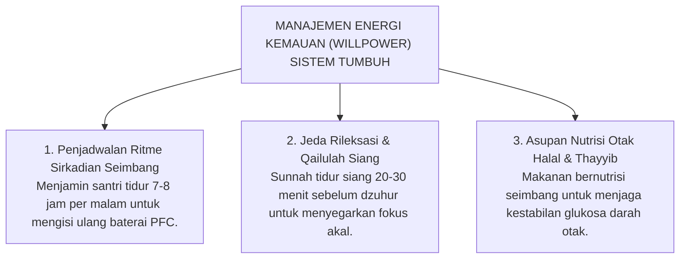

# SUB-BAB 3.4: MUJAHADATUN NAFS VS EXECUTIVE FUNCTION
## *Integrasi Konsep Pengendalian Diri Turats, Kapasitas Inhibitory Control Otak, dan Regulasi Energi Kemauan*

**Kode Klasifikasi**: `BOOK-01/BAB-03/SUB-04/MONOGRAF-MASTER-VIBRANT`  
**Disiplin Ilmu**: Psikologi Kognitif Terapan, Neurosains Kendali Diri (*Inhibitory Control*), & Tasawuf 'Amali  
**Penanggung Jawab Keilmuan**: Dewan Pakar Ekosistem TUMBUH (*Master Author, Pakar Psikologi Belajar, & Pakar Neurosains Perkembangan*)

---

### Pertempuran Terbesar di Dalam Diri Manusia

Rasulullah SAW bersabda sekembalinya dari sebuah pertempuran besar:

$$\text{رَجَعْنَا مِنَ الْجِهَادِ الْأَصْغَرِ إِلَى الْجِهَادِ الْأَكْبَرِ: مُجَاهَدَةِ النَّفْسِ}$$
*"Kita baru saja kembali dari jihad kecil menuju jihad yang paling besar: yaitu **perjuangan menundukkan hawa nafsu (*Mujahadatun Nafs*)**."*

Di lorong-lorong asrama pesantren, pertempuran jihad akbar ini terjadi setiap detik:
* Saat tangan seorang santri ingin mengambil makanan kawan, namun ia menahannya karena takut pada Allah.
* Saat seorang santri merasa sangat mengantuk di waktu subuh, namun ia memaksakan kakinya bangkit melangkah ke tempat wudhu.
* Saat seorang santri diejek temannya, namun ia menahan lisannya dari membalas mencaci.

Apa rahasia kekuatan batin yang mampu menahan dorongan nafsu hewani tersebut?

Dalam khazanah Turats Islam, kekuatan ini dinamakan **Mujahadatun Nafs wa ash-Shabr**. Dalam sains kognitif modern, kapasitas ini dinamakan **Fungsi Eksekutif (*Executive Function*)**, khususnya daya **Pengendalian Impuls (*Inhibitory Control*)** di Korteks Prefrontal.

<b>Gambar 3.4.1:</b> Sinergi antara Mujahadatun Nafs Turats dan Kapasitas Executive Function Otak dalam Mengendalikan Impuls.

---

### Tiga Pilar Fungsi Eksekutif (*Executive Function*) di Otak Santri

Sains kognitif modern[^1] membuktikan bahwa kemampuan santri menjalankan adab bertumpu pada tiga pilar fungsi eksekutif di otak depan:

1. **Inhibitory Control (Rem Pengendali Impuls)**:  
   Kemampuan biologis untuk menahan diri dari dorongan spontan yang merusak. Inilah terjemahan neurobiologis dari konsep *ash-Shabr 'anil Ma'shiyah* (kesabaran menahan diri dari dosa).
2. **Working Memory (Memori Kerja Aktif)**:  
   Kapasitas otak untuk mempertahankan tujuan luhur dan dalil syariat di dalam kesadaran aktif saat menghadapi godaan sesaat.
3. **Cognitive Flexibility (Kelenturan Berpikir)**:  
   Kemampuan untuk mengubah sudut pandang dan mencari jalan keluar damai saat menghadapi konflik antar-kawan sekamar.

---

### Riset *Ego Depletion*: Energi Pengendalian Diri Bukanlah Tak Terbatas

Pakar psikologi sosial **Roy Baumeister**[^2] menemukan fakta ilmiah penting yang sering diabaikan pengasuh pondok: **daya pengendalian diri (*willpower*) ibarat energi otot yang bisa mengalami kelelahan (*Ego Depletion*)**.

Ketika seorang santri dipaksa belajar dari pagi hingga larut malam tanpa jeda istirahat, kurang tidur, dan kelaparan, cadangan glukosa dan energi di Korteks Prefrontalnya habis terkuras. Akibatnya biologisnya: **santri kehilangan kemampuan mengendalikan diri (*loss of inhibitory control*)**, sehingga di malam hari anak menjadi sangat mudah marah, menangis histeris, atau berkelahi dengan kawan sekamarnya.

> [!CAUTION]
> ### ⚠️ Pelajaran Penting bagi Jadwal Pesantren:
> Menjejalkan jadwal kegiatan padat dari jam 03.00 pagi hingga jam 23.00 malam tanpa waktu istirahat yang cukup **bukanlah penempaan mental, melainkan kelalaian biologis yang menguras energi nalar anak**.  
> 
> Santri yang kelelahan kronis tidak akan mampu mengendalikan hawa nafsunya karena rem biologis di otaknya kehabisan daya baterai!

---

### Solusi Sistemik TUMBUH: Manajemen Energi Kemauan (*Willpower Management*)

Menjawab hukum biologis ini, **Sistem TUMBUH** merekayasa tata kelola energi batin santri:

<b>Gambar 3.4.2:</b> Tiga Pilar Manajemen Energi Kemauan (Willpower) Ekosistem TUMBUH.

---

### Sintesis Integratif Sub-Bab 3.4

*Mujahadatun Nafs* adalah jihad spiritual seumur hidup, dan *Executive Function* adalah anugerah biologis Allah untuk memenangkan jihad tersebut.

Dengan menjaga kesehatan fisik, nutrisi, dan waktu istirahat santri secara proporsional (*Mutawaazin*), Sistem TUMBUH memastikan bahwa baterai rem moral di otak santri selalu berada dalam kondisi penuh—memampukan mereka menundukkan hawa nafsu dan menegakkan adab mulia dalam situasi apa pun.

---

## 📌 Catatan Kaki & Rujukan Primer

[^1]: **Adele Diamond**, "Executive functions", *Annual Review of Psychology*, Vol. 64 (2013), hlm. 135–168.
[^2]: **Roy F. Baumeister et al.**, "Ego depletion: Is the active self a limited resource?", *Journal of Personality and Social Psychology*, Vol. 74, No. 5 (1998), hlm. 1252–1265.
