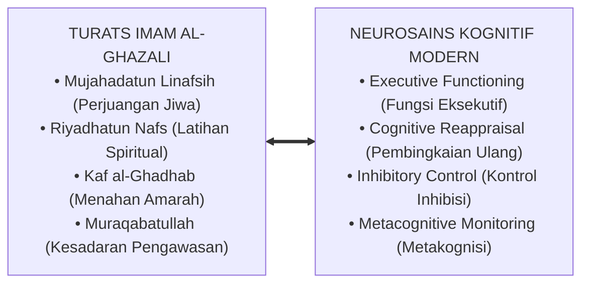

# SUB-BAB 3.4: MUJAHADATUN NAFS VS EXECUTIVE FUNCTION
## *Kesejajaran Konseptual antara Tirakat Qalbu Ulama Salaf dan Fungsi Eksekutif Korteks Prefrontal*

**Kode Modul**: `BOOK-01/BAB-03/SUB-04`  
**Kategori**: Integrasi Turats & Neurosains Kognitif  
**Fokus Keilmuan**: Cognitive Psychology & Tasawuf Akhlaqi

---

### 1. Titik Temu Keilmuan Turats dan Neurosains
Salah satu keunggulan terbesar ekosistem TUMBUH adalah kemampuannya mempertemukan konsep-konsep spiritual turats klasik dengan mekanisme kerja sirkuit biologis otak:

---

### 2. Tiga Komponen Inti Executive Function dalam Pembiasaan Santri
1. **Inhibitory Control (Kontrol Inhibisi / *Kaf an-Nafs*)**: Kapasitas menahan dorongan naluriah (misal: tidak membalas saat diejek teman, menahan kantuk saat menyimak halaqah).
2. **Working Memory (Memori Kerja / *Hifzh*)**: Kapasitas menahan dan mengolah informasi aturan adab di dalam pikiran saat mengambil keputusan di lapangan.
3. **Cognitive Flexibility (Kelenturan Kognitif / *Hikmah & Fathana*)**: Kemampuan beradaptasi terhadap perubahan situasi asrama, menyelesaikan konflik kamar dengan damai, dan mencari alternatif solusi yang bijak.
