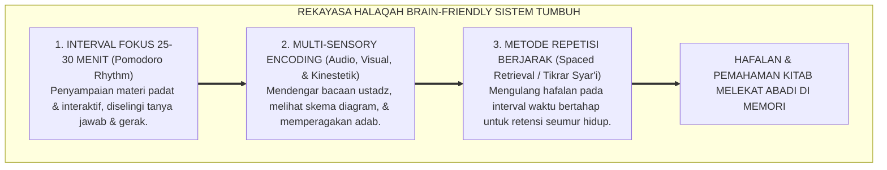
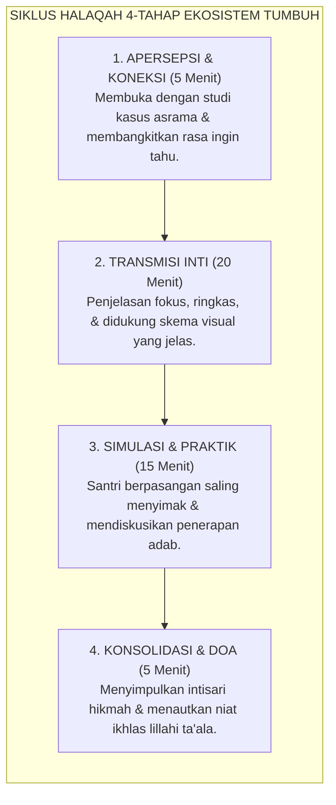

# SUB-BAB 3.5: DESAIN HALAQAH BERBASIS CARA KERJA OTAK
## *Rekayasa Didaktik Kelas Pesantren, Teori Beban Kognitif, dan Integrasi Tradisi Sorogan dengan Sains Memori Mutakhir*

**Kode Klasifikasi**: `BOOK-01/BAB-03/SUB-05/MONOGRAF-MASTER-VIBRANT`  
**Disiplin Ilmu**: Pedagogi Terapan Pesantren, Neurosains Pembelajaran (*Educational Neuroscience*), & Didaktik Turats  
**Penanggung Jawab Keilmuan**: Dewan Pakar Ekosistem TUMBUH (*Master Author, Pakar Pedagogi Guru, & Pakar Psikologi Belajar*)

---

### Mengapa Santri Sering Mengantuk di Majelis Taklim?

Pemandangan klasik yang sering kita jumpai di ruang kelas madrasah atau serambi masjid pada siang hari:

Seorang ustadz duduk membaca kitab kuning dengan suara datar monoton selama dua jam tanpa henti. Di hadapannya, puluhan santri menunduk di atas meja kecil. Awalnya mereka tekun memberi makna (*makna gandul*), namun berselang tiga puluh menit kemudian, satu per satu kepala mulai terantuk-antuk menahan kantuk yang teramat berat, pulpen terlepas dari jemari, dan catatan kitab menjadi coretan tak terbaca.

Banyak guru menganggap santri mengantuk karena *"kurang ikhlas"* atau *"digoda setan"*. 

Namun sains kognitif modern membuktikan fakta sederhana: **metode mengajar yang monoton dan satu arah secara biologis membuat otak santri kekurangan oksigen dan mengalami kejenuhan beban kognitif (*Cognitive Overload*)**[^1]!

<b>Gambar 3.5.1:</b> Tiga Pilar Desain Halaqah Pembelajaran Berbasis Cara Kerja Otak Ekosistem TUMBUH.

---

### Teori Beban Kognitif (*Cognitive Load Theory*) & Sains Memori

Pakar psikologi pendidikan **John Sweller**[^1] dan riset kurva lupa **Hermann Ebbinghaus**[^2] membuktikan dua hukum penting dalam pembelajaran:

1. **Batas Memori Kerja (*Working Memory Capacity*)**:  
   Otak manusia hanya mampu memproses 4 hingga 7 potong informasi baru dalam satu waktu. Jika seorang ustadz menjejalkan puluhan kaidah fiqih sekaligus dalam ceramah dua jam tanpa jeda, memori kerja santri mengalami *crash* (kelebihan beban), dan otak meresponsnya dengan tidur untuk melindungi dirinya dari kerusakan!
2. **Kekuatan Repetisi Berjarak (*Spaced Repetition / Tikrar*)**:  
   Menghafal 1 jam setiap hari selama 6 hari berturut-turut menghasilkan kekuatan memori 10 kali lebih kuat dibanding menghafal 6 jam maraton dalam satu malam (*cramming*).

---

### Menghidupkan Kembali Kejeniusan Tradisi Sorogan & Talaqqi

Sains pembelajaran modern ini sesungguhnya mengonfirmasi kejeniusan metode klasik para ulama salaf terdahulu:

* **Metode Sorogan (Private One-on-One)**: Santri membaca langsung di depan kiai dan disimak secara teliti. Metode ini adalah model pembelajaran paling efektif (*Mastery Learning*) karena memberikan umpan balik instan (*immediate feedback*) yang mengaktifkan neuroplastisitas otak santri secara maksimal.
* **Metode Mudzakarah / Munazharah (Diskusi Debat Ilmiah)**: Santri diajak beradu argumentasi dalil. Aktivitas ini merangsang Korteks Prefrontal untuk berpikir kritis, menganalisis masalah, dan melatih kelenturan berpikir tingkat tinggi (*Higher-Order Thinking Skills*).

---

### Solusi Sistemik TUMBUH: Standar Desain Halaqah Interaktif 4-Tahap

Ekosistem TUMBUH merumuskan format pembelajaran kelas dan halaqah tahfizh yang selaras dengan cara kerja otak:

<b>Gambar 3.5.2:</b> Siklus Empat Tahap Desain Halaqah Interaktif Ekosistem TUMBUH.

Dengan siklus 4-tahap ini, kelas pesantren menjadi medan belajar yang sangat hidup, dinamis, menyenangkan, dan bebas dari rasa kantuk.

---

## 📌 Catatan Kaki & Rujukan Primer

[^1]: **John Sweller**, "Cognitive load during problem solving: Effects on learning", *Cognitive Science*, Vol. 12, No. 2 (1988), hlm. 257–285; serta **John Sweller et al.**, *Cognitive Load Theory* (New York: Springer, 2011).
[^2]: **Hermann Ebbinghaus**, *Memory: A Contribution to Experimental Psychology* (New York: Teachers College, Columbia University, 1913; cetak ulang dari edisi orisinal 1885).
