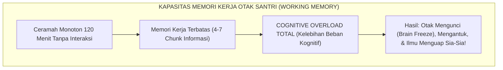
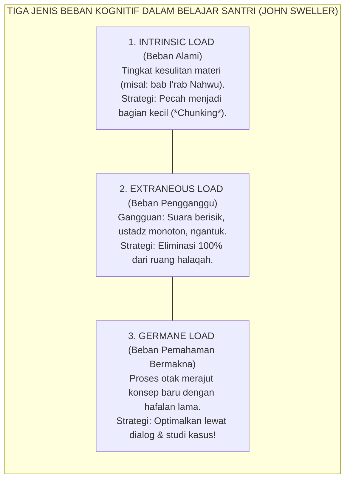
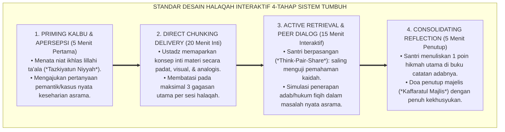

# SUB-BAB 3.5: DESAIN HALAQAH BERBASIS CARA KERJA OTAK
## *Rekonstruksi Majelis Ilmu Interaktif: Mengintegrasikan Teori Beban Kognitif, Neurosains Memori, dan Kejeniusan Tradisi Sorogan Klasik*

**Kode Klasifikasi**: `BOOK-01/BAB-03/SUB-05/MONOGRAF-MASTER-VIBRANT`  
**Disiplin Ilmu**: Didaktik Pembelajaran Islam, Neurosains Kognitif Pembelajaran (*Educational Neuroscience*), & Teori Beban Kognitif  
**Penanggung Jawab Keilmuan**: Dewan Pakar Ekosistem TUMBUH (*Master Author, Pakar Pedagogi Master Guru, & Pakar Psikologi Belajar*)

---

### Ketika Halaqah Menjadi Momok yang Menjemukan

Pernahkah kita mengamati sebuah pemandangan klasik yang kerap terjadi di ruang kelas madrasah atau serambi masjid pesantren:

Seorang ustadz duduk bersila di depan mikrofon, membacakan kitab kuning secara monoton selama dua jam tanpa jeda, sementara puluhan santri di hadapannya mulai menundukkan kepala, menguap berulang kali, mencoret-coret pinggiran kitab karena jenuh, bahkan beberapa santri di barisan belakang tertidur pulas dengan kepala tersandar di tiang masjid.

Tatkala santri-santri tersebut tidak mampu menjawab pertanyaan dalam ujian akhir, ustadz dengan mudah menyalahkan mereka: *"Kalian ini memang santri pemalas, tidak punya niat sungguh-sungguh mencari ilmu!"*

Mari kita bedah secara jujur dari kacamata neurosains pembelajaran: **apakah benar santri-santri itu "malas", ataukah desain pembelajaran halaqah kita yang telah melanggar prinsip biologis cara kerja otak manusia?**


<div align="center"><sub><b>Gambar 3.5.1:</b> Dampak Ceramah Monoton terhadap Terjadinya Cognitive Overload di Otak Santri.</sub></div>

Sistem **TUMBUH** merekonstruksi desain halaqah pesantren dengan memadukan **Kejeniusan Tradisi Sorogan-Talaqqi Salaf** dengan **Teori Beban Kognitif Modern (*Cognitive Load Theory*)**[^1], menghadirkan majelis ilmu yang hidup, interaktif, memikat nalar, dan mengakar kuat di memori jangka panjang santri.

---

### Teori Beban Kognitif (*Cognitive Load Theory*) & Neurosains Memori

Pakar psikologi kognitif **John Sweller**[^1] membuktikan bahwa memori kerja (*Working Memory*) manusia memiliki kapasitas penampungan yang sangat terbatas. Otak remaja hanya mampu memproses informasi baru secara fokus selama **15 hingga 20 menit berturut-turut** sebelum membutuhkan jeda konsolidasi (*Consolidation Pause*).

Jika materi disuntikkan secara terus-menerus tanpa henti (*Cognitive Overload*), hipokampus akan mengalami kejenuhan sinaptik: informasi baru akan saling bertubrukan dan langsung terhapus sebelum sempat disimpan ke dalam korteks serebral (*Long-Term Memory*).


<div align="center"><sub><b>Gambar 3.5.2:</b> Tiga Jenis Beban Kognitif dan Strategi Optimasi Pembelajaran Halaqah TUMBUH.</sub></div>

---

### Menghidupkan Kembali Kejeniusan Tradisi Sorogan & Talaqqi

Para ulama salaf terdahulu sesungguhnya telah menerapkan metode neuro-pedagogi tingkat tinggi melalui tradisi **Sorogan (Pembelajaran Individual Terbimbing)** dan **Munadharah (Debat Kritis Beradab)**[^2]:

* **Sorogan adalah Asesmen Formatif Presisi**: Guru menyimak satu per satu bacaan santri, mengoreksi makhraj huruf dan pemahaman nahwu secara langsung (*Immediate Feedback*), memastikan tidak ada miskonsepsi yang mengendap.
* **Talaqqi adalah Multi-Sensory Immersion**: Santri melihat mimik wajah guru (*Visual*), mendengarkan intonasi bacaan (*Auditory*), dan mencatat makna gandul di kitab (*Kinesthetic*), mengaktifkan berbagai belahan otak secara serempak.

---

### Standar Desain Halaqah Interaktif 4-Tahap Sistem TUMBUH

Ekosistem TUMBUH merumuskan standar baku pelaksanaan halaqah madrasah berdurasi 45 menit ke dalam **Protokol 4-Tahap Berbasis Neurosains**:


<div align="center"><sub><b>Gambar 3.5.3:</b> Protokol Desain Halaqah Interaktif 4-Tahap Berbasis Neurosains Kognitif Ekosistem TUMBUH.</sub></div>

#### 1. Tahap 1: Priming Kalbu & Apersepsi (5 Menit Pertama)
Ustadz tidak langsung membuka kitab dan membaca, melainkan memicu rasa ingin tahu otak (*Dopamine Trigger*):
* *"Anak-anakku sekalian, semalam di asrama kita melihat kawan kita berselisih karena masalah pinjam sandal. Nah, tahukah kalian bagaimana bab Ghashab dalam kitab Fathul Qarib yang kita pelajari hari ini memberi solusi elegan atas masalah tersebut?"*
* Otak santri seketika terstimulasi dan merasa bahwa ilmu yang akan dipelajari memiliki relevansi langsung dengan hidupnya!

#### 2. Tahap 2: Direct Chunking Delivery (20 Menit Inti)
Ustadz menyampaikan materi inti dengan tempo yang jelas, menggunakan analogi hidup, dan menuliskan bagan peta konsep di papan tulis. Penyampaian dibatasi maksimal 20 menit sebelum rentang atensi otak santri menurun.

#### 3. Tahap 3: Active Retrieval & Peer Dialog (15 Menit Interaktif)
Ustadz meminta santri berpasangan (*Think-Pair-Share*): Santri A menjelaskan kembali makna bait matan kepada Santri B, lalu bergantian. Proses memanggil kembali memori dari dalam otak (*Active Retrieval Practice*) ini terbukti meningkatkan retensi memori jangka panjang hingga 400% dibandingkan hanya duduk mendengarkan!

#### 4. Tahap 4: Consolidating Reflection (5 Menit Penutup)
Sesi ditutup dengan hening sejenak: santri merenungkan hikmah amaliyah dari ayat atau hadits yang baru dipelajari dan berkomitmen untuk menerapkannya di asrama malam nanti.

---

### Penataan Geometri Ruang Halaqah: Bentuk Melingkar U-Shape

Sistem TUMBUH merevolusi tata ruang fisik halaqah:

```mermaid
graph LR
    subgraph TataRuangHalaqah["GEOMETRI RUANG HALAQAH SISTEM TUMBUH"]
        Lama["Baris Teater Memanjang ke Belakang<br/>(Santri belakang tidak terlihat ustadz & mudah mengantuk)"] 
        ==>|"TRANSFORMASI RUANG"| 
        Baru["Bentuk Melingkar Setengah Lingkaran (U-Shape)<br/>(Seluruh santri bertatapan mata sejajar dengan ustadz & aktif berpartisipasi)"]
    end
```
<div align="center"><sub><b>Gambar 3.5.4:</b> Transformasi Geometri Ruang Halaqah Menjadi Setengah Lingkaran (U-Shape).</sub></div>

Dengan tata ruang setengah lingkaran (*U-Shape*), kontak mata (*Eye-to-Eye Contact*) antara ustadz dan seluruh santri terjalin secara merata. Tidak ada lagi "barisan anak terbuang" di pojok belakang. Seluruh santri merasa dihargai, dipantau dengan kasih sayang, dan terdorong untuk aktif berpartisipasi.

Dengan mengintegrasikan sains kognitif modern ke dalam keagungan tradisi halaqah Turats salaf, Sistem TUMBUH mentransformasikan ruang-ruang belajar madrasah menjadi taman ilmu yang memancarkan kenikmatan intelektual dan kemuliaan adab bagi seluruh generasi penerus umat.

---

## 📌 Catatan Kaki & Rujukan Primer

[^1]: **John Sweller, Paul Ayres, & Slava Kalyuga**, *Cognitive Load Theory* (New York: Springer Science+Business Media, 2011), hlm. 1–45.
[^2]: **K.H. M. Hasyim Asy'ari**, *Adab al-'Alim wal Muta'allim*, Tahqiq: Tim Tebuireng (Jombang: Pustaka Warisan Islam, 2014), Bab 3: "Adab al-Muta'allim fi Darsihi", hlm. 40–65.
