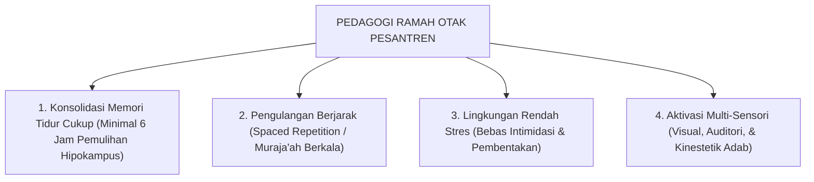

# SUB-BAB 3.5: DESAIN HALAQAH BERBASIS CARA KERJA OTAK
## *Aplikasi Pedagogi Ramah Otak (Brain-Based Pedagogy) dalam Pembelajaran Kitab dan Tahfizh Qur'an*

**Kode Modul**: `BOOK-01/BAB-03/SUB-05`  
**Kategori**: Pedagogi Terapan Neurosains  
**Fokus Keilmuan**: Educational Neuroscience & Metodologi Pengajaran Pesantren

---

### 1. Prinsip Pedagogi Ramah Otak di Pesantren
Untuk memaksimalkan retensi hafalan dan penghayatan adab, metode halaqah dan sorogan direkayasa selaras dengan cara kerja otak:

---

### 2. Protokol Praktis bagi Asatidz dan Musyrif
1. **Aturan 20/20/20**: Dalam sesi belajar 60 menit, bagi menjadi 20 menit transfer konsep, 20 menit diskusi/sorogan aktif santri, dan 20 menit refleksi internalisasi.
2. **Jeda Otak (*Brain Breaks*)**: Memberikan jeda 2 menit peregangan fisik atau teknik pernapasan dzikir tenang (*deep breathing dzikr*) di antara transisi materi yang padat.
3. **Penyampaian Umpan Balik Korektif yang Hangat**: Mengoreksi kesalahan bacaan/adab secara personal (*private correction*), bukan mempermalukan santri di hadapan seluruh anggota halaqah.
