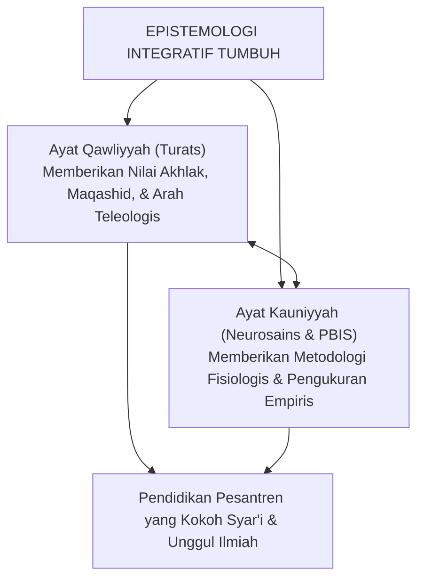

# BAB 3: EPISTEMOLOGI INTEGRATIF: MENAUTKAN TURATS NABAWI DENGAN NEUROSAINS KOGNITIF
## *Integrasi Ayat Kauniyyah dan Qawliyyah, Neuroplastisitas Pembiasaan 66-Hari, dan Kesejajaran Mujahadah dengan Executive Function*

**Nomor Identifikasi**: `BOOK-01/BAB-03/EPISTEMOLOGI-INTEGRATIF/2026`  
**Volume**: Buku 01 — *Akar Filosofis & Epistemologi Pendidikan Karakter Pesantren*  
**Dewan Pakar**: `pakar-neurosains-perkembangan`, `pakar-epistemologi-turats`, `pakar-psikologi-belajar`

---

## 📑 DAFTAR ISI SUB-BAB 3

1. [3.1 Menautkan Dua Sayap Kebenaran: Ayat Qawliyyah dan Ayat Kauniyyah](#31-menautkan-dua-sayap-kebenaran-ayat-qawliyyah-dan-ayat-kauniyyah)
2. [3.2 Neurosains Pembiasaan Karakter: Neuroplastisitas, Mielinisasi, dan Sirkuit Otak](#32-neurosains-pembiasaan-karakter-neuroplastisitas-mielinisasi-dan-sirkuit-otak)
3. [3.3 Siklus Pembentukan Kebiasaan Otomatis 66-Hari (*Habit Loop*)](#33-siklus-pembentukan-kebiasaan-otomatis-66-hari-habit-loop)
4. [3.4 Penyelarasan Konsep Mujahadatun Linafsih dengan Executive Functioning](#34-penyelarasan-konsep-mujahadatun-linafsih-dengan-executive-functioning)
5. [3.5 Implikasi Didaktik: Desain Halaqah & Asrama yang Berbasis Cara Kerja Otak](#35-implikasi-didaktik-desain-halaqah--asrama-yang-berbasis-cara-kerja-otak)

---

## 3.1 Menautkan Dua Sayap Kebenaran: Ayat Qawliyyah & Kauniyyah

Epistemologi TUMBUH menolak dikotomi sekuler yang memisahkan sains dari agama. Dalam worldview Islam:
* **Ayat Qawliyyah (Wahyu Al-Qur'an & Hadits Otentik)** memberikan kepastian nilai, hukum moral, orientasi keselamatan akhirat, dan tujuan hakiki kehidupan.
* **Ayat Kauniyyah (Konsensus Sains Empiris & Neurosains Perkembangan)** menyingkap hukum alam (*sunnatullah*) tentang bagaimana sel-sel saraf manusia merespons stimulasi, bagaimana memori terbentuk, dan bagaimana emosi diregulasi.

---

## 3.2 Neurosains Pembiasaan Karakter: Neuroplastisitas & Mielinisasi

Pembentukan akhlak dalam sains modern identik dengan proses **Neuroplastisitas**—kemampuan otak untuk mengubah struktur dan kekuatan koneksi antar-neuron berdasarkan pengalaman berulang (*neurons that fire together, wire together*).

Ketika santri membiasakan diri bangun sebelum fajar, merapikan kasur, menundukkan pandangan, dan bersikap sabar saat mengantre, sirkuit saraf di otak mengalami proses **Mielinisasi** (pelapisan selubung lemak mielin pada akson saraf). Mielinisasi ini mempercepat transmisi sinyal listrik hingga ratusan kali lipat, sehingga perilaku yang awalnya terasa berat (*conscious effort*) bertransformasi menjadi refleks adab bawah sadar yang otomatis dan ringan (*khuluq mu'tadah*).

---

## 3.3 Siklus Pembentukan Kebiasaan Otomatis 66-Hari (*Habit Loop*)

Riset ilmiah kontemporer (Lally et al., University College London) membuktikan bahwa pembentukan kebiasaan otomatis (*automaticity*) membutuhkan rata-rata **66 hari pengulangan konsisten**, bukan 21 hari sebagaimana mitos populer.

Ekosistem TUMBUH merancang ritme pengasuhan asrama melintasi **Siklus Habit Loop Tiga Komponen**:
1. **Cue (Pemicu / Isyarat)**: Suara tarhim masjid, bel shalat, atau visual pengingat adab di dinding kamar.
2. **Routine (Aktivitas Adab)**: Tindakan konkret (segera mengambil wudhu, berjalan tenang menuju masjid).
3. **Reward (Ganjaran / Kepuasan Jiwa)**: Penguatan verbal tulus dari musyrif (*apresiasi 4:1*), ketenangan dzikir berjamaah, dan kepuasan batin dekat dengan Allah.

---

## 3.4 Penyelarasan Mujahadatun Linafsih dengan Executive Function

| Konsep Turats (*Imam Al-Ghazali*) | Konsep Neurosains Modern (*Cognitive Neuroscience*) | Fungsi Praktis dalam Pengasuhan Santri |
| :--- | :--- | :--- |
| **Mujahadatun Linafsih** | **Executive Functioning** | Kemampuan mengerahkan daya sadar untuk mengarahkan fokus dan menolak dorongan instingtif. |
| **Kaf al-Ghadhab** (Menahan Amarah) | **Inhibitory Control** | Menahan respon impulsif saat terprovokasi teman sekamar; memberi jeda bagi otak atas untuk berpikir. |
| **Ash-Shabr 'ala at-Ta'ah** (Sabar dalam Ketaatan) | **Delayed Gratification & Cognitive Flexibility** | Menunda kesenangan instan (tidur/santai) demi tujuan jangka panjang (hafalan Qur'an & ridha Allah). |
| **Muraqabatullah & Muhasabah** | **Metacognitive Monitoring** | Mengamati pikiran dan motif tindakan diri sendiri secara sadar dan mengevaluasinya secara berkala. |

---

## 3.5 Implikasi Didaktik: Desain Halaqah Berbasis Cara Kerja Otak

Pemahaman neurosains mengubah cara mengajar di halaqah dan kelas pesantren:
* **Pemberian Jeda Istirahat Otak (*Brain Breaks*)**: Setiap 40 menit pembelajaran intensif diselingi peregangan fisik ringan untuk memulihkan kapasitas neurotransmiter asetilkolin.
* **Manajemen Stres & Suasana Belajar Hangat**: Menghilangkan budaya menguji hafalan dengan membentak, karena kecemasan tinggi menghambat transfer memori kerja (*working memory*) ke hipokampus (*long-term memory storage*).
