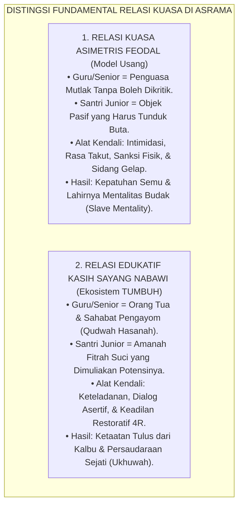
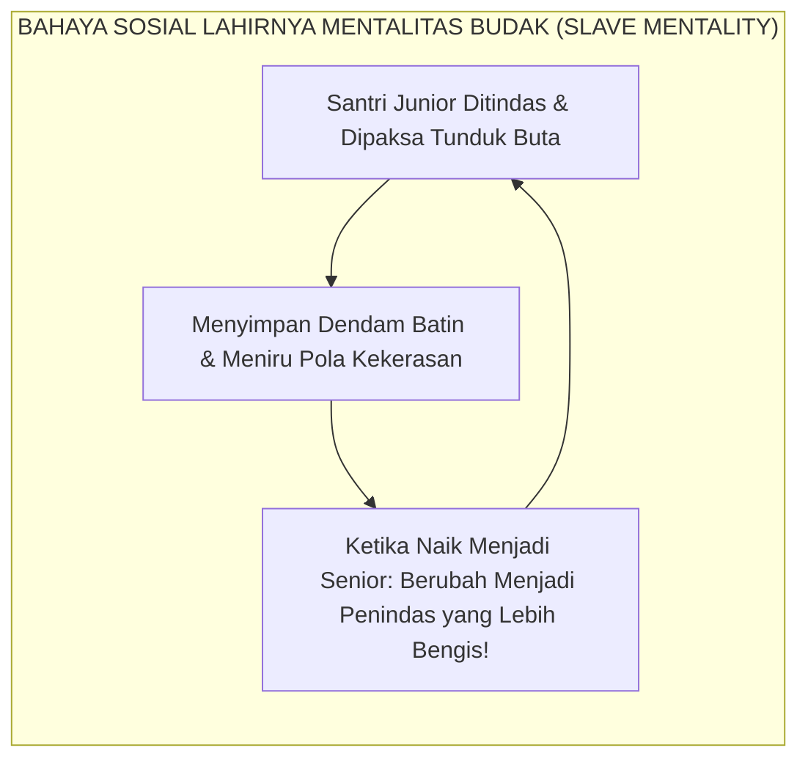
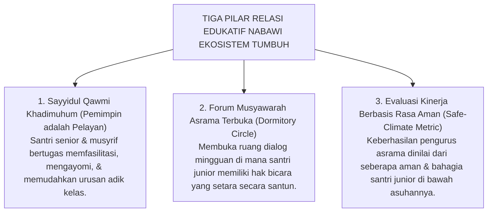

# DEKONSTRUKSI RELASI KUASA ASIMETRIS

---
> [!NOTE]
> ### 📌 Distingsi Mendasar: Ihtiram Guru vs Senioritas Feodal
> Sebelum melangkah lebih jauh, kita wajib membedakan dua entitas yang berbeda secara diametral:
> 1. **Takzim & Ihtiram kepada Guru/Kiai**: Merupakan keharusan syariat (*Adab al-Muta'allim ma'a Syaikhihi*) yang lahir dari cinta, keikhlasan batin, dan pengakuan atas sanad keilmuan yang mulia.
> 2. **Senioritas Feodal Antar-Santri**: Merupakan relasi kuasa semu di mana santri yang lebih tua/tinggi tingkatannya menuntut ketundukan adik kelas melalui teror, ancaman, dan perundungan. Inilah yang didekonstruksi secara total dalam bab ini.

### Ilusi Ketundukan di Bawah Bayang-Bayang Otoriter

Di sebagian pesantren tradisional, kita kerap menjumpai pemandangan yang sekilas tampak sangat memukau mata:

Ratusan santri berjalan membungkuk hampir sembilan puluh derajat saat berpapasan dengan seniornya, menundukkan pandangan dalam-dalam tanpa berani menatap mata, dan berbisik dengan suara gemetar saat diajak bicara. Para pengurus tersenyum bangga di hadapan para tamu dan menyatakan: *"Lihatlah, betapa tingginya adab dan rasa takzim santri-santri kami!"*

Namun, ketika kita mengamati dinamika batin mereka lebih dekat dan berbicara dari hati ke hati di ruang yang aman, sebuah kenyataan getir terungkap: **sikap menunduk itu bukanlah buah dari rasa hormat yang tulus (*Ihtiram*), melainkan ekspresi dari rasa takut yang mencekam (*Terror-Driven Submission*)**[^1].

Santri menunduk bukan karena hatinya mengagumi keluhuran akhlak senior atau ustadznya, melainkan karena takut ditampar, takut dibentak di depan umum, takut dikunci di kamar mandi, atau takut dihakimi di sidang kamar malam hari.

<b>Gambar 4.1.1:</b> Perbandingan Relasi Kuasa Asimetris Feodal vs Relasi Edukatif Nabawi dalam Ekosistem TUMBUH.

---

### Membongkar Hegemoni Kuasa: Ketika Jabatan Menjadi Alat Penindasan

Filsuf sosiologi kritis **Michel Foucault** dalam karyanya *Discipline and Punish: The Birth of the Prison*[^1] membongkar bahwa di dalam institusi tertutup (*Total Institutions*), kekuasaan (*power*) sering kali bekerja secara represif melalui pendisiplinan tubuh yang mekanis (*disciplinary power*).

Di lingkungan pesantren feodal, relasi kuasa asimetris terjadi tatkala pengurus asrama atau santri senior menyalahgunakan jubah "penegak disiplin" untuk melampiaskan ego kekuasaan:
1. **Penyalahgunaan Wewenang Disiplin**: Menghukum adik kelas semata-mata demi kepuasan gengsi pribadi atau rasa superioritas senioritas (*power tripping*).
2. **Pembuatan Aturan Arbitrer**: Menciptakan aturan-aturan konyol yang tidak memiliki dasar syariat maupun rasionalitas pendidikan (misalnya: adik kelas dilarang memakai sandal warna tertentu, dilarang melewati jalan utama, atau wajib menyapa senior dengan sebutan feodal).
3. **Doktrin Anti-Kritik**: Siapa pun santri yang berani bertanya secara santun saat ada ketidakadilan langsung dicap sebagai anak yang *"kurang ajar"*, *"su'ul adab"*, atau *"terancam hilang berkah ilmunya"*.

<b>Gambar 4.1.2:</b> Siklus Transmisi Dendam dan Pelestarian Mentalitas Budak Antargenerasi.

Budaya hegemoni ini merusak mentalitas generasi santri: anak-anak kita dididik menjadi **manusia berjiwa budak (*slave mentality*)** yang hanya berani tunduk ketika ada figur otoritas di hadapannya, namun akan berubah menjadi penindas yang kejam tatkala kelak memegang tampuk kekuasaan di masyarakat!

---

### Teladan Agung Rasulullah SAW: Meruntuhkan Kasta dan Feodalisme

Baginda Rasulullah SAW—sosok manusia paling agung di muka bumi—sepanjang hayatnya **meruntuhkan segala bentuk feodalisme, kultus individu, dan relasi kuasa yang menindas**.

Perhatikan sebuah riwayat monumental tatkala seorang lelaki Arab Badui datang menghadap Rasulullah SAW dengan tubuh gemetar ketakutan karena mengira beliau adalah raja otoriter yang kejam:

> [!NOTE]
> ### 📜 Kelembutan Agung Rasulullah SAW Meruntuhkan Sikap Feodal:
> 
> $$\text{هَوِّنْ عَلَيْكَ، فَإِنِّي لَسْتُ بِمَلِكٍ، إِنَّمَا أَنَا ابْنُ امْرَأَةٍ مِنْ قُرَيْشٍ كَانَتْ تَأْكُلُ الْقَدِيدَ بِمَكَّةَ}$$
> 
> **Artinya:**  
> *"Tenangkanlah dirimu dan jangan gemetar! Sesungguhnya aku ini bukanlah seorang raja yang kejam. Aku ini hanyalah putra dari seorang wanita Quraisy sederhana yang biasa memakan dendeng daging kering di kota Makkah."*  
> *(HR. Ibnu Majah no. 3312 dan Al-Hakim dalam Al-Mustadrak no. 4366).*

Rasulullah SAW duduk sejajar dengan para sahabatnya di atas tanah tanpa alas istimewa, makan bersama para pelayan dan anak yatim, serta **melarang keras para sahabat berdiri mengagungkan beliau** layaknya perlakuan terhadap kaisar Romawi dan raja-raja Persia:
$$\text{لَا تَقُومُوا كَمَا تَقُومُ الْأَعَاجِمُ يُعَظِّمُ بَعْضُهُمْ بَعْضًا}$$
*"Janganlah kalian berdiri mengagungkanku sebagaimana orang-orang non-Arab berdiri mengagungkan para pembesar mereka!"* (HR. Abu Dawud no. 5230 dan Ahmad no. 22177).

---

### Transformasi Relasi Edukatif Kasih Sayang Sistem TUMBUH

Ekosistem **TUMBUH** merekonstruksi tata kelola hubungan pendidik-santri melalui **Tiga Pilar Relasi Edukatif Nabawi**:

<b>Gambar 4.1.3:</b> Tiga Pilar Relasi Edukatif Nabawi Ekosistem TUMBUH.

Penerapan di pesantren:
1. **Senior sebagai Pelayan**: Doktrin feodal diganti dengan semangat pelayanan (*khidmah*): senior bertugas membimbing hafalan adik kelas, membantu saat adik kelas sakit, dan membersihkan fasilitas bersama.
2. **Musyawarah Asrama Terbuka**: Menggelar forum lingkaran kamar (*Dormitory Circle*) mingguan di mana setiap santri bebas menyampaikan aspirasi dan keluh kesah secara santun tanpa rasa takut diintimidasi.
3. **Penilaian Berbasis Rasa Aman**: Prestasi santri pengurus tidak lagi diukur dari seberapa banyak pelanggaran yang berhasil ditindak, melainkan dari **seberapa tinggi tingkat rasa aman, ukhuwah, dan kebahagiaan adik kelas** di bawah bimbingannya.

Pesantren didirikan untuk mencetak kesatria umat yang berjiwa merdeka, bertauhid murni, dan berakhlak mulia—bukan pabrik pembudakan mental.

Dengan mendekonstruksi relasi kuasa asimetris dan menggantinya dengan Kepemimpinan Pengayom Nabawi, Sistem TUMBUH mengembalikan martabat kemanusiaan santri, melahirkan kader pemimpin yang berwibawa karena keteladanannya, bukan karena ancaman rasa takut.

---

## 📌 Catatan Kaki & Rujukan Primer

[^1]: **Michel Foucault**, *Discipline and Punish: The Birth of the Prison*, Terjemahan Alan Sheridan (New York: Vintage Books, 1977), Bab 2: "The Means of Correct Training", hlm. 170–194.
[^2]: **Robert K. Greenleaf**, *Servant Leadership: A Journey into the Nature of Legitimate Power and Greatness* (New York: Paulist Press, 1977), hlm. 1–48.

---

### IV. Eksplanasi Filosofis Lanjutan & Hermeneutika Nilai Dekonstruksi Relasi Kuasa Asimetris

Penyelidikan mendalam terhadap tema **DEKONSTRUKSI RELASI KUASA ASIMETRIS** menuntut pemahaman integral atas relasi antara *Ontologi Fitrah* dan *Sosiologi Pembelajaran Pesantren*. Ketika seorang santri memasuki ekosistem pendidikan, ia membawa amanah perjanjian primordial (*Mithaq*) yang menuntut ruang tumbuh yang aman dari distorsi psikologis.

1. **Dialektika Keikhlasan (*Shidq an-Niyyah*) vs Formalisme Perilaku**:
   Dalam pandangan *Hujjatul Islam* Al-Imam Al-Ghazali dalam *Ihya 'Ulumiddin*, pembentukan karakter yang sejati bermula dari pembersihan batin (*Thaharatul Batin*). Ketika sebuah institusi mereduksi adab menjadi kepatuhan semu di hadapan figur otoritas, yang sesungguhnya terjadi adalah pelemahan integritas diri (*Nifaq Tarbawi*). Sistem TUMBUH menegaskan bahwa kesalehan sejati harus lahir dari kemerdekaan batin yang disinari oleh cinta kepada Allah (*Mahabbatullah*) dan kesadaran pengawasan-Nya (*Muraqabatullah*).

2. **Dinamika Neuroplastisitas & Internalisasi Nilai Ruhiyyah**:
   Sains kognitif kontemporer membuktikan bahwa pembiasaan nilai yang disertai rasa takut ekstrem mengaktifkan poros *HPA (Hypothalamic-Pituitary-Adrenal)* dan membanjiri otak dengan hormon kortisol. Kondisi ini membekukan kemampuan *Prefrontal Cortex* untuk merefleksikan nilai secara mandiri. Sebaliknya, ketika nilai **DEKONSTRUKSI RELASI KUASA ASIMETRIS** disampaikan dalam suasana pengasuhan yang hangat (*Warm Presence*), otak santri melepaskan *oksitosin* dan *dopamin* yang mempercepat konsolidasi sinaptik dan pembentukan memori jangka panjang (*Long-Term Potentiation*).

3. **Matriks Transformasi Praksis Pembinaan**:

| Dimensi Pengasuhan | Pola Lama (Mekanistis-Punitif) | Pola Rekonstruksi Ekosistem TUMBUH |
| :--- | :--- | :--- |
| **Sumber Motivasi** | Tekanan eksternal dan rasa takut akan sanksi fisik. | Kesadaran fitrah internal dan kerinduan pada rida ilahi. |
| **Relasi Musyrif-Santri** | Pengawasan hierarkis intimidatif (panoptikon). | Keteladanan hidup (*Qudwah Hasanah*) dan pendampingan empatik. |
| **Ketahanan Karakter** | Runtuh ketika pengawasan ditiadakan (liburan/lulus). | Melekat kokoh sebagai kompas moral seumur hidup (*Insan Adabi*). |

---

### V. Refleksi Pedagogis & Rekomendasi Aksi Lembaga

Penerapan prinsip **DEKONSTRUKSI RELASI KUASA ASIMETRIS** di lingkungan pesantren menuntut komitmen kelembagaan yang terstruktur:
* **Audit Budaya Pengasuhan**: Pimpinan pesantren wajib melakukan refleksi berkala atas seluruh interaksi antara asatidz, musyrif, dan santri guna memastikan tidak ada celah bagi masuknya feodalisme atau kekerasan terselubung.
* **Penguatan Kapasitas Pendidik**: Setiap pembina asrama difasilitasi dengan pelatihan literasi psikologi perkembangan dan konseling Islam agar memiliki kematangan emosi dalam menghadapi dinamika santri.
* **Integrasi Ruhiyyah 24 Jam**: Memastikan bahwa setiap detik kehidupan santri di pondok—mulai dari bangun tidur, halaqah Qur'an, mudzakarah ilmu, hingga istirahat malam—selalu dinaungi oleh nilai keikhlasan dan ukhuwah yang tulus.
