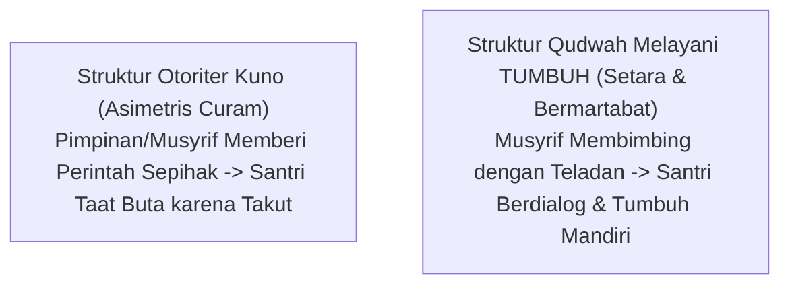

# SUB-BAB 4.1: DEKONSTRUKSI RELASI KUASA ASIMETRIS
## *Membedah Struktur Otoritarianisme Pesantren dan Dampak Destruktifnya terhadap Kemandirian Santri*

**Kode Modul**: `BOOK-01/BAB-04/SUB-01`  
**Kategori**: Sosiologi Lembaga Islam  
**Fokus Keilmuan**: Analisis Relasi Kuasa & Tata Kelola Kelembagaan Pesantren

---

### 1. Struktur Relasi Kuasa Asimetris
Feodalisme pesantren terbentuk ketika jarak kekuasaan (*power distance*) antara pimpinan, musyrif, dan santri dibuat terlampau curam. Dalam kultur otoriter semacam ini:
* Santri diposisikan semata-mata sebagai objek yang tidak berhak memiliki suara (*voiceless*).
* Segala instruksi dipaksakan tanpa ruang dialog dan tanpa penjelasan tujuan pedagogis.
* Kritik atau masukan dianggap sebagai tindakan lancang yang membatalkan keberkahan ilmu.

---

### 2. Dampak Kerusakan Karakter Santri Akibat Otoritarianisme
1. **Sindrom Ketidakberdayaan yang Dipelajari (*Learned Helplessness*)**: Santri kehilangan inisiatif dan menjadi pasif, selalu menunggu disuruh, dan tidak mampu mengambil keputusan mandiri saat terjun ke masyarakat.
2. **Karakter Munafik Sosial**: Santri belajar berpura-pura alim di depan pembina namun melanggar aturan secara ekstrem saat tidak ada pengawasan.
3. **Penghambatan Nalar Kritis (*Critical Thinking Suppression*)**: Budaya membungkam pertanyaan melahirkan santri yang dogmatis dan rentan terpapar paham ekstremisme di kemudian hari.
