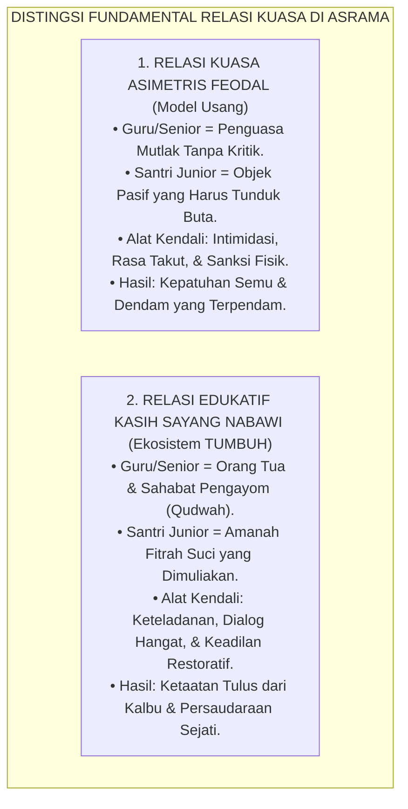
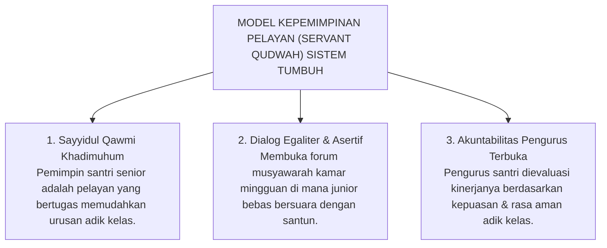

# SUB-BAB 4.1: DEKONSTRUKSI RELASI KUASA ASIMETRIS
## *Membongkar Hegemoni Otoriter, Normalisasi Rasa Takut, dan Rekonstruksi Relasi Edukatif Berbasis Kasih Sayang Nabawi*

**Kode Klasifikasi**: `BOOK-01/BAB-04/SUB-01/MONOGRAF-MASTER-VIBRANT`  
**Disiplin Ilmu**: Sosiologi Pendidikan Kritis, Hermeneutika Kuasa Michel Foucault, & Etika Kepemimpinan Islam  
**Penanggung Jawab Keilmuan**: Dewan Pakar Ekosistem TUMBUH (*Master Author, Pakar Tata Kelola Qudwah, & Pakar Filosofi TUMBUH*)

---

### Ilusi Ketundukan di Bawah Bayang-Bayang Otoriter

Di sebagian pesantren tradisional, kita kerap menjumpai pemandangan yang sekilas tampak sangat menakjubkan:

Ratusan santri berjalan membungkuk hampir sembilan puluh derajat saat berpapasan dengan seniornya, menundukkan pandangan tanpa berani menatap mata, dan berbisik dengan suara gemetar. Para pengurus tersenyum bangga dan mengklaim: *"Lihatlah, betapa tingginya adab dan rasa takzim santri-santri kami!"*

Namun, Ketika kita mengamati lebih dekat dan berbicara dari hati ke hati dengan para santri, sebuah kenyataan getir terungkap: **sikap menunduk itu bukanlah buah dari rasa hormat yang tulus (*Ihtiram*), melainkan ekspresi dari rasa takut yang mencekam (*Terror-Driven Submission*)**.

Santri menunduk bukan karena hatinya memuliakan guru atau senior, melainkan karena takut ditampar, takut dibentak di depan umum, atau takut dihakimi di sidang malam.

<b>Gambar 4.1.1:</b> Perbandingan Relasi Kuasa Asimetris Feodal vs Relasi Edukatif Nabawi dalam Ekosistem TUMBUH.

---

### Membongkar Hegemoni Kuasa: Ketika Jabatan Menjadi Alat Penindasan

Filsuf sosiologi kritis **Michel Foucault**[^1] membongkar bahwa di dalam institusi tertutup, kekuasaan (*power*) sering kali bekerja secara terselubung melalui pendisiplinan tubuh yang represif (*disciplinary power*). 

Di pesantren, relasi kuasa asimetris terjadi Ketika santri senior atau pengurus asrama menyalahgunakan jubah "penegak disiplin" untuk melampiaskan ego kekuasaan:
* Menghukum adik kelas semata-mata demi kepuasan gengsi pribadi.
* Membuat aturan-aturan konyol yang tidak ada dasarnya dalam syariat (seperti larangan memakai baju warna tertentu bagi junior).
* Mengembangkan budaya anti-kritik: siapa pun yang bertanya dianggap "tidak sopan" atau "kurang ajar".

Budaya hegemoni ini merusak mentalitas santri: anak-anak kita dididik menjadi **manusia berjiwa budak (*slave mentality*)** yang hanya berani tunduk saat ada penguasa di hadapannya, namun akan berubah menjadi penindas yang kejam Ketika kelak memegang kekuasaan!

---

### Teladan Agung Rasulullah SAW: Meruntuhkan Kasta dan Feodalisme

Rasulullah SAW—manusia paling mulia di muka bumi—sepanjang hayatnya **meruntuhkan segala bentuk feodalisme dan relasi kuasa yang menindas**.

Ketika seorang lelaki datang menghadap Rasulullah SAW dengan tubuh gemetar ketakutan karena mengira beliau adalah raja yang kejam, Rasulullah SAW langsung tersenyum hangat, menepuk pundaknya, dan bersabda dengan penuh kelembutan:

> [!NOTE]
> ### 📜 Kelembutan Agung Rasulullah SAW Meruntuhkan Sikap Feodal:
> 
> $$\text{هَوِّنْ عَلَيْكَ، فَإِنِّي لَسْتُ بِمَلِكٍ، إِنَّمَا أَنَا ابْنُ امْرَأَةٍ مِنْ قُرَيْشٍ كَانَتْ تَأْكُلُ الْقَدِيدَ بِمَكَّةَ}$$
> 
> **Artinya:**  
> *"Tenangkanlah dirimu dan jangan gemetar! Sesungguhnya aku ini bukanlah seorang raja yang kejam. Aku ini hanyalah putra dari seorang wanita Quraisy sederhana yang biasa memakan dendeng kering di kota Makkah."*  
> *(HR. Ibnu Majah no. 3312 dan Al-Hakim dalam Al-Mustadrak no. 4366).*

Rasulullah SAW duduk sejajar dengan para sahabatnya di atas tanah, makan bersama para pelayan, dan tidak pernah membiarkan para sahabat berdiri mengagungkan beliau layaknya perlakuan terhadap raja-raja Romawi dan Persia yang zalim.

---

### Solusi Sistemik TUMBUH: Transformasi Menjadi Servant Qudwah Leadership

Ekosistem **TUMBUH** merekonstruksi tata kelola kepemimpinan asrama melalui **Model Kepemimpinan Pelayan (*Servant Qudwah Leadership*)**:

<b>Gambar 4.1.2:</b> Tiga Pilar Model Kepemimpinan Pelayan (Servant Qudwah Leadership) Ekosistem TUMBUH.

Penerapan di pesantren:
1. **Senior sebagai Pelayan**: Doktrin feodal diganti dengan sabda Nabi: *"Pemimpin suatu kaum adalah pelayan bagi mereka"* (*Sayyidul Qawmi Khadimuhum*). Senior bertugas membimbing hafalan dan membantu adik kelas yang kesulitan.
2. **Forum Lingkaran Asrama**: Menggelar musyawarah kamar mingguan (*Dormitory Circle*) di mana setiap santri memiliki hak bicara yang sama untuk menyampaikan aspirasi.
3. **Penilaian Berbasis Pelayanan**: Prestasi santri senior diukur dari seberapa banyak adik kelas yang merasa aman, terbimbing, dan bahagia di bawah pengasuhannya.

---

### Sintesis Sosiologis Sub-Bab 4.1

Pesantren didirikan untuk mencetak kesatria umat yang berjiwa merdeka dan bertauhid murni, bukan pabrik pembudakan mental.

Dengan mendekonstruksi relasi kuasa asimetris dan menggantinya dengan Kepemimpinan Pengayom Nabawi, Sistem TUMBUH mengembalikan martabat kemanusiaan santri, melahirkan kader pemimpin yang berwibawa karena keteladanannya, bukan karena ancaman rasa takut.

---

## 📌 Catatan Kaki & Rujukan Primer

[^1]: **Michel Foucault**, *Discipline and Punish: The Birth of the Prison*, Terjemahan Alan Sheridan (New York: Vintage Books, 1977), Bab 2: "The Means of Correct Training", hlm. 170–194.
[^2]: **Robert K. Greenleaf**, *Servant Leadership: A Journey into the Nature of Legitimate Power and Greatness* (New York: Paulist Press, 1977), hlm. 1–48.
