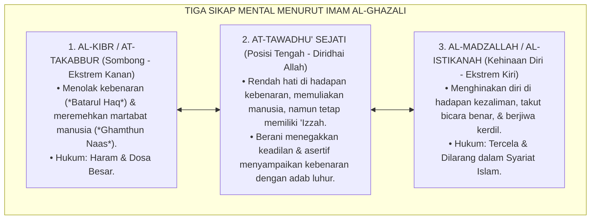
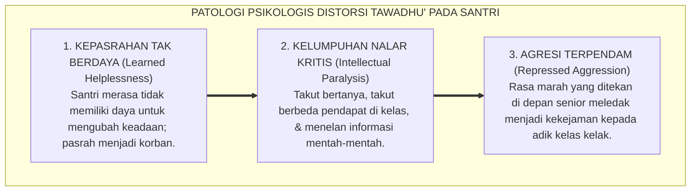
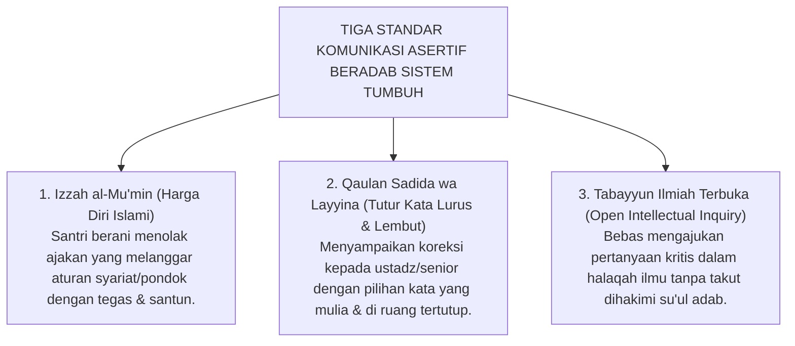

# SUB-BAB 4.2: DISTORSI TAWADHU' & IHTIRAM
## *Meluruskan Salah Kaprah Konsep Kerendahan Hati: Membedakan Tawadhu' Sejati dari Mentalitas Kehinaan Diri yang Tercela*

**Kode Klasifikasi**: `BOOK-01/BAB-04/SUB-02/MONOGRAF-MASTER-VIBRANT`  
**Disiplin Ilmu**: Tasawuf Akhlaqi Klasik, Psikologi Kepribadian Remaja, & Komunikasi Asertif Islami  
**Penanggung Jawab Keilmuan**: Dewan Pakar Ekosistem TUMBUH (*Master Author, Pakar Epistemologi Turats, & Pakar Filosofi TUMBUH*)

---

> [!IMPORTANT]
> ### 📌 Batasan Syar'i Mutlak: Ihtiram kepada Masyaikh adalah Fardhu Adab!
> Ekosistem **TUMBUH** menegaskan garis batas yang sangat jernih: **Rasa hormat, takzim, dan tawadhu' yang tulus kepada para Kiai, Habaib, Masyaikh, dan Dewan Asatidz yang alim adalah Fardhu Adab (*Kewajiban Pokok*) penuntut ilmu yang menjadi kunci terbukanya pintu keberkahan ilmu dan futuhaniyyah**.
> 
> Kritik yang diangkat dalam bab ini **sama sekali tidak ditujukan untuk mengurangi rasa takzim santri kepada guru mulianya**, melainkan secara khusus membongkar **penyalahgunaan wewenang senioritas antar-sesama santri di asrama**, di mana oknum santri senior memaksakan ketundukan buta layaknya raja feodal kepada adik kelasnya.

Salah satu distorsi konsep adab yang paling berbahaya dan kerap disalahpahami di dunia pesantren adalah **kerancuan antara Tawadhu' (Kerendahan Hati Sejati) dan Madzallah/Istikanah (Kehinaan Diri yang Tercela)**.

Perhatikan fenomena yang sering kita jumpai:
Seorang santri yang cerdas, memiliki nalar kritis, dan melihat adanya ketidakadilan nyata di depan matanya (misalnya: temannya dipukuli tanpa bukti oleh oknum pengurus), memilih diam membisu, tidak berani berbicara, dan menundukkan kepala. Ketika ditanya mengapa ia tidak berani menyampaikan kebenaran secara santun kepada dewan guru, ia menjawab: *"Saya ingin menjaga adab tawadhu' dan takut dicap su'ul adab kepada senior..."*

Apakah ini yang dimaksud dengan tawadhu' dalam Islam? **Sama sekali bukan!**

Ini bukanlah tawadhu', melainkan **Kepengecutan Moral (*Moral Cowardice*) dan Kehinaan Diri (*Madzallah*)** yang dibungkus secara keliru dengan label kesalehan semu.

<b>Gambar 4.2.1:</b> Spektrum Tiga Sikap Mental Al-Ghazali: Kibr vs Tawadhu' vs Madzallah.

---

### Tinjauan Turats: Imam Al-Ghazali tentang Batas Antara Tawadhu' dan Madzallah

Hujjatul Islam **Imam Abu Hamid Al-Ghazali** dalam mahakaryanya *Ihya' 'Ulumiddin* (Kitab Kasr asy-Syahwatayn wa Riyadhatin Nafs)[^1] meletakkan pembedaan yang sangat tegas dan jernih:

> [!NOTE]
> ### 📜 Syarah Tajam Imam Al-Ghazali tentang Tawadhu' vs Kehinaan Diri:
> 
> $$\text{إِنَّ التَّوَاضُعَ مَحْمُودٌ، وَهُوَ الْوَسَطُ بَيْنَ الْكِبْرِ وَالْمَذَلَّةِ، فَأَمَّا التَّكَبُّرُ فَهُوَ أَنْ يَرَى نَفْسَهُ فَوْقَ غَيْرِهِ، وَأَمَّا التَّخَاشُعُ وَالْمَذَلَّةُ فَهُوَ أَنْ يُسْقِطَ نَفْسَهُ وَيَرْضَى بِالدَّنِيَّةِ فِي دِينِهِ وَعِرْضِهِ، وَكِلَاهُمَا مَذْمُومٌ، وَالْمَحْمُودُ هُوَ الْعَدْلُ وَهُوَ التَّوَاضُعُ مَعَ حِفْظِ الْعِزَّةِ}$$
> 
> **Artinya:**  
> *"Ketahuilah, sesungguhnya **Tawadhu' adalah sifat yang terpuji, yaitu posisi tengah yang adil di antara sifat Sombong (*Kibr*) dan sifat Hina Diri (*Madzallah*)**. Adapun sombong adalah memandang dirinya lebih mulia dari orang lain. Sedangkan menghinakan diri (*Madzallah*) adalah merendahkan martabat jiwanya hingga rela diinjak-injak kehormatan dan agamanya. **Kedua sikap ekstrem itu sama-sama tercela! Dan yang terpuji adalah sikap Tawadhu' yang senantiasa disertai dengan penjagaan kemuliaan martabat jiwa ('Izzah al-Mu'min)**."*

Rasulullah SAW bersabda dengan sangat tegas melarang seorang mukmin menghinakan dirinya sendiri:
$$\text{لَا يَنْبَغِي لِلْمُؤْمِنِ أَنْ يُذِلَّ نَفْسَهُ، قَالُوا: وَكَيْفَ يُذِلُّ نَفْسَهُ؟ قَالَ: يَتَعَرَّضُ مِنَ الْبَلَاءِ لِمَا لَا يُطِيقُ}$$
*"Tidak pantas dan tidak boleh bagi seorang mukmin untuk menghinakan dirinya sendiri! Para sahabat bertanya: 'Bagaimana ia menghinakan dirinya sendiri wahai Rasulullah?' Beliau menjawab: 'Ia membiarkan dirinya diinjak-injak dan menerima perlakuan zalim yang meruntuhkan kehormatannya!'"* (HR. At-Tirmidzi no. 2254 dan Ahmad no. 23376).

---

### Dampak Psikologis Distorsi Tawadhu': Lahirnya Mentalitas Pengecut

Tatkala seorang santri sejak usia belia dicekoki pemahaman keliru bahwa *"tawadhu' berarti tidak boleh membantah senior meski disuruh berbuat salah"*, dampaknya sangat merusak psikologis anak:

<b>Gambar 4.2.2:</b> Tiga Tahap Kerusakan Psikologis Akibat Distorsi Konsep Tawadhu'.

1. **Kepasrahan Tak Berdaya (*Learned Helplessness*)**[^2]: Santri kehilangan inisiatif hidup, menjadi peragu (*indecisive*), dan tidak memiliki keberanian untuk mengambil keputusan penting.
2. **Kelumpuhan Intelektual**: Santri tidak berani berdiskusi kritis dalam majelis bahtsul masail karena takut dianggap *"sok pintar"*, mematikan daya kreativitas ilmiah yang sejatinya menjadi tradisi keemasan ulama salaf.
3. **Agresi Terpendam**: Amarah dan rasa terhina yang dipendam bertahun-tahun di alam bawah sadar meledak menjadi dendam kesumat tatkala anak tersebut naik kelas menjadi pengurus asrama.

---

### Solusi Sistemik TUMBUH: Membiasakan Sikap Asertif Beradab (*Adab al-Hiwar*)

Ekosistem TUMBUH merekonstruksi konsep tawadhu' dan melatih seluruh santri memiliki keterampilan **Komunikasi Asertif Beradab (*Adab al-Hiwar wal Munadharah*)**:

<b>Gambar 4.2.3:</b> Tiga Standar Komunikasi Asertif Beradab Ekosistem TUMBUH.

Penerapan nyata di pesantren:
* **Santri dilatih berani berkata "Tidak"**: Jika ada oknum senior yang menyuruh santri junior mencuci pakaian pribadinya atau membelikan makanan di luar jam izin, santri junior dilatih menjawab dengan asertif dan tenang: *"Afwan Akhi, menurut SOP asrama setiap santri bertanggung jawab atas pakaian pribadinya masing-masing, dan saya harus fokus muroja'ah hafalan Qur'an."*
* **Kritik Konstruktif yang Beradab**: Lembaga menyediakan kotak saran musyrif dan forum dialog terbuka di mana santri dapat memberikan masukan kepada dewan asatidz secara terhormat tanpa rasa takut dikriminalisasi.

Islam tidak pernah membutuhkan generasi penakut yang menunduk dalam kepalsuan. Islam merindukan generasi santri yang berhati tawadhu' seluas samudera, berjiwa ksatria, memiliki kemuliaan martabat (*'Izzah*), dan berani menyuarakan kebenaran demi tegaknya keadilan di muka bumi.

---

## 📌 Catatan Kaki & Rujukan Primer

[^1]: **Hujjatul Islam Imam Abu Hamid al-Ghazali**, *Ihya' 'Ulumiddin*, Kitab Kasr asy-Syahwatayn wa Riyadhatin Nafs (Beirut: Dar al-Ma'rifah, t.th.), Jilid III, hlm. 340–348.
[^2]: **Martin E. P. Seligman**, *Helplessness: On Depression, Development, and Death* (San Francisco: W. H. Freeman, 1975), hlm. 21–68.
