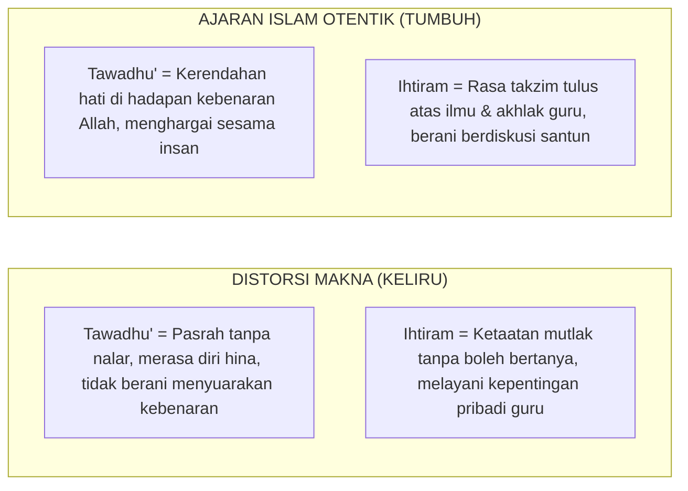

# SUB-BAB 4.2: DISTORSI TAWADHU' & IHTIRAM
## *Membedakan Kerendahan Hati yang Luhur (Tawadhu' Hakiki) dari Mentalitas Budak (Inferiority Complex)*

**Kode Modul**: `BOOK-01/BAB-04/SUB-02`  
**Kategori**: Kritik Terminologi Adab  
**Fokus Keilmuan**: Etika Islam & Psikologi Kepribadian

---

### 1. Pembelokan Makna Nilai Luhur
Nilai *tawadhu'* (rendah hati) dan *ihtiram* (menghormati guru) adalah pilar mulia dalam khazanah Islam. Namun, dalam banyak kasus, kedua nilai ini mengalami distorsi makna:

---

### 2. Teladan Rasulullah SAW dan Para Sahabat
Rasulullah SAW adalah manusia paling mulia namun paling tawadhu'. Beliau tidak pernah membiarkan para sahabat memperlakukan beliau layaknya raja-raja Romawi atau Persia. Sahabat bebas mengemukakan pendapat dalam urusan strategi (sebagaimana usulan Salman al-Farisi dalam Perang Khandaq atau Hubab bin Mundzir dalam Perang Badar).

Pendidikan adab pesantren sejati harus menumbuhkan santri yang **beradab tinggi sekaligus memiliki kemuliaan diri (*'Izzah*)**, bukan santri yang kerdil jiwanya dan memiliki mentalitas budak.
