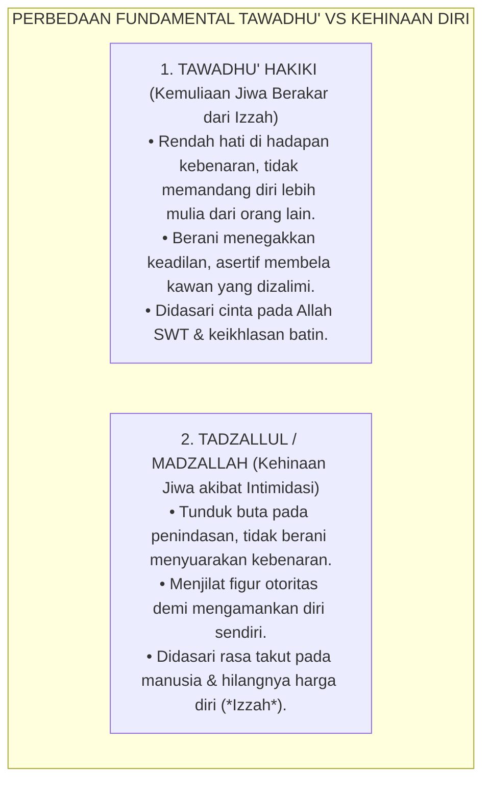
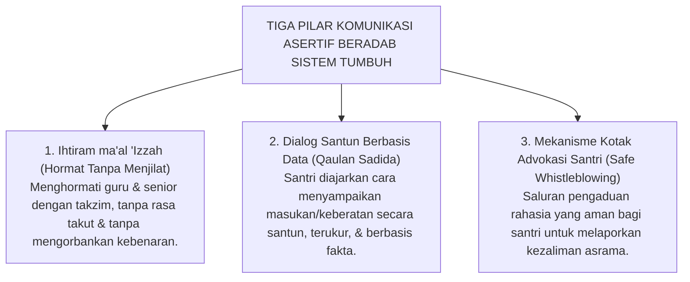

# SUB-BAB 4.2: DISTORSI TAWADHU' & IHTIRAM
## *Meluruskan Salah Kaprah Kerendahan Hati, Membedakan Tawadhu' Hakiki vs Ketundukan Hina, dan Membangun Karakter Izzah Santri*

**Kode Klasifikasi**: `BOOK-01/BAB-04/SUB-02/MONOGRAF-MASTER-VIBRANT`  
**Disiplin Ilmu**: Etika Tasawuf (*Akhlaq wa Adab*), Psikologi Kepribadian Asertif, & Epistemologi Turats  
**Penanggung Jawab Keilmuan**: Dewan Pakar Ekosistem TUMBUH (*Master Author, Pakar Filosofi TUMBUH, & Pakar Epistemologi Turats*)

---

### Jebakan Salah Kaprah Memaknai Kerendahan Hati

Salah satu distorsi akhlak yang paling merusak di sebagian lingkungan pesantren adalah **salah paham dalam memaknai konsep *Tawadhu'* (kerendahan hati) dan *Ihtiram* (penghormatan)**.

Sering kali, seorang santri yang pasif, pendiam, tidak berani mengemukakan pendapat, dan selalu mengiyakan apa pun perkataan seniornya—meskipun perkataan itu jelas-jelas salah atau menzalimi orang lain—langsung dipuji sebagai santri yang *"sangat tawadhu' dan beradab"*.

Sebaliknya, santri yang kritis, berani bertanya secara santun saat ada ketidakadilan, atau berinisiatif memberikan masukan konstruktif, justru dicap sebagai anak yang *"sombong"*, *"tidak punya adab"*, atau *"su'ul adab"*.

Ini adalah pembalikan nilai yang sangat berbahaya. Sikap diam dan pasrah karena takut bukanlah *Tawadhu'*, melainkan **Kehinaan Jiwa (*Tadzallul / Madzallah*)** yang dilarang keras oleh syariat Islam!

<b>Gambar 4.2.1:</b> Perbandingan Hakiki antara Sikap Tawadhu' Islami vs Kehinaan Diri (*Tadzallul*).

---

### Tinjauan Turats: Imam Al-Ghazali tentang Batas Antara Tawadhu' dan Kehinaan

Hujjatul Islam **Imam Abu Hamid Al-Ghazali** dalam *Ihya 'Ulumiddin* (Kitab *Dzammi al-Kibr wat-Ta'azzuz*)[^1] telah meletakkan batas garis pemisah yang sangat tegas antara kemuliaan tawadhu' dan kehinaan tadzallul:

> [!NOTE]
> ### 📜 Kaidah Emas Imam Al-Ghazali tentang Tawadhu' Hakiki:
> 
> $$\text{التَّوَاضُعُ مَحْمُودٌ، وَهُوَ الْوَسَطُ بَيْنَ الْكِبْرِ وَالْمَذَلَّةِ. فَالْكِبْرُ هُوَ رُؤْيَةُ النَّفْسِ فَوْقَ الْغَيْرِ وَاسْتِحْقَارُهُ، وَالْمَذَلَّةُ هِيَ وَضْعُ النَّفْسِ فِي مَوْضِعٍ تُمْتَهَنُ فِيهِ وَتُضَيَّعُ فِيهِ الْحُقُوقُ خَوْفًا مِنَ النَّاسِ، وَأَمَّا التَّوَاضُعُ فَهُوَ خَفْضُ الْجَنَاحِ لِلْمُؤْمِنِينَ إِعْزَازًا لِدِينِ اللَّهِ مَعَ حِفْظِ الْكَرَامَةِ}$$
> 
> **Artinya:**  
> *"Tawadhu' adalah sifat terpuji yang berada tepat di tengah-tengah **antara Kesombongan (*Kibr*) dan Kehinaan Diri (*Madzallah*)**.*  
> *Sombong adalah memandang diri lebih tinggi dari orang lain dan meremehkan mereka. Kehinaan diri adalah menempatkan diri pada posisi diinjak-injak martabatnya dan diabaikan hak-haknya semata-mata karena takut pada manusia.*  
> *Adapun **Tawadhu' sejati adalah bersikap lembut kepada orang beriman demi memuliakan agama Allah, sembari tetap menjaga harga diri dan martabat kehormatannya (*Hifzhul Karamah*)**."*

Islam menginginkan santri yang memiliki **Izzatul Mukmin (Wibawa dan Harga Diri Mukmin)**: yaitu santri yang berhati emas, santun dan rendah hati saat menyapa siapa pun, namun memiliki ketegasan moral baja dan tidak sudi diinjak-injak kehormatannya oleh tradisi kezaliman.

---

### Dampak Psikologis Distorsi Tawadhu': Lahirnya Mentalitas Pengecut

Ketika kepasifan dan ketundukan buta terus-menerus didoktrinasi sebagai "adab", santri akan mengalami kerusakan psikologis yang parah:
1. **Lahirnya Sikap Apatis (*Bystander Effect*)**: Santri yang melihat temannya dipukul atau dibully di asrama memilih diam membisu dan pura-pura tidak tahu dengan dalih *"tidak mau ikut campur agar tetap tawadhu'"*.
2. **Kemandulan Intelektual (*Impotent Intellect*)**: Santri menjadi takut mengemukakan ide-ide kreatif atau mempertanyakan kesalahan logika senior karena takut dicap lancang.
3. **Sindrom Kepribadian Ganda**: Santri yang sangat tunduk di depan senior akan melampiaskan rasa tertindasnya dengan menjadi sosok penindas yang sangat bengis Ketika ia sendiri naik menjadi senior.

---

### Solusi Sistemik TUMBUH: Membiasakan Sikap Asertif Beradab (*Adab al-Hiwar*)

Ekosistem **TUMBUH** mengajarkan bahwa **menyampaikan kebenaran secara santun adalah puncak tertinggi dari adab**. Sistem TUMBUH melatih seluruh santri memiliki keterampilan **Komunikasi Asertif Beradab (*Adab al-Hiwar*)**:

<b>Gambar 4.2.2:</b> Tiga Pilar Komunikasi Asertif Beradab Ekosistem TUMBUH.

Penerapan di pesantren:
* Santri dilatih menggunakan kalimat asertif: *"Mohon izin Ustadz/Akhi, afwan jika ada kekhilafan, namun berdasarkan aturan asrama pasal sekian..."*
* Disediakan **Kotak Advokasi & Aduan Rahasia Santri** yang dipantau langsung oleh Dewan Kiai dan Pengasuh, menjamin setiap santri terlindungi dari intimidasi saat menyuarakan kebenaran.

---

### Sintesis Etis Sub-Bab 4.2

Tawadhu' sejati tidak pernah melahirkan jiwa pengecut, melainkan melahirkan pahlawan peradaban yang berakhlak mulia.

Dengan meluruskan makna Tawadhu' dan Ihtiram, Sistem TUMBUH mencetak generasi santri yang santun pekertinya, lembut tutur katanya, namun kokoh wibawanya dan berani berdiri di garda terdepan menegakkan keadilan di tengah umat.

---

## 📌 Catatan Kaki & Rujukan Primer

[^1]: **Hujjatul Islam Imam Abu Hamid al-Ghazali**, *Ihya' 'Ulumiddin*, Kitab Dzammil Kibri wal 'Ujb (Kairo & Beirut: Dar al-Ma'rifah, t.th.), Jilid III, hlm. 338–345.
[^2]: **Al-Imam Ibn Qudamah al-Maqdisi**, *Mukhtashar Minhaj al-Qashidin*, Tahqiq: Zuhair asy-Syawisy (Damaskus & Beirut: Al-Maktab al-Islami, 1419 H), hlm. 215–220.
