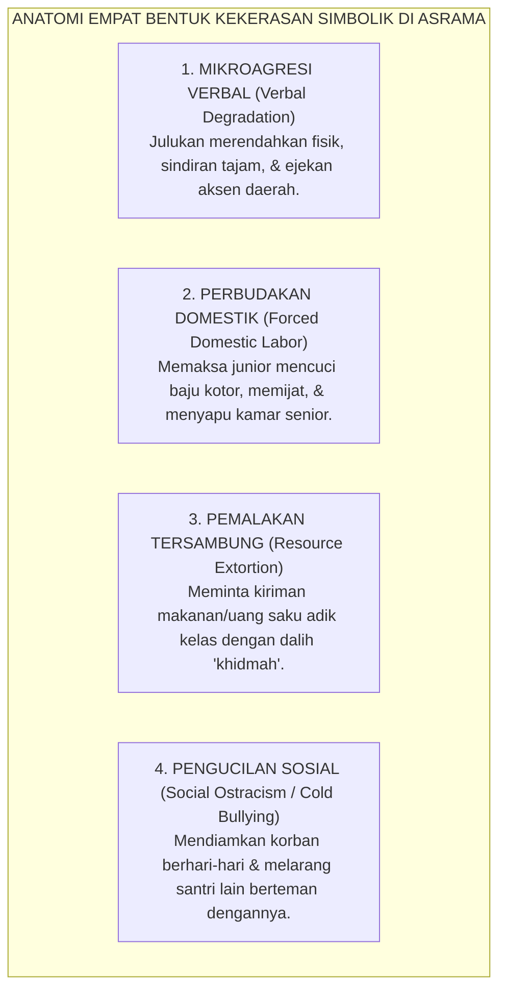
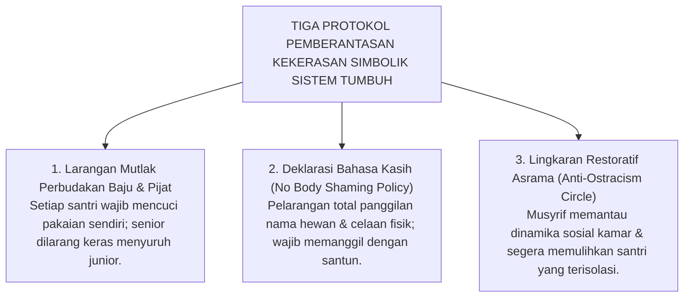

# SUB-BAB 4.3: KEKERASAN SIMBOLIK & PERPELONCOAN SENIORITAS
## *Membongkar Mikroagresi Tak Kasat Mata, Teori Kekerasan Simbolik Pierre Bourdieu, dan Dekonstruksi Tradisi Penindasan Asrama*

**Kode Klasifikasi**: `BOOK-01/BAB-04/SUB-03/MONOGRAF-MASTER-VIBRANT`  
**Disiplin Ilmu**: Sosiologi Kritis Pendidikan, Psikologi Perundungan (*Anti-Bullying*), & Teori Kekerasan Simbolik  
**Penanggung Jawab Keilmuan**: Dewan Pakar Ekosistem TUMBUH (*Master Author, Pakar Perlindungan Anak, & Pakar Psikologi Sosial Santri*)

---

### Luka Batin di Balik Candaan Kasar Asrama

Kekerasan di lingkungan pesantren tidak selalu berwujud pukulan rotan atau tamparan fisik yang membekas merah di pipi. 

Kerap kali, kekerasan menyusup dalam bentuk yang jauh lebih halus, tidak berdarah, namun **meremukkan martabat dan jiwa anak secara perlahan**:
* Memberikan julukan nama-nama hewan atau celaan fisik (*body shaming*) kepada adik kelas yang bertubuh gemuk atau pendek.
* Memaksa santri junior mencuci pakaian kotor senior atau memijat kaki senior hingga larut malam dengan dalih "ngalap berkah khidmah".
* Mengambil jatah lauk makan atau kiriman uang saku junior secara paksa (*palak halus*).
* Menyembunyikan kitab atau barang pribadi santri baru untuk dijadikan bahan tertawaan bersama di kamar.

Ketika korban menangis atau mengadu, para pelaku penindas membela diri dengan enteng: *"Ah, ustadz, kami cuma bercanda kok! Mereka saja yang baperan dan lembek!"*

Sosiolog Prancis **Pierre Bourdieu**[^1] menyebut fenomena beracun ini sebagai **Kekerasan Simbolik (*Symbolic Violence*)**: yaitu bentuk penindasan tak kasat mata di mana korban dipaksa menerima dominasi pelaku sebagai sesuatu yang "wajar dan alami", hingga korban akhirnya menyalahkan dirinya sendiri atas penderitaan yang ia alami.

<b>Gambar 4.3.1:</b> Empat Bentuk Kekerasan Simbolik dan Perundungan Non-Fisik di Asrama Pesantren.

---

### Dekonstruksi Istilah "Khidmah": Membedakan Kebaktian Ikhlas vs Perbudakan Senior

Banyak santri senior membungkus tindakan penindasannya dengan kata suci dalam tradisi pesantren: **"Khidmah"** (pelayanan dan pengabdian).

Mari kita luruskan konsep ini secara syar'i dan tegas:

| Dimensi | Khidmah Syar'i Hakiki (Luhur & Berkah) | Perbudakan Senioritas (Kezaliman Berdosa) |
| :--- | :--- | :--- |
| **Penerima Pelayanan** | Membantu kiai sepuh, guru, atau santri yang sedang sakit/kesulitan. | Melayani santri senior yang sehat bugar demi kepentingan pribadinya. |
| **Sifat Tindakan** | Sukarela, tulus dari hati, tanpa ada paksaan atau ancaman. | Dipaksa dengan ancaman intimidasi, bentakan, atau sanksi fisik. |
| **Dampak Ruhani** | Mendatangkan ketenangan batin, keberkahan ilmu, dan cinta Allah. | Menimbulkan rasa tertekan, dendam batin, dan kelelahan fisik santri. |

> [!CAUTION]
> ### ⚠️ Batas Tegas:
> Memaksa santri yunior mencuci pakaian kotor senior yang bertubuh bugar **bukanlah khidmah, melainkan pemerasan tenaga dan kezaliman nyata** yang diharamkan oleh syariat Islam!

---

### Dampak Neurobiologis & Psikologis: Mengapa Korban Menjadi Pendiam dan Apatis?

Riset psikologi perkembangan[^2] membuktikan bahwa paparan mikroagresi dan pengucilan sosial (*Social Ostracism*) mengaktifkan area otak yang sama persis dengan rasa sakit fisik akibat dipukul (**Korteks Singulat Anterior Dorsal / dACC**).

Bagi otak anak, **diejek dan dikucilkan oleh kawan sekamarnya dirasakan sama menyakitkannya dengan ditusuk pisau secara fisik!**

Akibat jangka panjang pada korban:
* **Hilangnya Kepercayaan Diri (*Erosion of Self-Efficacy*)**: Santri merasa dirinya tidak berharga, minder, dan menarik diri dari pergaulan asrama.
* **Penurunan Prestasi Belajar Tajam**: Konsentrasi belajar hancur karena energi otak terkuras habis untuk mengantisipasi ejekan dan teror kawan sekamarnya.
* **Pemicu Depresi & Putus Sekolah**: Korban merasa tidak ada tempat aman di pondok, hingga akhirnya meminta pindah atau kabur dari pesantren.

---

### Solusi Sistemik TUMBUH: Protokol Toleransi Nol Mikroagresi (*Zero Tolerance*)

Ekosistem **TUMBUH** memberantas kekerasan simbolik melalui **Tiga Protokol Perlindungan Santri**:

<b>Gambar 4.3.2:</b> Tiga Protokol Pemberantasan Kekerasan Simbolik Ekosistem TUMBUH.

---

### Sintesis Kultural Sub-Bab 4.3

Kehormatan seorang mukmin lebih mulia di sisi Allah daripada kemuliaan Ka'bah. Menjaga perasaan dan martabat adik kelas adalah kewajiban adab yang mutlak.

Dengan menghapus seluruh bentuk kekerasan simbolik dan perpeloncoan berkedok khidmah, Sistem TUMBUH menjadikan asrama pesantren sebagai oase persaudaraan sejati yang aman, hangat, dan memuliakan fitrah setiap santri.

---

## 📌 Catatan Kaki & Rujukan Primer

[^1]: **Pierre Bourdieu & Jean-Claude Passeron**, *Reproduction in Education, Society and Culture*, Terjemahan Richard Nice (London: Sage Publications, 1977), Bab 1: "Cultural Capital and Pedagogic Communication", hlm. 1–68.
[^2]: **Naomi I. Eisenberger et al.**, "Does rejection hurt? An fMRI study of social exclusion", *Science*, Vol. 302, No. 5643 (2003), hlm. 290–292.
