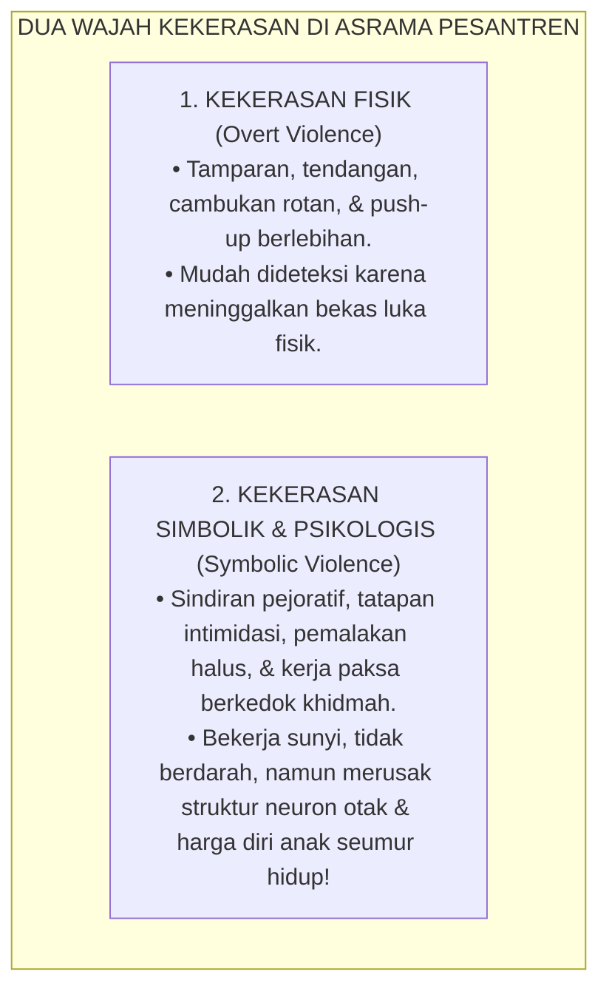
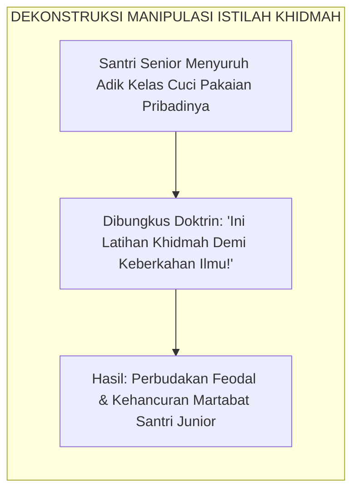
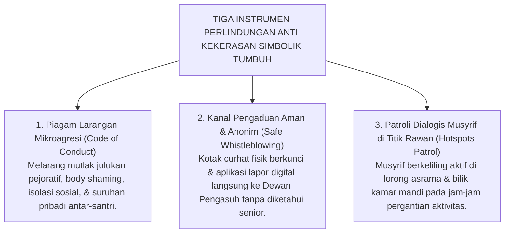

# SUB-BAB 4.3: KEKERASAN SIMBOLIK & PERPELONCOAN SENIORITAS
## *Analisis Sosiologi Pierre Bourdieu, Dekonstruksi Istilah "Khidmah", dan Protokol Toleransi Nol Perundungan Halus*

**Kode Klasifikasi**: `BOOK-01/BAB-04/SUB-03/MONOGRAF-MASTER-VIBRANT`  
**Disiplin Ilmu**: Sosiologi Kritis Pierre Bourdieu, Viktimologi Pesantren, & Protokol Anti-Bullying  
**Penanggung Jawab Keilmuan**: Dewan Pakar Ekosistem TUMBUH (*Master Author, Pakar Perlindungan Anak, & Pakar Sosiologi Santri*)

---

### Kekerasan yang Tak Berdarah Namun Mematikan Jiwa

Tatkala kita berbicara tentang kekerasan di pesantren, perhatian publik kerap kali hanya tersita pada insiden pemukulan fisik yang meninggalkan luka lebam berdarah atau membawa korban ke rumah sakit.

Namun, di balik dinding-dinding asrama, sesungguhnya berlangsung sebuah bentuk kekerasan lain yang jauh lebih licin, tersembunyi, dan beroperasi setiap hari tanpa disadari oleh pimpinan pondok: **Kekerasan Simbolik (*Symbolic Violence*) dan Perpeloncoan Halus (*Subtle Hazing*)**[^1].

Kekerasan simbolik tidak menggunakan kepalan tangan, melainkan bekerja melalui tatapan mata yang mengintimidasi, kata-kata sindiran yang merendahkan, pemaksaan kerja paksa yang dibungkus istilah suci, atau isolasi sosial yang membekukan batin korban.

<b>Gambar 4.3.1:</b> Komparasi Antara Kekerasan Fisik Terbuka vs Kekerasan Simbolik Terselubung di Asrama.

---

### Dekonstruksi Istilah "Khidmah": Membedakan Kebaktian Ikhlas vs Perbudakan Senior

Sosiolog terkemuka Prancis **Pierre Bourdieu**[^1] menjelaskan bahwa kekerasan simbolik adalah mekanisme dominasi di mana korban dipaksa untuk menerima penindasan atas dirinya sendiri sebagai sesuatu yang "wajar", "alami", dan "bernilai luhur".

Di lingkungan pesantren feodal, pembodohan massal ini kerap kali dilegitimasi melalui manipulasi istilah mulia: **"Khidmah"** (kebaktian/pelayanan):

| Dimensi | Khidmah Syar'i Sejati (Sunnah Nabawi) | Perbudakan Senior Berkedok Khidmah (Penyimpangan) |
| :--- | :--- | :--- |
| **Penerima Layanan** | Guru mulia, ulama, orang tua, atau fasilitas umum pondok. | Santri senior sekamar yang bertubuh sehat dan sebaya. |
| **Motif Tindakan** | Keikhlasan murni lillahi ta'ala demi mencari berkah ilmu. | Keterpaksaan karena takut dibentak, diintimidasi, atau dihukum. |
| **Bentuk Pekerjaan** | Membantu menyapu masjid, menyajikan teh kiai, merawat kitab. | Mencuci baju kotor senior, menyemir sepatu, membelikan rokok/makanan. |
| **Dampak Mental** | Melahirkan ketenangan jiwa dan kemuliaan adab (*Tazkiyah*). | Menghancurkan harga diri santri dan melahirkan dendam batin. |

<b>Gambar 4.3.2:</b> Alur Manipulasi Doktrin Khidmah Palsu yang Menindas Santri Junior.

Ekosistem TUMBUH menegaskan secara tegas: **Menyuruh santri junior mencuci pakaian pribadi senior, menyemir sepatu pengurus, atau membelikan makanan di luar jam tidur adalah BUKAN KHIDMAH, MELAINKAN BENTUK EKSPLOITASI FEODAL YANG HARAM DITOLERANSI!**

---

### Dampak Neurobiologis & Psikologis: Mengapa Korban Menjadi Pendiam dan Apatis?

Kekerasan simbolik yang dialami santri secara berulang-ulang (*Chronic Microaggressions*) memicu kerusakan fatal pada arsitektur biologis otaknya:

1. **Hiper-Reaktivitas Amigdala (*Hyperactive Amygdala*)**:  
   Sistem radar bahaya di otak korban terus-menerus menyala selama 24 jam penuh. Santri tidak pernah merasa aman; saat melangkah di lorong asrama, saat antre mandi, bahkan saat tidur malam, otaknya dipenuhi hormon stres kortisol dan adrenalin.
2. **Mutisme Selektif & Penarikan Diri Sosial (*Social Withdrawal*)**:  
   Korban berhenti berbicara, menghindari kontak mata, kerap mengurung diri di pojok ranjang, dan mengalami penurunan drastis dalam kemampuan menghafal Al-Qur'an (*Cognitive Impairment*).
3. **Insomnia & Gangguan Somatisasi**:  
   Santri mengalami mimpi buruk berulang, sering mengeluh sakit perut, pusing tanpa sebab medis, atau mengalami demam setiap kali menjelang jam malam asrama.

---

### Protokol Toleransi Nol Mikroagresi (*Zero Tolerance for Microaggressions*)

Ekosistem TUMBUH membangun benteng perlindungan santri yang kokoh melalui **Tiga Instrumen Pencegahan Kekerasan Simbolik**:

<b>Gambar 4.3.3:</b> Tiga Instrumen Perlindungan Anti-Kekerasan Simbolik Ekosistem TUMBUH.

* **Penegakan Kode Etik Anti-Suruhan Pribadi**: Setiap santri—termasuk ketua organisasi dan santri kelas tertinggi—wajib mencuci pakaian pribadinya sendiri dan menjaga kebersihan lokernya sendiri.
* **Kanal Pengaduan Aman (*Safe Whistleblowing Protocol*)**: Santri junior dijamin keamanannya untuk melaporkan segala bentuk intimidasi tanpa takut akan pembalasan (*retaliation*). Setiap laporan langsung ditangani oleh Musyrif Utama dan Guru Bimbingan Konseling secara rahasia.
* **Patroli Dialogis Musyrif**: Musyrif hadir menyapa santri di lorong-lorong asrama pada jam-jam rawan (menjelang maghrib dan tengah malam), memastikan tidak ada ruang gelap yang dijadikan tempat perpeloncoan.

Pesantren adalah baitullah—rumah Allah yang suci untuk menuntut ilmu syariat. 

Dengan memberantas tuntas segala bentuk kekerasan simbolik dan feodalisme senioritas, Sistem TUMBUH mengembalikan kesucian asrama pesantren sebagai taman surga persaudaraan yang menaungi setiap jiwa santri dengan kehangatan cinta, keadilan, dan kemuliaan adab nabawi.

---

## 📌 Catatan Kaki & Rujukan Primer

[^1]: **Pierre Bourdieu & Jean-Claude Passeron**, *Reproduction in Education, Society and Culture*, Terjemahan Richard Nice (London: Sage Publications, 1977; cetak ulang 1990), Bab 1: "Foundations of a Theory of Symbolic Violence", hlm. 1–68.
[^2]: **Dan Olweus**, *Bullying at School: What We Know and What We Can Do* (Oxford: Blackwell Publishing, 1993), hlm. 10–45.
