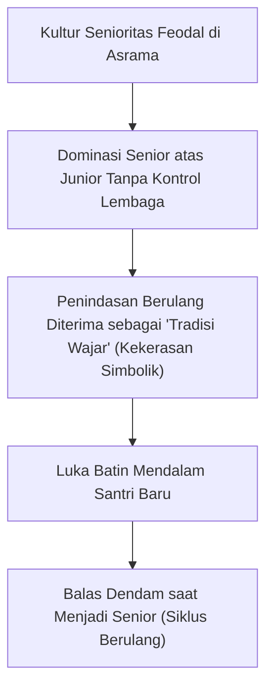

# SUB-BAB 4.3: KEKERASAN SIMBOLIK & PERPELONCOAN SENIORITAS
## *Analisis Sosiologis Penindasan Terselubung dan Pembongkaran Hierarki Feodal Antar-Santri*

**Kode Modul**: `BOOK-01/BAB-04/SUB-03`  
**Kategori**: Patologi Budaya Sebaya Pesantren  
**Fokus Keilmuan**: Sosiologi Pierre Bourdieu & Perlindungan Santri

---

### 1. Teori Kekerasan Simbolik di Pesantren
Kekerasan simbolik adalah kekerasan yang diterima oleh korban sebagai hal yang lumrah dan wajar karena adanya hegemoni budaya yang mapan. Di lingkungan pesantren berasrama, ini termanifestasi dalam bentuk:
* **Perpeloncoan Terselubung**: Mengharuskan santri baru melakukan tugas-tugas merendahkan (misal: memijat senior tanpa henti, mencucikan baju, menjadi pelayan kamar).
* **Eksklusi Sosial & Pengucilan**: Memberikan sanksi sosial berupa didiamkan (*silent treatment*) oleh seluruh angkatan jika berani melaporkan pelanggaran senior kepada pembina.

---

### 2. Tindakan Tegas Ekosistem TUMBUH
1. **Peniadaan Segala Bentuk Perpeloncoan**: Seluruh masa pengenalan lingkungan pondok (MPLP) diisi dengan pengenalan sarana, matrikulasi adab, dan permainan kebersamaan yang menyenangkan (*ice-breaking bonding*).
2. **Kanal Pengaduan Aman & Terlindungi**: Menyediakan akses bagi santri baru untuk melapor langsung ke Dewan Pengasuhan tanpa takut diintimidasi senior.
3. **Sanksi Tegas bagi Pelaku Penindasan**: Pelanggaran senioritas ditangani dengan proses restoratif dan jika berulang dikenakan sanksi skorsing pengasuhan.
