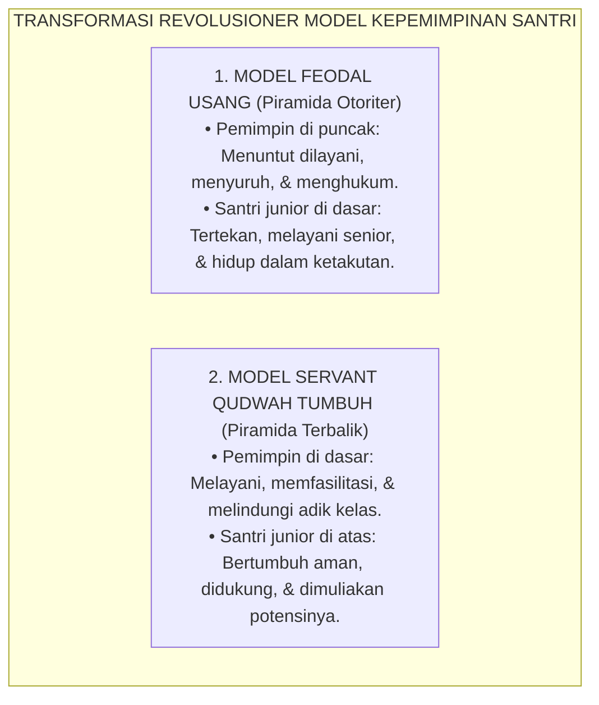
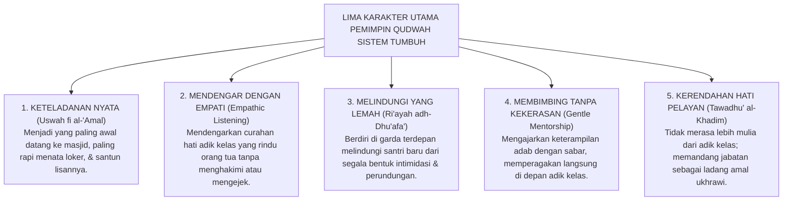
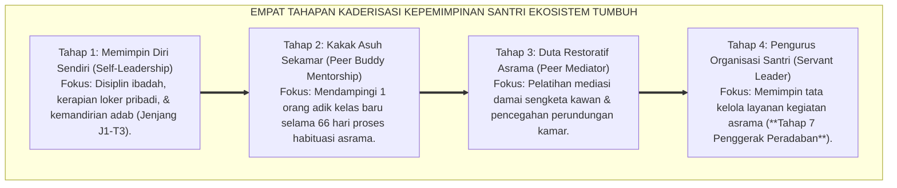

# PANDUAN PRAKTIS 4.4: MODEL SERVANT QUDWAH LEADERSHIP

**Sasaran Pengguna**: Pimpinan Pondok, Kepala Pengasuhan, Wali Kelas, & Musyrif Asrama  
**Fokus Penerapan**: Panduan Kerja Lapangan & Pembiasaan Karakter Harian Sistem TUMBUH  

---

### 🎯 Tujuan & Manfaat Panduan
Panduan ini dirancang sebagai petunjuk operasional terapan agar pendidik dan musyrif dapat:
1. Menjalankan pembinaan adab santri dengan pendekatan kasih sayang (*Rahmah*) dan ketegasan yang mendidik (*Firm & Kind*).
2. Menghindari cara-cara kekerasan fisik, bentakan verbal, maupun hukuman yang mempermalukan santri.
3. Menciptakan suasana asrama dan kelas yang aman, tertib, dan menumbuhkan kesadaran diri (*Bi'ah Shalihah*).

---

### 💡 Intisari Cepat (3 Menit Memahami Esensi)
* **Kunci Pengasuhan**: Karakter santri tumbuh melalui keteladanan nyata (*Qudwah Hasanah*), komunikasi empatik, dan pembiasaan terstruktur 24 jam.
* **Tindakan Utama**: Terapkan panduan langkah demi langkah di bawah ini secara konsisten, pantau perkembangan santri secara objektif, dan berikan apresiasi atas setiap perbaikan diri yang mereka capai.
* **Prinsip Disiplin**: Fokus pada pemulihan hubungan dan tanggung jawab nyata (*Restoratif*), bukan sekadar melampiaskan amarah atau menghukum.

---

### 📖 Uraian Panduan & Langkah Aksi Lapangan

---

### Membalik Piramida Kekuasaan di Pesantren

Bagaimana kita mendefinisikan seorang "pemimpin" di lingkungan pondok pesantren?

Dalam paradigma lama yang feodal dan militeristik, jabatan pemimpin santri (seperti ketua asrama, lurah pondok, atau komandan kedisiplinan) diposisikan layaknya seorang tiran kecil: ia merasa berhak membentak, berhak menyuruh adik kelas melakukan pekerjaan pribadinya, berhak menghukum di tengah malam, dan duduk santai bersedekap dada menyaksikan santri junior bekerja bakti membersihkan selokan.

Pola asuh feodal ini menanamkan racun mental yang berbahaya: santri diajarkan bahwa *"menjadi pemimpin berarti memiliki hak istimewa untuk berkuasa dan menindas orang lain"*.

Sistem **TUMBUH** merekonstruksi total pemahaman ini dengan mengembalikan konsep kepemimpinan kepada teladan murni Baginda Rasulullah SAW:

$$\text{سَيِّدُ الْقَوْمِ خَادِمُهُمْ}$$
*"Pemimpin sejati suatu kaum adalah pelayan yang paling tulus dan rendah hati dalam melayani kebutuhan mereka."* (HR. Al-Baihaqi dalam Syu'abul Iman no. 7343).


<div align="center"><sub><b>Gambar 4.4.1:</b> Transformasi dari Model Kepemimpinan Feodal Menuju Piramida Terbalik Servant Qudwah Leadership.</sub></div>

---

### Lima Pilar Utama Pemimpin Qudwah Ekosistem TUMBUH

Teori kepemimpinan modern oleh **Robert K. Greenleaf**[^1] mengenai *Servant Leadership* menemukan landasan spiritual tertingginya dalam konsep **Qudwah Hasanah** Islam.

Seorang santri senior yang diangkat menjadi pengurus atau *Peer Mentor* dalam Sistem TUMBUH wajib memancarkan **Lima Karakter Utama Qudwah**:


<div align="center"><sub><b>Gambar 4.4.2:</b> Lima Karakter Utama Pemimpin Qudwah Ekosistem TUMBUH.</sub></div>

#### 1. Uswah fi al-'Amal (Keteladanan Sebelum Instruksi)
Pemimpin Qudwah tidak pernah menyuruh santri lain melakukan sesuatu yang ia sendiri belum amalkan. Ia adalah orang pertama yang menyapu lantai saat piket kamar, orang pertama yang antre dengan tertib di tempat wudhu, dan orang pertama yang menata sandalnya menghadap ke luar di rak asrama.

#### 2. Empathic Listening (Mendengarkan dengan Kasih Sayang)
Ketika ada santri baru yang menangis tersedu-sedu di sudut kamar karena rindu rumah, pemimpin pelayan tidak membentaknya dengan kata *"cengeng!"*, melainkan duduk di sampingnya, menepuk pundaknya dengan hangat, mendengarkan kesedihannya, dan menenangkannya dengan kata-kata doa yang menyejukkan hati.

#### 3. Ri'ayah adh-Dhu'afa' (Membela Santri yang Lemah)
Pemimpin Qudwah menggunakan wibawa dan kekuatannya bukan untuk menindas, melainkan untuk membela santri yang pemalu, santri bertubuh kecil, atau santri yang sering diejek oleh kawan-kawannya.

---

### Pembubaran Mahkamah Gelap: Dari Hakim Penghukum Menjadi Sahabat Pembimbing

Salah satu langkah reformasi paling revolusioner dalam Ekosistem TUMBUH adalah **Mencabut 100% Wewenang Yudisial/Menghukum dari Tangan Santri Senior**:

```mermaid
graph LR
    subgraph DekonstruksiMahkamah["PERUBAHAN TOTAL PERAN SANTRI SENIOR DI ASRAMA"]
        Lama["Peran Senior Lama:<br/>HAKIM PENGHUKUM<br/>(Sidang kamar malam, merazia, & memberi hukuman fisik/denda)"] 
        ==>|"DEKONSTRUKSI TOTAL"| 
        Baru["Peran Senior TUMBUH:<br/>KAKAK ASUH & SAHABAT PEMBIMBING<br/>(Mendampingi hafalan, mengajari cuci baju, & teman berbagi cerita)"]
    end
```
<div align="center"><sub><b>Gambar 4.4.3:</b> Transformasi Peran Santri Senior dari Hakim Penghukum Menjadi Sahabat Pembimbing.</sub></div>

* **Penghapusan Sidang Kamar Malam**: Santri senior **dilarang keras** menggelar sidang kamar malam hari, menginterogasi kesalahan adik kelas, atau menjatuhkan sanksi apa pun.
* **Wewenang Penegakan Disiplin di Tangan Musyrif Dewasa**: Hak penyelesaian pelanggaran adab dikembalikan sepenuhnya kepada dewan musyrif profesional melalui mekanisme **Disiplin Restoratif 4R**.
* **Alih Peran Menjadi Kakak Asuh (*Peer Mentors*)**: Santri senior diberdayakan menjadi Kakak Asuh: mengajarkan adik kelas cara melipat pakaian di lemari, menyimak setoran hafalan Al-Qur'an sore hari, dan mengajari adab makan berjamaah.

---

### Kurikulum Kaderisasi Pemimpin Pelayan Berjenjang

Ekosistem TUMBUH merancang tahapan kaderisasi kepemimpinan santri yang berjenjang dan terukur:


<div align="center"><sub><b>Gambar 4.4.4:</b> Empat Tahapan Kaderisasi Berjenjang Kepemimpinan Santri Ekosistem TUMBUH.</sub></div>

Kekuasaan sejati dalam Islam bukanlah diukur dari seberapa banyak orang yang gemetar ketakutan di hadapanmu, melainkan dari seberapa banyak orang yang merasa aman, terbimbing, dan dicintai di bawah kepemimpinanmu.

Dengan menegakkan model *Servant Qudwah Leadership*, Sistem TUMBUH melahirkan generasi pemimpin masa depan yang berjiwa ksatria, berintegritas baja, rendah hati, dan senantiasa mendedikasikan hidupnya untuk melayani umat dan bangsa dengan tulus lillahi ta'ala.

---

## 📌 Catatan Kaki & Rujukan Primer

[^1]: **Robert K. Greenleaf**, *The Servant as Leader* (Newton Centre: Robert K. Greenleaf Center, 1970; cetak ulang 2008), hlm. 1–35.
[^2]: **Al-Imam Abu al-Hasan al-Mawardi**, *Al-Ahkam as-Sulthaniyyah wal Wilayat ad-Diniyyah*, Tahqiq: Dr. Ahmad Mubarak al-Baghdadi (Kuwait: Dar Ibn Qutaibah, 1989), Bab 1: "Aqd al-Imamah", hlm. 3–25.
