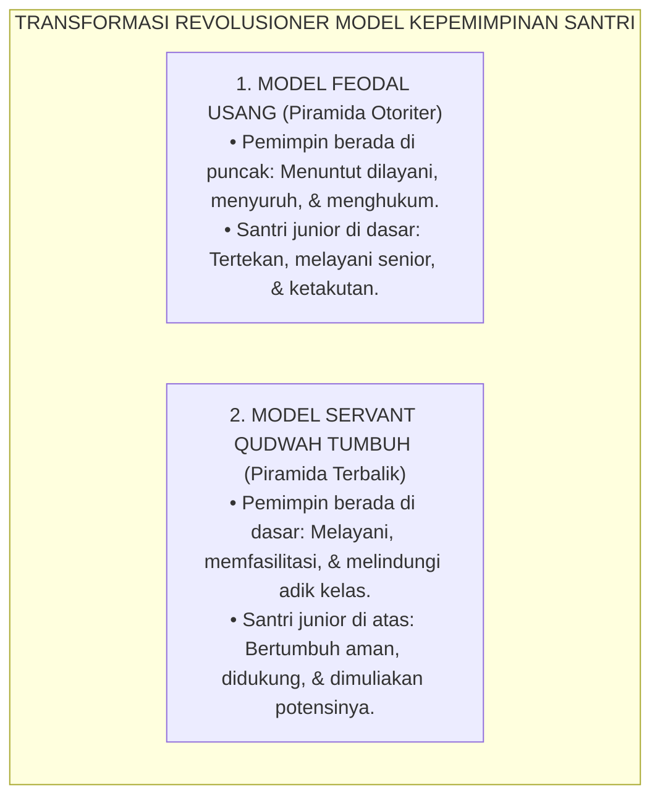
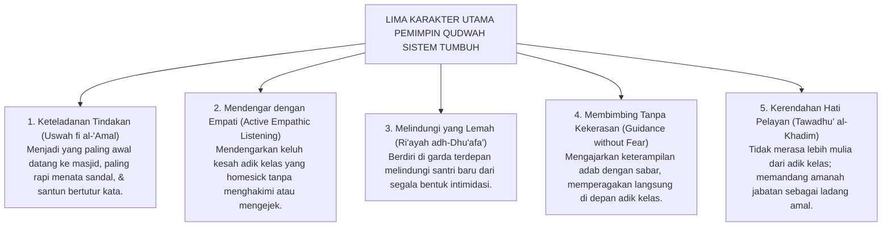
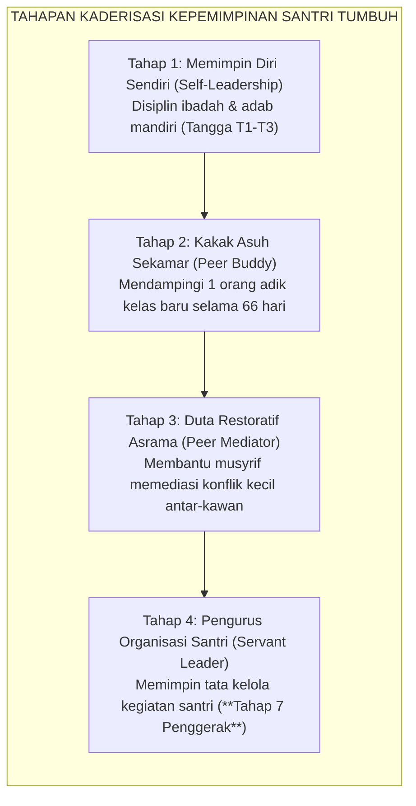

# SUB-BAB 4.4: MODEL SERVANT QUDWAH LEADERSHIP
## *Rekonstruksi Kepemimpinan Santri Berbasis Khidmah Nabawiyyah, Teladan Sebelum Kata, dan Pemberdayaan Kakak Asuh*

**Kode Klasifikasi**: `BOOK-01/BAB-04/SUB-04/MONOGRAF-MASTER-VIBRANT`  
**Disiplin Ilmu**: Teori Kepemimpinan Islam (*Al-Qiyadah al-Islamiyyah*), Servant Leadership, & Manajemen Kaderisasi Santri  
**Penanggung Jawab Keilmuan**: Dewan Pakar Ekosistem TUMBUH (*Master Author, Pakar Tata Kelola Qudwah, & Pakar Filosofi TUMBUH*)

---

### I. Pintu Masuk: Membalik Piramida Kekuasaan di Pesantren

Bagaimana kita mendefinisikan seorang pemimpin di lingkungan pondok pesantren?

Dalam paradigma lama yang feodal, pemimpin santri (seperti ketua asrama atau lurah pondok) diposisikan layaknya seorang komandan militer: ia berhak membentak, berhak menyuruh adik kelas, berhak menghukum, dan duduk santai menyaksikan santri lain bekerja keras membersihkan asrama.

Sistem **TUMBUH** membalik total piramida kekuasaan ini dengan mengembalikan konsep kepemimpinan kepada teladan murni Rasulullah SAW:

$$\text{سَيِّدُ الْقَوْمِ خَادِمُهُمْ}$$
*"Pemimpin sejati suatu kaum adalah pelayan yang paling tulus melayani mereka."* (HR. Al-Baihaqi dan Abu Nu'aim).

<b>Gambar 4.4.1:</b> Transformasi dari Model Kepemimpinan Feodal Menuju Piramida Terbalik Servant Qudwah Leadership.

---

### II. Lima Pilar Utama Pemimpin Qudwah Ekosistem TUMBUH

Seorang santri yang diangkat menjadi pengurus atau *Peer Mentor* dalam Sistem TUMBUH wajib memiliki **Lima Karakter Utama Qudwah**:

<b>Gambar 4.4.2:</b> Lima Karakter Utama Pemimpin Qudwah Ekosistem TUMBUH.

---

### III. Pembubaran Mahkamah Gelap: Dari Hakim Penghukum Menjadi Sahabat Pembimbing

Salah satu langkah pembaruan paling radikal dalam Sistem TUMBUH adalah **Mencabut 100% Wewenang Yudisial/Menghukum dari Tangan Santri**:

* Santri senior **dilarang keras** menggelar sidang kamar malam hari, mengadili kesalahan adik kelas, atau menjatuhkan sanksi fisik/denda.
* Hak penegakan disiplin dikembalikan sepenuhnya kepada dewan musyrif dewasa melalui mekanisme **Disiplin Restoratif 4R**.
* Peran santri senior dialihkan 180 derajat menjadi **Sahabat Pembimbing (*Peer Mentors*)**: mendampingi hafalan Al-Qur'an adik kelas, mengajari cara merapikan lemari pakaian, dan menjadi kawan berbagi cerita di waktu senggang.

---

### IV. Solusi Sistemik TUMBUH: Kurikulum Kaderisasi Pemimpin Pelayan

Ekosistem TUMBUH menyusun tahapan kaderisasi kepemimpinan santri yang berjenjang dan terukur:

<b>Gambar 4.4.3:</b> Tahapan Kaderisasi Berjenjang Kepemimpinan Santri dalam Ekosistem TUMBUH.

---

### Sintesis Kepemimpinan Sub-Bab 4.4

Kekuasaan sejati bukanlah diukur dari seberapa banyak orang yang takut kepadamu, melainkan dari seberapa banyak orang yang merasa aman, terbimbing, dan dicintai di bawah kepemimpinanmu.

Dengan menegakkan model *Servant Qudwah Leadership*, Sistem TUMBUH melahirkan generasi pemimpin masa depan yang berjiwa ksatria, berintegritas tinggi, dan senantiasa mengabdikan dirinya untuk melayani umat dengan tulus lillahi ta'ala.

---

## 📌 Catatan Kaki & Rujukan Primer

[^1]: **Robert K. Greenleaf**, *The Servant as Leader* (Newton Centre: Robert K. Greenleaf Center, 1970; cetak ulang 2008), hlm. 1–35.
[^2]: **Al-Imam Abu al-Hasan al-Mawardi**, *Al-Ahkam as-Sulthaniyyah wal Wilayat ad-Diniyyah*, Tahqiq: Dr. Ahmad Mubarak al-Baghdadi (Kuwait: Dar Ibn Qutaibah, 1989), Bab 1: "Aqd al-Imamah", hlm. 3–20.
