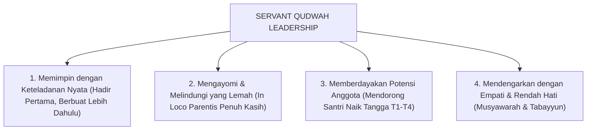

# SUB-BAB 4.4: MODEL SERVANT QUDWAH LEADERSHIP
## *Paradigma Kepemimpinan Melayani Berbasis Keteladanan Akhlak Nabawi di Lingkungan Pengasuhan*

**Kode Modul**: `BOOK-01/BAB-04/SUB-04`  
**Kategori**: Model Kepemimpinan Pesantren  
**Fokus Keilmuan**: Islamic Leadership & Servant Leadership Theory

---

### 1. Prinsip Dasar Sayyidul Qawmi Khadimuhum
Kepemimpinan dalam Islam berpijak pada sabda Rasulullah SAW:
$$\text{سَيِّدُ الْقَوْمِ خَادِمُهُمْ}$$
*"Pemimpin suatu kaum adalah pelayan bagi mereka."*

Dalam Ekosistem TUMBUH, konsep ini diwujudkan ke dalam model **Servant Qudwah Leadership** yang memadukan prinsip kepemimpinan melayani (*servant leadership*) dengan kekuatan keteladanan akhlak nyata (*Qudwah Hasanah*):

---

### 2. Standar Perilaku Musyrif Qudwah
* **Bukan Memerintah dari Jauh**: Musyrif ikut membersihkan kamar mandi asrama bersama santri pada jadwal kerja bakti, bukan hanya berdiri sambil membawa peluit atau tongkat.
* **Menjaga Martabat Santri**: Saat menegur santri yang melanggar, musyrif memanggilnya ke ruang privat, menyapa dengan salam hangat, dan berbicara dengan intonasi rendah namun tegas (*Firm & Kind*).
* **Menjadi Tempat Berlindung yang Aman**: Santri merasa nyaman menceritakan masalah pribadi, rasa rindu rumah (*homesickness*), atau kesulitan belajar tanpa takut dihakimi.
