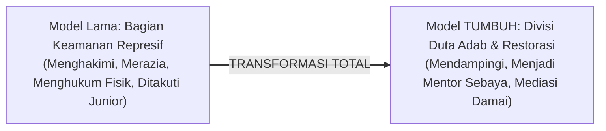

# SUB-BAB 4.5: TRANSFORMASI ORGANISASI SANTRI PENGAYOM
## *Restrukturisasi Organisasi Santri Intra Pondok Menjadi Duta Adab dan Fasilitator Perdamaian Sebaya*

**Kode Modul**: `BOOK-01/BAB-04/SUB-05`  
**Kategori**: Tata Kelola Organisasi Santri  
**Fokus Keilmuan**: Manajemen Organisasi Kesiswaan & Peer Mediation

---

### 1. Rekonstruksi Peran Organisasi Santri (OSIS / OPPM / ISMI)
Secara historis, bagian keamanan organisasi santri kerap menjadi titik kebocoran kekerasan di pesantren karena santri senior diberi wewenang menghukum adik kelasnya.

Ekosistem TUMBUH merekonstruksi struktur organisasi santri:

---

### 2. Tiga Tugas Utama Duta Adab & Pengurus Santri TUMBUH
1. **Peer Mentoring (Pendampingan Belajar Sebaya)**: Membantu adik kelas yang mengalami kesulitan tahsin Al-Qur'an, mufrodat bahasa Arab, atau adaptasi kehidupan asrama.
2. **Peer Mediation (Mediasi Konflik Ringan Antarteman)**: Menjadi penengah yang netral saat terjadi perselisihan kecil antarteman sekamar menggunakan protokol *Restorative Circle*.
3. **Inisiator Gerakan Kebajikan Komunitas**: Mengorganisir kegiatan bakti sosial, lomba kebersihan asrama yang kreatif, dan kampanye budaya ramah adab.
