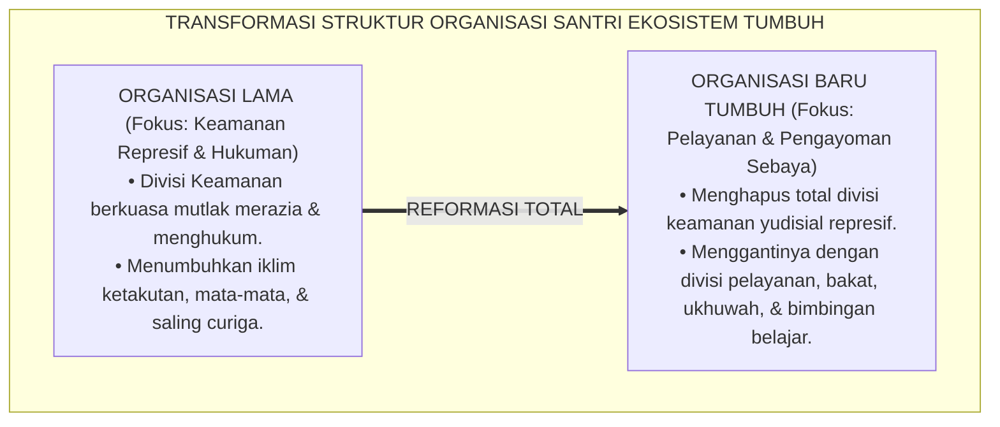
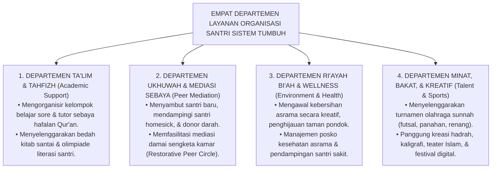
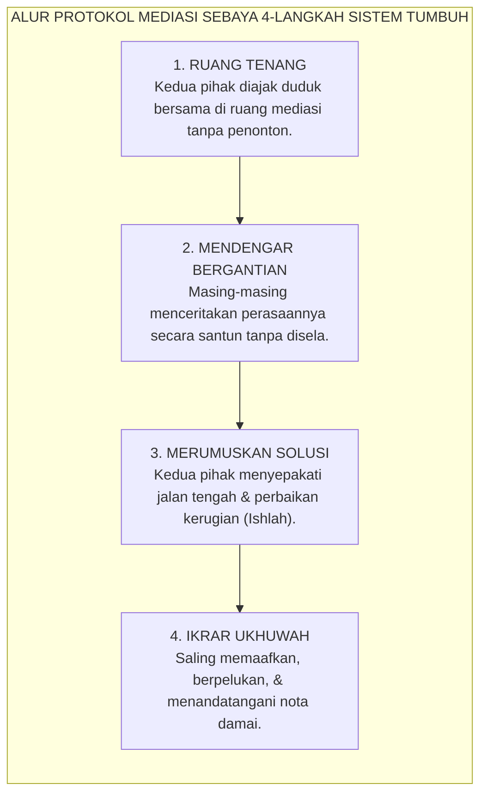

# SUB-BAB 4.5: TRANSFORMASI ORGANISASI SANTRI PENGAYOM
## *Restrukturisasi Organisasi Santri dari Lembaga Yudisial Represif Menjadi Wadah Pengayoman, Pelayanan Kreatif, dan Mediasi Sebaya*

**Kode Klasifikasi**: `BOOK-01/BAB-04/SUB-05/MONOGRAF-MASTER-VIBRANT`  
**Disiplin Ilmu**: Manajemen Organisasi Pendidikan Islam, Sosiologi Komunitas Santri, & Teori Dinamika Kelompok Sebaya  
**Penanggung Jawab Keilmuan**: Dewan Pakar Ekosistem TUMBUH (*Master Author, Pakar Tata Kelola Qudwah, & Pakar Arsitektur PBIS Restoratif*)

---

### Mengubah Wajah Organisasi Santri di Pesantren

Di banyak pesantren di Indonesia, struktur Organisasi Santri (seperti Bagian Keamanan OSIS/OPPM/ISMI) sering kali menjadi lembaga yang paling ditakuti dan dijauhi oleh warga asrama.

Sosok pengurus bagian keamanan diidentikkan dengan figur-figur yang dingin, membawa tongkat kayu atau pipa paralon, bertampang garang, berteriak-teriak membubarkan santri saat jam malam, dan bertindak layaknya polisi rahasia yang gemar mengintai kesalahan kawan-kawannya. Akibatnya sangat merusak iklim asrama:
* Muncul jurang pemisah (*social gulf*) antara santri pengurus dan santri non-pengurus.
* Organisasi santri kehilangan esensi edukatifnya dan terdistorsi menjadi instrumen penindasan birokratis yang melahirkan dendam.
* Santri-santri yang duduk di kepengurusan terbiasa mempraktikkan arogansi kekuasaan sejak usia remaja, yang berisiko membentuk kepribadian otoriter ketika mereka terjun ke masyarakat kelak.

Ekosistem **TUMBUH** melakukan **transformasi struktural 180 derajat**: mengubah organisasi santri dari "lembaga kepolisian represif" menjadi **Wadah Pengayoman, Pelayanan Kreatif, dan Sahabat Sebaya (*The Peer Support & Service Community*)**[^1].

<b>Gambar 4.5.1:</b> Transformasi Paradigma Organisasi Santri dari Lembaga Represif Menjadi Wadah Pelayanan.

---

### Arsitektur Empat Departemen Pengayoman Organisasi Santri dalam sistem TUMBUH

Dalam Sistem TUMBUH, organisasi santri dirancang bukan untuk mengawasi dan menghukum, melainkan untuk memfasilitasi kebutuhan tumbuh kembang seluruh warga asrama melalui **Empat Departemen Layanan**:

<b>Gambar 4.5.2:</b> Struktur Empat Departemen Layanan Organisasi Santri Ekosistem TUMBUH.

#### 1. Departemen Ta'lim & Tahfizh (Layanan Akademik Sebaya)
Alih-alih merazia catatan santri dengan bentakan, departemen ini hadir memberikan bantuan:
* Mengidentifikasi santri-santri yang kesulitan memahami pelajaran nahwu atau hafalan juz 'amma, lalu memasangkan mereka dengan **Tutor Sebaya (*Peer Tutors*)**.
* Menciptakan suasana belajar kelompok yang seru di serambi masjid dengan metode kuis interaktif dan diskusi santai.

#### 2. Departemen Ukhuwah & Mediasi Sebaya (Layanan Rekonsiliasi & Sahabat)
Departemen inilah yang menggantikan fungsi divisi keamanan lama:
* Bertindak sebagai **Mediator Sebaya Terlatih (*Trained Peer Mediators*)** yang membantu mendamaikan kesalahpahaman kecil antar-kawan sekamar sebelum masalah membesar.
* Membentuk tim penyambut santri baru (*Welcoming Committee*) dan mendampingi adik kelas yang sedang dilanda rindu rumah (*homesick*).

#### 3. Departemen Ri'ayah Bi'ah & Kesehatan (Layanan Lingkungan & Kebugaran)
* Menggerakkan budaya kebersihan melalui sistem **Lomba Kamar Terbersih & Terkreatif Mingguan**, mengganti hukuman kotor dengan penghargaan relasional.
* Membantu piket Pos Kesehatan Pesantren (Poskestren): mengantarkan makanan hangat dan obat bagi santri yang sedang beristirahat di ruang isolasi sakit.

#### 4. Departemen Minat, Bakat, & Olahraga (Layanan Pengembangan Potensi)
* Menyalurkan energi berlebih para santri remaja ke dalam aktivitas fisik dan kreativitas yang positif: turnamen futsal, panahan sunnah, lomba pidato 3 bahasa, seni nasyid, dan kaligrafi mushaf.

---

### Protokol Mediasi Sebaya (*Peer Mediation Protocol*)

Ketika terjadi perselisihan kecil antar-santri di asrama (misalnya: salah paham pinjam buku atau senggolan saat bermain olahraga), Departemen Ukhuwah memfasilitasi **Protokol Mediasi Sebaya 4-Langkah**:

<b>Gambar 4.5.3:</b> Alur Protokol Mediasi Sebaya 4-Langkah Ekosistem TUMBUH.

1. **Ruang Tenang Bebas Intimidasi**: Mediasi dilakukan di ruangan khusus yang nyaman, tertutup dari sorak-sorai kawan-kawannya, didampingi oleh 2 orang pengurus mediator sebaya dan 1 orang musyrif pembimbing.
2. **Mendengarkan Cerita dari Dua Sisi**: Masing-masing pihak diberikan waktu yang sama untuk menceritakan apa yang ia rasakan tanpa boleh dipotong atau diejek.
3. **Mencari Solusi Menang-Menang (*Win-Win Restorative Solution*)**: Mediator mengarahkan: *"Apa yang bisa kita lakukan bersama agar persahabatan antum berdua kembali rukun dan kamar kita tetap nyaman?"*
4. **Ikrar Perdamaian & Rekonsiliasi**: Kedua santri menyepakati solusi, saling meminta maaf secara tulus, dan berikrar untuk tidak menyimpan dendam batin di masa depan.

---

### Akuntabilitas & Pendampingan Musyrif Terpadu

Organisasi santri dalam Sistem TUMBUH tidak berjalan secara liar tanpa kontrol:
* Setiap departemen dibimbing langsung oleh **Satu Orang Musyrif Pembimbing** yang memastikan seluruh program kerja mengedepankan prinsip kasih sayang nabawi (*Rahmatan lil 'Alamin*).
* Evaluasi mingguan difokuskan pada indikator kebermanfaatan sosial: *"Berapa banyak kawan sekamar yang berhasil kita bantu pekan ini? Apakah ada santri yang merasa tidak aman atau terisolasi di asrama kita?"*

Organisasi santri adalah kawah candradimuka di mana para santri belajar arti sejati dari kepemimpinan Islam: bahwa memimpin adalah melayani, membimbing adalah menyayangi, dan berorganisasi adalah sarana menebar manfaat seluas-luasnya bagi sesama (*Khairunnaas anfa'uhum linnaas*).

Dengan mereformasi organisasi santri menjadi wadah pengayoman kreatif, Sistem TUMBUH memastikan asrama pesantren menjadi rumah peradaban yang aman, hangat, ceria, dan dipenuhi semangat persaudaraan sejati.

---

## 📌 Catatan Kaki & Rujukan Primer

[^1]: **Richard Cohen**, *Students Resolving Conflict: Peer Mediation in Schools* (Glenview: Good Year Books, 1995), hlm. 25–68.
[^2]: **B. Bradford Brown & Jim Larson**, "Peer relationships in adolescence", dalam R. M. Lerner & L. Steinberg (Eds.), *Handbook of Adolescent Psychology* (Hoboken: John Wiley & Sons, 2009), Vol. 2, hlm. 74–103.
