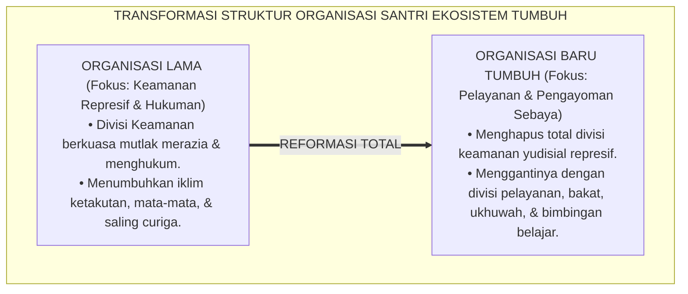
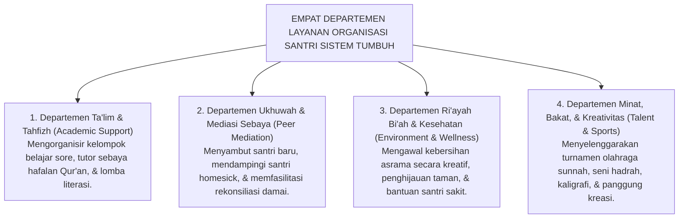

# SUB-BAB 4.5: TRANSFORMASI ORGANISASI SANTRI PENGAYOM
## *Restrukturisasi Organisasi Santri dari Lembaga Yudisial Represif Menjadi Wadah Pengayoman, Pelayanan Kreatif, dan Mediasi Sebaya*

**Kode Klasifikasi**: `BOOK-01/BAB-04/SUB-05/MONOGRAF-MASTER-VIBRANT`  
**Disiplin Ilmu**: Manajemen Organisasi Pendidikan Islam, Sosiologi Komunitas Santri, & Teori Dinamika Kelompok Sebaya  
**Penanggung Jawab Keilmuan**: Dewan Pakar Ekosistem TUMBUH (*Master Author, Pakar Tata Kelola Qudwah, & Pakar Arsitektur PBIS Restoratif*)

---

### Mengubah Wajah Organisasi Santri di Pesantren

Di banyak pesantren, Organisasi Santri (seperti Bagian Keamanan atau Tim Kedisiplinan) sering kali menjadi lembaga yang paling ditakuti oleh seluruh santri. 

Pengurus keamanan digambarkan membawa tongkat, bertampang garang, berteriak-teriak saat jam tidur, dan bertindak layaknya polisi rahasia yang gemar mengintai kesalahan kawan-kawannya. Akibatnya, organisasi santri kehilangan fungsi edukatifnya dan berubah menjadi mesin penindasan birokratis yang dibenci.

Ekosistem **TUMBUH** melakukan **transformasi struktural 180 derajat**: mengubah organisasi santri dari "lembaga kepolisian represif" menjadi **Wadah Pengayoman, Pelayanan Kreatif, dan Sahabat Sebaya (*The Peer Support & Service Community*)**.

<b>Gambar 4.5.1:</b> Transformasi Paradigma Organisasi Santri dari Lembaga Represif Menjadi Wadah Pelayanan.

---

### Arsitektur Empat Departemen Pengayoman Organisasi Santri TUMBUH

Dalam Sistem TUMBUH, organisasi santri dirancang untuk memfasilitasi kebutuhan tumbuh kembang seluruh warga asrama melalui **Empat Departemen Layanan**:

<b>Gambar 4.5.2:</b> Struktur Empat Departemen Layanan Organisasi Santri Ekosistem TUMBUH.

---

### Mekanisme Mediasi Sebaya (*Peer Mediation Protocol*)

Ketika terjadi perselisihan kecil antar-santri sekamar (seperti salah paham peminjaman barang atau senggolan saat bermain bola), Departemen Ukhuwah bertindak sebagai **Mediator Sebaya (*Peer Mediators*)** yang terlatih:

1. **Mendengar Tanpa Menghakimi**: Mempertemukan kedua belah pihak di ruang tenang asrama untuk saling mengutarakan perasaan secara santun.
2. **Fokus pada Solusi Damai**: Mengarahkan kedua belah pihak untuk memahami perasaan kawan dan mencari jalan tengah yang adil (*Ishlah al-Bain*).
3. **Rekonsiliasi & Saling Memaafkan**: Mengakhiri mediasi dengan saling berpelukan, meminta maaf secara tulus, dan memastikan tidak ada dendam yang tersisa.

---

### Solusi Sistemik TUMBUH: Akuntabilitas & Pendampingan Musyrif Terpadu

Organisasi santri dalam Sistem TUMBUH tidak berjalan sendiri tanpa kendali:
* Setiap departemen didampingi langsung oleh **Satu Orang Musyrif Pembimbing** yang memastikan seluruh program kerja berjalan selaras dengan prinsip kasih sayang nabawi.
* Evaluasi mingguan difokuskan pada pertanyaan: *"Berapa banyak kawan kita yang terbantu pekan ini? Apakah ada santri yang merasa tidak nyaman atau terintimidasi di asrama kita?"*

---

### Sintesis Kelembagaan Sub-Bab 4.5

Organisasi santri adalah laboratorium peradaban di mana anak-anak kita belajar arti sejati dari kepemimpinan Islam: memimpin adalah melayani, membimbing adalah menyayangi, dan berorganisasi adalah ladang untuk menebar manfaat bagi sesama (*Khairunnaas anfa'uhum linnaas*).

Dengan mereformasi organisasi santri menjadi wadah pengayom, Sistem TUMBUH memastikan asrama pesantren menjadi rumah peradaban yang aman, ceria, dan dipenuhi semangat persaudaraan yang indah.

---

## 📌 Catatan Kaki & Rujukan Primer

[^1]: **B. Bradford Brown & Jim Larson**, "Peer relationships in adolescence", dalam R. M. Lerner & L. Steinberg (Eds.), *Handbook of Adolescent Psychology* (Hoboken: John Wiley & Sons, 2009), Vol. 2, hlm. 74–103.
[^2]: **Richard Cohen**, *Students Resolving Conflict: Peer Mediation in Schools* (Glenview: Good Year Books, 1995), hlm. 25–60.
