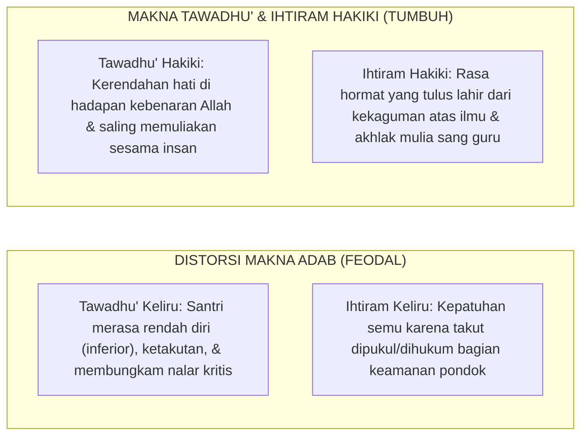

# BAB 4: KRITIK TERHADAP FEODALISME, KEKERASAN SIMBOLIK, & DISTORSI MAKNA TAWADHU'
## *Dekonstruksi Relasi Kuasa Asimetris, Mengikis Perpeloncoan Berdalih Disiplin, dan Menegakkan Kepemimpinan Melayani (Servant Qudwah Leadership)*

**Nomor Identifikasi**: `BOOK-01/BAB-04/KRITIK-FEODALISME/2026`  
**Volume**: Buku 01 — *Akar Filosofis & Epistemologi Pendidikan Karakter Pesantren*  
**Dewan Pakar**: `pakar-tata-kelola-qudwah`, `pakar-perlindungan-anak-dan-advokasi-santri`, `pakar-filosofi-tumbuh`

---

## 📑 DAFTAR ISI SUB-BAB 4

1. [4.1 Anatomi Feodalisme & Relasi Kuasa Asimetris di Dunia Pesantren](#41-anatomi-feodalisme--relasi-kuasa-asimetris-di-dunia-pesantren)
2. [4.2 Distorsi Makna Tawadhu' dan Ihtiram: Membedakan Takzim Hakiki vs Ketakutan Semu](#42-distorsi-makna-tawadhu-dan-ihtiram-membedakan-takzim-hakiki-vs-ketakutan-semu)
3. [4.3 Fenomena Kekerasan Simbolik dan Normalisasi Budaya Perpeloncoan Senioritas](#43-fenomena-kekerasan-simbolik-dan-normalisasi-budaya-perpeloncoan-senioritas)
4. [4.4 Model Kepemimpinan Melayani: Servant Qudwah Leadership](#44-model-kepemimpinan-melayani-servant-qudwah-leadership)
5. [4.5 Transformasi Struktur Organisasi Santri: Dari Hierarki Represif ke Kader Pengayom](#45-transformasi-struktur-organisasi-santri-dari-hierarki-represif-ke-kader-pengayom)

---

## 4.1 Anatomi Feodalisme & Relasi Kuasa Asimetris di Pesantren

Tradisi luhur pesantren menjunjung tinggi penghormatan kepada guru dan orang yang lebih tua. Namun, tanpa pengawalan nilai-nilai kemanusiaan Islam, tradisi ini rentan tergelincir menjadi **feodalisme kultural**. Relasi kuasa yang sangat asimetris antara pengasuh, musyrif, santri senior, dan santri yunior menciptakan celah terjadinya penyalahgunaan wewenang (*abuse of power*).

Ciri-ciri relasi feodal yang merusak fitrah santri:
* Hak istimewa berlebihan bagi senior yang tidak dapat diganggu gugat.
* Larangan bertanya atau berdiskusi yang dianggap sebagai "pembangkangan".
* Menganggap kepatuhan buta (*blind obedience*) tanpa pemahaman sebagai bentuk adab tertinggi.

---

## 4.2 Distorsi Makna Tawadhu' & Ihtiram: Takzim vs Ketakutan Semu

Perlu ditegaskan dekonstruksi terhadap distorsi makna **Tawadhu'** dan **Ihtiram**:

Rasulullah SAW mengajarkan bahwa tawadhu' tidak boleh menghilangkan keberanian dalam menegakkan kebenaran (*al-haqq*) dan tidak boleh merendahkan martabat manusia di hadapan makhluk.

---

## 4.3 Fenomena Kekerasan Simbolik & Perpeloncoan Senioritas

Sosiolog Pierre Bourdieu memperkenalkan konsep **Kekerasan Simbolik (*Symbolic Violence*)**—kekerasan yang tidak disadari karena telah dianggap sebagai norma budaya yang wajar. Di pesantren, ini termanifestasi dalam praktik:
* Menugaskan santri junior mencuci pakaian santri senior atau membelikan makanan tanpa imbalan sebagai "uji loyalitas".
* Sidang malam atau ospek tidak resmi yang diwarnai intimidasi mental, kata-kata kasar, dan hukuman push-up/tamparan.

Ekosistem TUMBUH menyatakan bahwa **segala bentuk perpeloncoan senioritas adalah kezaliman yang diharamkan syariat**. Senioritas tidak memberikan hak menghukum, melainkan melimpahkan kewajiban mengayomi (*ar-Ri'ayah*).

---

## 4.4 Model Kepemimpinan Melayani: Servant Qudwah Leadership

Sebagai antitesis dari model kepemimpinan otoriter, TUMBUH menerapkan model **Servant Qudwah Leadership**:
1. **Sayyidul Qawmi Khadimuhum** (*Pemimpin suatu kaum adalah pelayan bagi mereka*): Pendidik dan pengurus santri memimpin dengan cara melayani kebutuhan perkembangan anggota, bukan memerintah dari atas menara gading.
2. **Memimpin dengan Teladan (*Qudwah*)**: Musyrif hadir paling awal di masjid bukan untuk mengabsen dengan tongkat, melainkan untuk duduk di shaf terdepan memberi contoh nyata.
3. **Mendengar dengan Empati**: Pemimpin membuka ruang dialog, mendengarkan keluh kesah santri, dan tanggap terhadap kesulitan belajar mereka.

---

## 4.5 Transformasi Struktur Organisasi Santri Menjadi Kader Pengayom

Organisasi santri (OSIS/ISMI) direstrukturisasi:
* Menghilangkan seksi "Keamanan/Mahkamah Fisik" yang bergaya militeristik represif.
* Menggantinya dengan **Divisi Duta Adab & Restorasi Sebaya (*Peer Mediation & Adab Ambassadors*)**.
* Tugas pengurus santri senior berfokus pada: pendampingan belajar, mengorganisir kegiatan kebersihan bersama (*gotong royong*), dan menjadi fasilitator perdamaian antarkamar.
