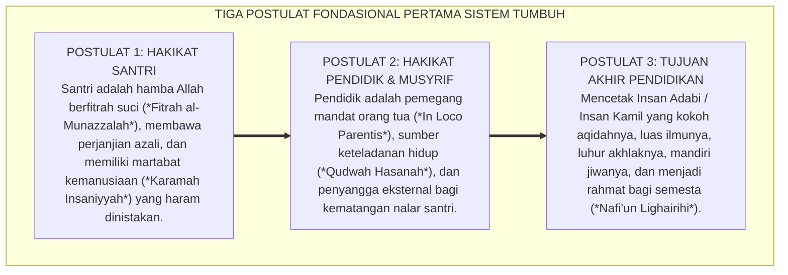

# SUB-BAB 5.1: POSTULAT 1 S.D. 3: HAKIKAT SANTRI, PENDIDIK, & TUJUAN AKHIR
## *Tiga Fondasi Eksistensial: Kesucian Fitrah Pembelajar, Keteladanan Qudwah Pengasuh, dan Profil Insan Adabi*

**Kode Klasifikasi**: `BOOK-01/BAB-05/SUB-01/MONOGRAF-MASTER-VIBRANT`  
**Disiplin Ilmu**: Filsafat Pendidikan Islam, Antropologi Teologis, & Etika Profesi Pendidik  
**Penanggung Jawab Keilmuan**: Dewan Pakar Ekosistem TUMBUH (*Master Author, Pakar Filosofi TUMBUH, & Pakar Epistemologi Turats*)

---

### Meletakkan Tiga Batu Pertama Bangunan Peradaban

Sebelum kita merumuskan ribuan pasal tata tertib, jadwal harian asrama, atau buku panduan guru, ada pertanyaan filosofis paling mendasar yang wajib dijawab dengan jernih:

* *Siapakah sebenarnya anak yang kita panggil "santri" itu? Apakah ia bejana kosong yang harus diisi, ataukah mutiara fitrah yang harus diselami keindahannya?*
* *Siapakah kita yang disebut "pendidik" dan "musyrif"? Apakah kita sipir penjara yang bertugas menghukum, ataukah orang tua pengganti yang mengalirkan cinta nabawi?*
* *Dan ke mana muara akhir dari seluruh jerih payah mendidik di pesantren ini?*

Ekosistem **TUMBUH** menjawab ketiga pertanyaan eksistensial ini melalui **Tiga Postulat Filosofis Pertama**:

<b>Gambar 5.1.1:</b> Tiga Postulat Filosofis Fondasional Pertama Ekosistem TUMBUH.

---

### Postulat 1: Hakikat Santri — Amanah Suci Berfitrah Ilahiah

Dalam pandangan Sistem TUMBUH, santri bukanlah objek pasif yang boleh dibentak, ditampar, atau diperlakukan sesuka hati. Santri adalah:
1. **Pribadi yang Membawa Fitrah Ketuhanan**: Sejak di alam arwah, jiwanya telah bersaksi bahwa Allah adalah Rabbnya (QS. Al-A'raf: 172). Di dalam dadanya tersimpan kompas moral bawaan yang mencintai kebaikan.
2. **Subjek Pembelajar yang Bertumbuh**: Kesalahan yang dilakukan santri bukanlah bukti kecacatan watak, melainkan proses belajar (*learning curve*) dari sistem saraf otak remaja yang sedang dalam tahap maturasi.
3. **Pemilik Kehormatan yang Wajib Dilindungi**: Rasulullah SAW menegaskan bahwa mencela, merendahkan, apalagi menyiksa fisik seorang mukmin adalah kefasikan dan kezaliman yang dimurkai Allah SWT.

---

### Postulat 2: Hakikat Pendidik — Orang Tua Pengganti & Teladan Hidup

Asatidz dan Musyrif dalam Sistem TUMBUH bukanlah sekadar pengajar yang datang menyampaikan materi lalu pulang, melainkan:
1. **Mandat In Loco Parentis (Orang Tua Pengganti 24 Jam)**: Mengemban amanah air mata orang tua di gerbang pondok untuk merawat jiwa, raga, dan keselamatan santri siang dan malam.
2. **Qudwah Hasanah (Sumber Keteladanan Sebelum Kata)**: Santri belajar 80% dari apa yang mereka lihat pada perilaku musyrifnya, dan hanya 20% dari apa yang mereka dengar di mimbar ceramah.
3. **Penyangga Regulasi Afektif (*Co-Regulation Agent*)**: Menjadi figur dewasa yang tenang, teduh, dan stabil saat santri menghadapi badai emosi remaja.

---

### Postulat 3: Hakikat Tujuan Akhir — Lahirnya Insan Adabi Paripurna

Tujuan akhir pendidikan pesantren bukanlah sekadar mencetak juara lomba hafalan atau lulusan berijazah formal, melainkan melahirkan **Insan Adabi (Santri Paripurna)** yang memiliki keseimbangan lima kecerdasan:
* **Kecerdasan Spiritual (Tauhid)**: Merasakan pengawasan Allah dalam kesendirian (*Muraqabatullah*).
* **Kecerdasan Moral (Adab)**: Lembut tutur katanya, santun perilakunya, dan adil dalam bersikap.
* **Kecerdasan Intelektual ('Ilm)**: Menguasai khazanah Turats klasik dan sains modern secara kritis.
* **Kecerdasan Emosional (Nafs)**: Mampu mengendalikan amarah dan berempati pada penderitaan sesama.
* **Kecerdasan Sosial (Maslahat)**: Mendedikasikan ilmunya untuk menebar manfaat dan memimpin umat (*Rahmatan lil 'Alamin*).

---

### Sintesis Filosofis Sub-Bab 5.1

Dengan memancangkan tiga postulat fondasional ini, Sistem TUMBUH meletakkan arah kiblat yang tidak akan pernah goyah: memuliakan santri sebagai amanah fitrah, mendudukkan pendidik sebagai teladan cinta nabawi, dan mengarahkan seluruh denyut pesantren menuju lahirnya kader peradaban adab.

---

## 📌 Catatan Kaki & Rujukan Primer

[^1]: **Prof. Dr. Syed Muhammad Naquib al-Attas**, *The Concept of Education in Islam* (Kuala Lumpur: ISTAC, 1980), hlm. 25–38.
[^2]: **Al-Imam Abu Hamid al-Ghazali**, *Fatihatul 'Ulum* (Kairo: Al-Mathba'ah al-Husayniyyah, 1322 H), Bab 4: "Fi Adab al-Mu'allim wal Muta'allim", hlm. 45–58.
