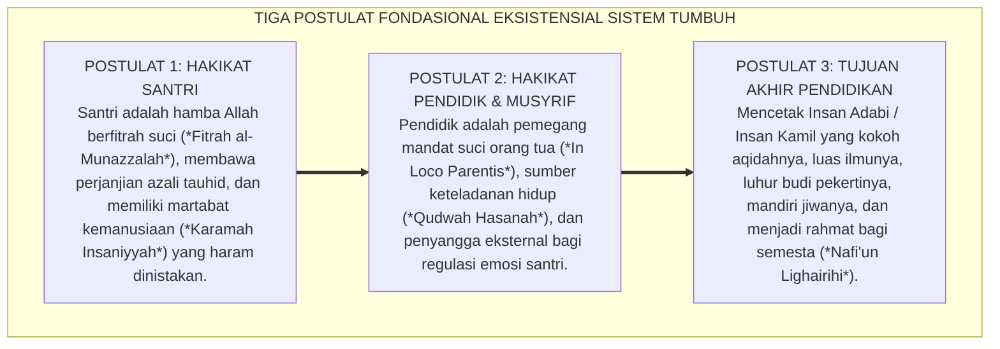
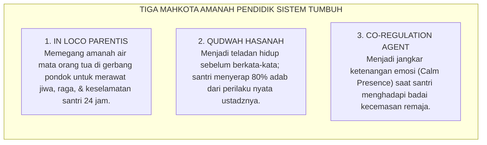
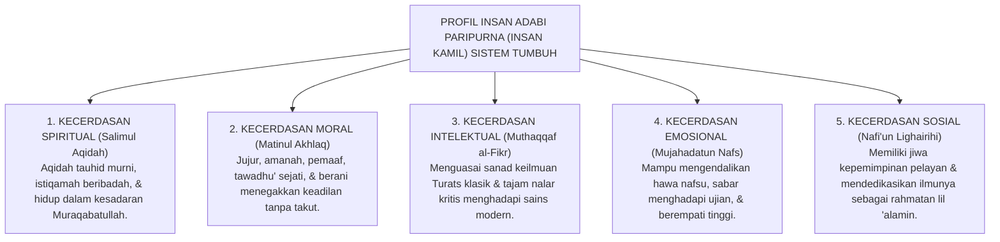

# POSTULAT 1 S.D. 3: HAKIKAT SANTRI, PENDIDIK, & TUJUAN AKHIR

---
### Meletakkan Tiga Batu Pertama Bangunan Peradaban

Sebelum sebuah pesantren merumuskan ribuan butir pasal tata tertib asrama, jadwal kegiatan harian, atau modul evaluasi santri, ada tiga pertanyaan eksistensial paling mendasar yang wajib dijawab dengan kejernihan filosofis mutlak:

* *Siapakah sebenarnya sosok anak yang kita panggil "santri" itu? Apakah ia bejana kosong yang pasif, ataukah mutiara fitrah ilahiah yang membawa potensi keluhuran sejak lahir?*
* *Siapakah kita yang disebut "pendidik", "ustadz", dan "musyrif"? Apakah kita sipir penjara yang bertugas memaksakan kepatuhan lahiriah, ataukah orang tua pengganti yang mengalirkan keteladanan cinta nabawi?*
* *Dan ke manakah muara akhir dari seluruh jerih payah mendidik di pesantren ini?*

Kerap kali kegagalan sistem pendidikan karakter berakar dari kerancuan dalam menjawab tiga pertanyaan ini. Ketika santri dipandang sebagai "makhluk bermasalah yang harus ditaklukkan", maka metode yang lahir adalah pentungan dan ancaman. Ketika pendidik memandang dirinya sebagai "penguasa feodal yang kebal kritik", maka asrama berubah menjadi kancah perpeloncoan.

Sistem **TUMBUH** meletakkan arah kiblat pendidikan pesantren melalui **Tiga Postulat Filosofis Pertama (Postulat 1, 2, dan 3)**:

<b>Gambar 5.1.1:</b> Tiga Postulat Filosofis Fondasional Eksistensial Ekosistem TUMBUH.

---

### Postulat 1: Hakikat Santri — Amanah Suci Berfitrah Ilahiah

Dalam ontologi Sistem TUMBUH, santri yang melangkah memasuki gerbang pesantren diposisikan secara terhormat sebagai:

1. **Jiwa yang Membawa Fitrah Ketuhanan (*Fitrah al-Munazzalah*)**:  
   Sejak di alam arwah, ruh setiap anak telah bersaksi atas keesaan dan ketuhanan Allah SWT (*"Alastu bi Rabbikum? Qalu Bala Syahidna!"*, QS. Al-A'raf: 172). Santri tidak datang membawa dosa warisan atau jiwa yang cacat. Di dalam dadanya tersimpan kompas moral alami yang mencintai kebaikan, mengagumi keadilan, dan haus akan kebenaran.
2. **Subjek Pembelajar yang Sedang Bertumbuh (*Developing Human Being*)**:  
   Kesalahan, kekhilafan, atau kelalaian yang dilakukan santri di asrama bukanlah bukti bahwa anak tersebut "berjiwa jahat", melainkan bagian alami dari kurva belajar (*learning curve*) sistem saraf otaknya yang sedang mengalami proses maturasi kognitif dan biologis.
3. **Pemilik Kehormatan Manusiawi (*Karamah Insaniyyah*)**:  
   Allah SWT menegaskan kemuliaan anak cucu Adam (*"Wa laqad karramna bani Adam"*, QS. Al-Isra': 70). Oleh karena itu, tubuh santri tidak boleh dipukul, wajahnya tidak boleh ditampar, dan harga dirinya tidak boleh diinjak-injak di depan umum dengan dalih apa pun!

---

### Postulat 2: Hakikat Pendidik — Orang Tua Pengganti & Teladan Hidup

Asatidz dan Musyrif dalam Sistem TUMBUH mengemban peran profetik yang melampaui sekadar instruktur kelas:

<b>Gambar 5.1.2:</b> Tiga Mahkota Amanah Profetik Pendidik Ekosistem TUMBUH.

1. **Mandat In Loco Parentis (Orang Tua Pengganti 24 Jam)**:  
   Tatkala orang tua santri menyerahkan anaknya di gerbang pondok dengan linangan air mata doa, mereka menitipkan amanah paling berharga dalam hidupnya. Pendidik TUMBUH menyambut amanah tersebut dengan rasa tanggung jawab ukhrawi: memperlakukan santri layaknya anak kandung sendiri yang disayangi, dilindungi dari bahaya, dan dirawat saat sakit.
2. **Qudwah Hasanah (Keteladanan Sebelum Instruksi)**:  
   Pendidik memahami bahwa santri adalah peniru yang ulung. Jika ustadz ingin santrinya tepat waktu shalat, maka ustadz harus berada di shaf pertama sebelum adzan berkumandang. Jika musyrif ingin santrinya bertutur kata santun, maka musyrif tidak boleh sekalipun mengeluarkan kata-kata makian atau bentakan kasar.
3. **Penyangga Regulasi Afektif (*Co-Regulation Presence*)**:  
   Ketika santri remaja mengalami krisis emosi (marah, sedih, atau frustrasi), musyrif tidak membalasnya dengan kemarahan yang memperkeruh suasana, melainkan hadir dengan ketenangan batin (*Calm Presence*) yang menenangkan sistem saraf santri.

---

### Postulat 3: Hakikat Tujuan Akhir — Lahirnya Insan Adabi Paripurna

Tujuan akhir pendidikan pesantren bukanlah sekadar mencetak lulusan yang hafal ribuan bait nadham atau menjuarai berbagai perlombaan formal, melainkan melahirkan **Insan Adabi (Santri Paripurna)** yang memiliki keseimbangan utuh pada lima dimensi kecerdasan:

<b>Gambar 5.1.3:</b> Lima Dimensi Profil Insan Adabi Paripurna Ekosistem TUMBUH.

Dengan memancangkan tiga postulat eksistensial ini, Sistem TUMBUH memastikan bahwa pesantren memiliki fondasi filosofis yang kokoh tak tergoyahkan: memuliakan santri sebagai amanah fitrah, mendudukkan pendidik sebagai teladan kasih sayang nabawi, dan mengarahkan seluruh denyut asrama menuju lahirnya kesatria peradaban yang berakhlak mulia.

---

## 📌 Catatan Kaki & Rujukan Primer

[^1]: **Prof. Dr. Syed Muhammad Naquib al-Attas**, *The Concept of Education in Islam: A Framework for an Islamic Philosophy of Education* (Kuala Lumpur: ISTAC, 1980), hlm. 25–45.
[^2]: **Hujjatul Islam Imam Abu Hamid al-Ghazali**, *Fatihatul 'Ulum* (Kairo: Al-Mathba'ah al-Husayniyyah, 1322 H), Bab 4: "Fi Adab al-Mu'allim wal Muta'allim", hlm. 45–62.

---

### IV. Eksplanasi Filosofis Lanjutan & Hermeneutika Nilai Postulat 1 S.D. 3: Hakikat Santri, Pendidik, & Tujuan Akhir

Penyelidikan mendalam terhadap tema **POSTULAT 1 S.D. 3: HAKIKAT SANTRI, PENDIDIK, & TUJUAN AKHIR** menuntut pemahaman integral atas relasi antara *Ontologi Fitrah* dan *Sosiologi Pembelajaran Pesantren*. Ketika seorang santri memasuki ekosistem pendidikan, ia membawa amanah perjanjian primordial (*Mithaq*) yang menuntut ruang tumbuh yang aman dari distorsi psikologis.

1. **Dialektika Keikhlasan (*Shidq an-Niyyah*) vs Formalisme Perilaku**:
   Dalam pandangan *Hujjatul Islam* Al-Imam Al-Ghazali dalam *Ihya 'Ulumiddin*, pembentukan karakter yang sejati bermula dari pembersihan batin (*Thaharatul Batin*). Ketika sebuah institusi mereduksi adab menjadi kepatuhan semu di hadapan figur otoritas, yang sesungguhnya terjadi adalah pelemahan integritas diri (*Nifaq Tarbawi*). Sistem TUMBUH menegaskan bahwa kesalehan sejati harus lahir dari kemerdekaan batin yang disinari oleh cinta kepada Allah (*Mahabbatullah*) dan kesadaran pengawasan-Nya (*Muraqabatullah*).

2. **Dinamika Neuroplastisitas & Internalisasi Nilai Ruhiyyah**:
   Sains kognitif kontemporer membuktikan bahwa pembiasaan nilai yang disertai rasa takut ekstrem mengaktifkan poros *HPA (Hypothalamic-Pituitary-Adrenal)* dan membanjiri otak dengan hormon kortisol. Kondisi ini membekukan kemampuan *Prefrontal Cortex* untuk merefleksikan nilai secara mandiri. Sebaliknya, ketika nilai **POSTULAT 1 S.D. 3: HAKIKAT SANTRI, PENDIDIK, & TUJUAN AKHIR** disampaikan dalam suasana pengasuhan yang hangat (*Warm Presence*), otak santri melepaskan *oksitosin* dan *dopamin* yang mempercepat konsolidasi sinaptik dan pembentukan memori jangka panjang (*Long-Term Potentiation*).

3. **Matriks Transformasi Praksis Pembinaan**:

| Dimensi Pengasuhan | Pola Lama (Mekanistis-Punitif) | Pola Rekonstruksi Ekosistem TUMBUH |
| :--- | :--- | :--- |
| **Sumber Motivasi** | Tekanan eksternal dan rasa takut akan sanksi fisik. | Kesadaran fitrah internal dan kerinduan pada rida ilahi. |
| **Relasi Musyrif-Santri** | Pengawasan hierarkis intimidatif (panoptikon). | Keteladanan hidup (*Qudwah Hasanah*) dan pendampingan empatik. |
| **Ketahanan Karakter** | Runtuh ketika pengawasan ditiadakan (liburan/lulus). | Melekat kokoh sebagai kompas moral seumur hidup (*Insan Adabi*). |

---

### V. Refleksi Pedagogis & Rekomendasi Aksi Lembaga

Penerapan prinsip **POSTULAT 1 S.D. 3: HAKIKAT SANTRI, PENDIDIK, & TUJUAN AKHIR** di lingkungan pesantren menuntut komitmen kelembagaan yang terstruktur:
* **Audit Budaya Pengasuhan**: Pimpinan pesantren wajib melakukan refleksi berkala atas seluruh interaksi antara asatidz, musyrif, dan santri guna memastikan tidak ada celah bagi masuknya feodalisme atau kekerasan terselubung.
* **Penguatan Kapasitas Pendidik**: Setiap pembina asrama difasilitasi dengan pelatihan literasi psikologi perkembangan dan konseling Islam agar memiliki kematangan emosi dalam menghadapi dinamika santri.
* **Integrasi Ruhiyyah 24 Jam**: Memastikan bahwa setiap detik kehidupan santri di pondok—mulai dari bangun tidur, halaqah Qur'an, mudzakarah ilmu, hingga istirahat malam—selalu dinaungi oleh nilai keikhlasan dan ukhuwah yang tulus.
