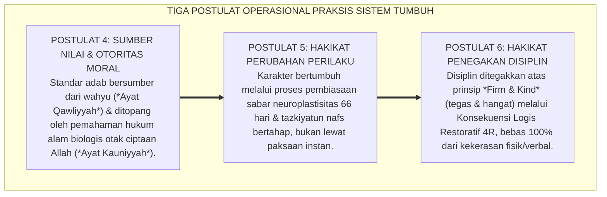
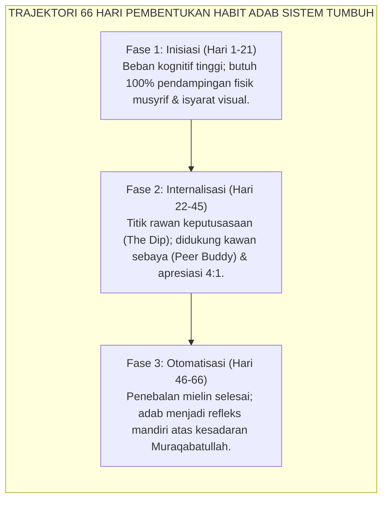
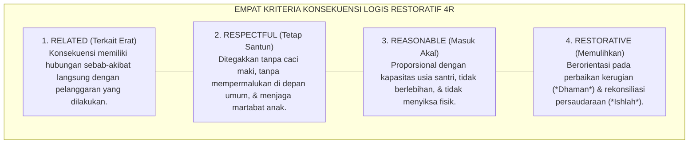

# SUB-BAB 5.2: POSTULAT 4 S.D. 6: SUMBER NILAI, PERUBAHAN, & DISIPLIN
## *Tiga Pilar Operasional: Otoritas Integratif Wahyu-Sains, Trajektori Perubahan 66-Hari, dan Disiplin Restoratif Tanpa Kekerasan*

**Kode Klasifikasi**: `BOOK-01/BAB-05/SUB-02/MONOGRAF-MASTER-VIBRANT`  
**Disiplin Ilmu**: Epistemologi Moral Islam, Kinesiologi Perubahan Karakter, & Teori Disiplin Restoratif  
**Penanggung Jawab Keilmuan**: Dewan Pakar Ekosistem TUMBUH (*Master Author, Pakar Arsitektur PBIS Restoratif, & Pakar Disiplin Positif*)

---

### Tiga Mesin Penggerak Transformasi Karakter

Setelah meletakkan tiga batu fondasi eksistensial tentang siapa santri, siapa pendidik, dan apa tujuan akhirnya, langkah strategis berikutnya adalah merumuskan mesin operasional pembinaannya:

* *Dari manakah kita mengambil otoritas kebenaran standar nilai dan moralitas adab?*
* *Bagaimana proses perubahan karakter itu sebenarnya terjadi di dalam sel-sel saraf dan jiwa manusia?*
* *Dan bagaimana cara kita menegakkan disiplin ketika terjadi pelanggaran aturan asrama?*

Sistem **TUMBUH** menjawab ketiga tantangan praksis ini melalui **Tiga Postulat Filosofis Kedua (Postulat 4, 5, dan 6)**:

<b>Gambar 5.2.1:</b> Tiga Postulat Operasional Sistemik Ekosistem TUMBUH.

---

### Postulat 4: Sumber Nilai — Paduan Berkah Wahyu dan Presisi Sains

Sistem TUMBUH menolak relativisme moral sekuler yang menanggalkan agama, sekaligus menolak tekstualisme kaku yang anti-ilmu pengetahuan:

1. **Wahyu sebagai Penentu Nilai Transendental (*The Ultimate 'Why'*)**:  
   Al-Qur'an dan Sunnah Nabawiyyah adalah sumber nilai mutlak yang menentukan halal-haram, hakikat keadilan, dan tujuan akhir hidup santri menggapai ridha Allah SWT. Wahyu memberi tahu kita **mengapa** adab harus ditegakkan dan **ke mana** jiwa santri harus diarahkan.
2. **Sains Perkembangan sebagai Penjelas Mekanisme Fisiologis (*The Operational 'How'*)**:  
   Neurosains kognitif, psikologi perkembangan anak, dan sistem PBIS modern digunakan untuk memahami **bagaimana** otak santri merespons rasa aman, bagaimana memori hafalan terbentuk, dan bagaimana kebiasaan fisik mendarah daging.
3. **Harmoni Tanpa Kontradiksi**:  
   Ketika seorang ustadz memahami kedua ayat ini secara terpadu, ia tidak akan lagi mendidik santri dengan emosi buta. Ia menghafal dalil tentang larangan marah, sekaligus memahami secara biologis bahwa bentakan keras memicu banjir hormon kortisol yang mematikan fungsi nalar moral anak (*Korteks Prefrontal*).

---

### Postulat 5: Hakikat Perubahan — Proses Sabar Melintasi Siklus 66 Hari

Sistem TUMBUH menolak ilusi bahwa karakter santri dapat diubah dalam sekejap mata melalui bentakan keras atau shock therapy perpeloncoan:

<b>Gambar 5.2.2:</b> Trajektori 66 Hari Pembentukan Kebiasaan Adab Ekosistem TUMBUH.

1. **Sunnatullah Bertahap (*Al-Tadarruj*)**:  
   Riset University College London (UCL) oleh Dr. Phillippa Lally membuktikan bahwa otak manusia membutuhkan rata-rata **66 hari berturut-turut** agar sebuah kebiasaan baru mencapai titik otomatisasi refleks (*Asymptote of Automaticity*).
2. **Menemani Pergulatan Batin**:  
   Ketika santri baru mengalami kesulitan di 3 pekan pertama, musyrif tidak marah, melainkan memahami bahwa kabel saraf di otak santri sedang dalam proses perintisan jalur baru. Kunci keberhasilan pembinaan bukanlah kekerasan hukuman, melainkan **frekuensi pengulangan positif yang konsisten dan penuh kasih sayang**.

---

### Postulat 6: Hakikat Disiplin — Tegas Tanpa Menyakiti (*Firm & Kind*)

Sistem TUMBUH merevolusi paradigma penegakan disiplin dari "sarana balas dendam pengurus" menjadi "proses pemulihan dan edukasi moral":

| Dimensi | Hukuman Konvensional (Usang) | Disiplin Restoratif Positif (Sistem TUMBUH) |
| :--- | :--- | :--- |
| **Landasan Emosi** | Didasari amarah, kekesalan, & arogansi pengurus. | Didasari ketenangan batin (*Calm Presence*) & kasih sayang. |
| **Bentuk Tindakan** | Pukulan fisik, tamparan, push-up, jemur di lapangan. | **Konsekuensi Logis Restoratif 4R** yang mendidik. |
| **Dampak pada Anak** | Merasa terhina, takut, & menyimpan dendam batin. | Menyadari dampak kesalahannya & tergerak memperbaiki diri. |
| **Fokus Hasil** | Kepatuhan semu saat diawasi (*Survival Compliance*). | Regulasi diri mandiri seumur hidup (*Internalized Discipline*). |

<b>Gambar 5.2.3:</b> Empat Kriteria Konsekuensi Logis Restoratif 4R Ekosistem TUMBUH.

Ketika seorang santri menumpahkan air teh di lantai kamar tidur:
* **Hukuman Usang**: Santri dimarahi, disuruh push-up 50 kali, atau dipukul betisnya (sama sekali tidak membersihkan lantai!).
* **Konsekuensi Logis 4R TUMBUH**: Musyrif berkata dengan tenang: *"Akhi, air tehnya tumpah. Mari ambil kain pel dan kita bersihkan lantainya bersama agar kamar kita kembali bersih dan teman-teman tidak terpeleset."* Santri belajar bertanggung jawab atas perbuatannya secara nyata, tanpa kehilangan harga dirinya.

Dengan memadukan otoritas integratif wahyu-sains, kesabaran habituasi 66 hari, dan disiplin restoratif *Firm & Kind*, Sistem TUMBUH memastikan bahwa pesantren mendidik karakter santri dengan cara yang paling mulia, efektif, dan penuh keberkahan ilahi.

---

## 📌 Catatan Kaki & Rujukan Primer

[^1]: **Jane Nelsen**, *Positive Discipline: The Classic Guide to Helping Children Develop Self-Discipline, Responsibility, Cooperation, and Problem-Solving Skills* (New York: Ballantine Books, 2006), hlm. 15–58.
[^2]: **Phillippa Lally et al.**, "How are habits formed: Modelling habit formation in the real world", *European Journal of Social Psychology*, Vol. 40, No. 6 (2010), hlm. 998–1009.
