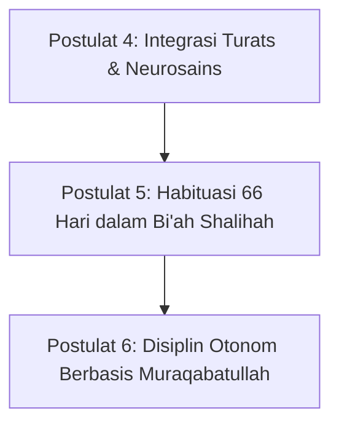

# SUB-BAB 5.2: POSTULAT 4–6: SUMBER NILAI, PERUBAHAN, & DISIPLIN
## *Manifesto Epistemologis tentang Otoritas Wahyu-Sains, Siklus Habituasi Saraf, dan Internalisasi Disiplin Otonom*

**Kode Modul**: `BOOK-01/BAB-05/SUB-02`  
**Kategori**: Postulat Metodologis  
**Fokus Keilmuan**: Epistemologi Integratif & Psikologi Kognitif Moral

---

### Postulat 4: Sumber Kebenaran & Otoritas Moral (Integrasi Turats & Sains)
Al-Qur'an dan As-Sunnah sebagai sumber nilai transendental mutlak, diperkaya dengan warisan khazanah *Turats* ulama salafush shalih, serta dipadukan secara harmonis dengan konsensus sains perkembangan dan psikologi modern yang sahih.

### Postulat 5: Dinamika Perubahan Perilaku (Sains Habituasi & Bi'ah)
Perubahan perilaku sejati lahir dari kombinasi: pemahaman kognitif yang bermakna, latihan berulang selama 66 hari hingga membentuk otomatisasi saraf (*habit loop*), dan berada di dalam lingkungan sosial yang aman dan saling menguatkan (*Bi'ah Shalihah*).

### Postulat 6: Hakikat Disiplin (Regulasi Diri Otonom & Muraqabah)
Disiplin bukanlah ketakutan akan ancaman sanksi eksternal, melainkan kemampuan santri untuk mengendalikan hawa nafsu dan mengatur diri sendiri secara otonom (*internalized self-discipline*) didorong oleh kesadaran *muraqabatullah* (merasa diawasi oleh Allah SWT).

