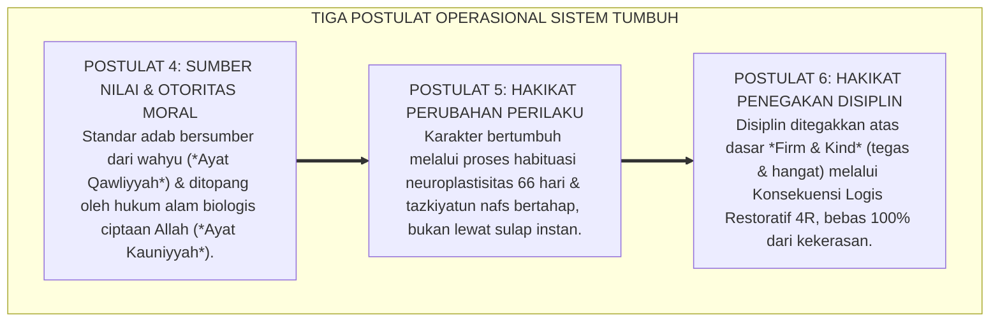

# SUB-BAB 5.2: POSTULAT 4 S.D. 6: SUMBER NILAI, PERUBAHAN, & DISIPLIN
## *Tiga Pilar Operasional: Otoritas Integratif Wahyu-Sains, Trajektori Perubahan 66-Hari, dan Disiplin Restoratif Tanpa Kekerasan*

**Kode Klasifikasi**: `BOOK-01/BAB-05/SUB-02/MONOGRAF-MASTER-VIBRANT`  
**Disiplin Ilmu**: Epistemologi Moral Islam, Kinesiologi Perubahan Karakter, & Teori Disiplin Restoratif  
**Penanggung Jawab Keilmuan**: Dewan Pakar Ekosistem TUMBUH (*Master Author, Pakar Arsitektur PBIS Restoratif, & Pakar Disiplin Positif*)

---

### Tiga Mesin Penggerak Transformasi Karakter

Setelah kita memahami siapa santri, siapa pendidik, dan apa tujuan akhirnya, langkah berikutnya adalah merumuskan mesin operasional pembinaannya:

* *Dari manakah kita mengambil standar nilai benar dan salah?*
* *Bagaimana proses perubahan karakter itu sebenarnya terjadi di dalam diri manusia?*
* *Dan bagaimana cara kita menegakkan disiplin Ketika terjadi pelanggaran aturan?*

Ekosistem **TUMBUH** menjawabnya melalui **Tiga Postulat Filosofis Kedua (Postulat 4, 5, dan 6)**:

<b>Gambar 5.2.1:</b> Tiga Postulat Operasional Sistemik Ekosistem TUMBUH.

---

### Postulat 4: Sumber Nilai — Paduan Berkah Wahyu dan Presisi Sains

Sistem TUMBUH menolak relativisme moral sekuler dan menolak tekstualisme buta:
1. **Wahyu sebagai Penentu Nilai Mutlak**: Al-Qur'an dan Sunnah adalah sumber hukum halal-haram dan standar akhlak yang abadi.
2. **Sains sebagai Penjelas Mekanisme Fisiologis**: Neurosains dan psikologi perkembangan digunakan untuk memahami cara kerja biologis otak santri agar proses transfer nilai berjalan efektif dan penuh kasih sayang.

---

### Postulat 5: Hakikat Perubahan — Proses Sabar Selama 66 Hari

Sistem TUMBUH menolak ilusi perubahan instan:
1. **Hukum Ketetapan Waktu (*Sunnatullah al-Tadarruj*)**: Membentuk kebiasaan adab baru membutuhkan waktu biologis rata-rata 66 hari berturut-turut untuk melapisi sirkuit saraf dengan mielin di *Basal Ganglia*.
2. **Menghormati Proses Bertahap**: Pendampingan dilakukan melintasi tiga fase: Inisiasi (Hari 1–21), Internalisasi (Hari 22–45), dan Otomatisasi Mandiri (Hari 46–66).

---

### Postulat 6: Hakikat Disiplin — Tegas Tanpa Menyakiti (*Firm & Kind*)

Sistem TUMBUH merevolusi makna disiplin dari "hukuman balas dendam" menjadi "proses pemulihan dan pembelajaran moral":
1. **Menghapus Mutlak Kekerasan Fisik & Verbal**: Rotan, tamparan, pembentakan massal, dan sidang senior dilarang 100%.
2. **Penerapan Konsekuensi Logis Restoratif 4R**: Pelanggaran diselesaikan dengan konsekuensi yang **Related** (terkait), **Respectful** (santun), **Reasonable** (masuk akal), dan **Restorative** (memulihkan persaudaraan melalui *Ishlah al-Bain*).

---

## 📌 Catatan Kaki & Rujukan Primer

[^1]: **Jane Nelsen**, *Positive Discipline* (New York: Ballantine Books, 2006), hlm. 15–48.
[^2]: **Howard Zehr**, *The Little Book of Restorative Justice* (Intercourse: Good Books, 2002), hlm. 12–35.
