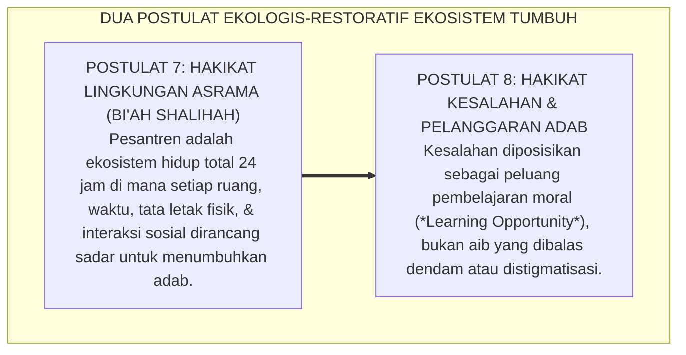
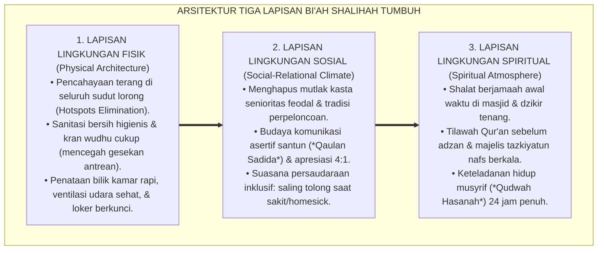
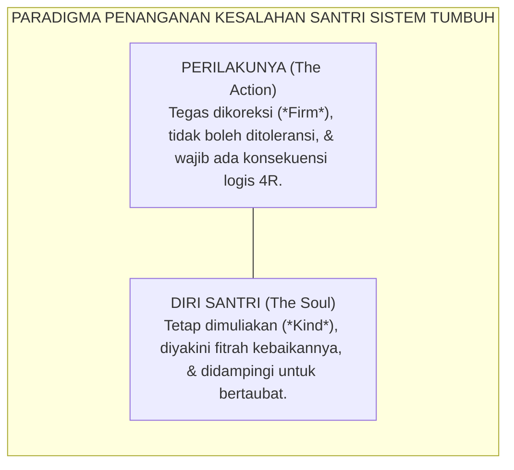

# POSTULAT 7 & 8: EKOSISTEM TOTAL & RESTORASI KESALAHAN

---

### 🧭 PETA POSISI PANDUAN DALAM SISTEM TUMBUH (DARI HULU KE HILIR)
* **Posisi Arsitektur**: `HULU EKOSISTEM (Akar Filosofis, Fitrah al-Munazzalah, & Worldview Islam)`
* **Peruntukan Pengguna**: Pimpinan Pesantren, Pengasuh Pondok, Kepala Madrasah, & Dewan Asatidz
* **Fokus Panduan**: Membangun cara pandang pengasuhan berbasis fitrah kesucian dan keteladanan nyata (Qudwah Hasanah), mengeliminasi tradisi kekerasan fisik dan feodalisme asrama.
* **Hasil Akhir yang Dituju**: Terwujudnya santri berkarakter *Insan Adabi* yang mandiri, musyrif yang mengasuh dengan kasih sayang tanpa *burnout*, dan pesantren yang aman berbasis data (*Safe Boarding School*).

---

### 🎯 Mengapa Panduan Ini Ada & Masalah Nyata yang Dipecahkan
1. **Latar Masalah di Lapangan**: Sering kali pengasuhan di pesantren berjalan tanpa SOP yang jelas atau terjebak dalam pola reaktif—menunggu santri berbuat salah baru dihukum dengan emosional.
2. **Solusi Sistem TUMBUH**: Panduan ini memberikan langkah preventif dan terstruktur agar setiap pembiasaan adab berjalan terencana, konsisten, dan terukur.
3. **Sasaran Perubahan**: Memastikan nilai-nilai Islam menyatu dalam perilaku harian santri melalui keteladanan nyata (*Qudwah Hasanah*).

---
### 🎯 Tujuan & Manfaat Panduan
Panduan ini dirancang sebagai petunjuk operasional terapan agar pendidik dan musyrif dapat:
1. Menjalankan pembinaan adab santri dengan pendekatan kasih sayang (*Rahmah*) dan ketegasan yang mendidik (*Firm & Kind*).
2. Menghindari cara-cara kekerasan fisik, bentakan verbal, maupun hukuman yang mempermalukan santri.
3. Menciptakan suasana asrama dan kelas yang aman, tertib, dan menumbuhkan kesadaran diri (*Bi'ah Shalihah*).

---

### 💡 Intisari Cepat (3 Menit Memahami Esensi)
* **Kunci Pengasuhan**: Karakter santri tumbuh melalui keteladanan nyata (*Qudwah Hasanah*), komunikasi empatik, dan pembiasaan terstruktur 24 jam.
* **Tindakan Utama**: Terapkan panduan langkah demi langkah di bawah ini secara konsisten, pantau perkembangan santri secara objektif, dan berikan apresiasi atas setiap perbaikan diri yang mereka capai.
* **Prinsip Disiplin**: Fokus pada pemulihan hubungan dan tanggung jawab nyata (*Restoratif*), bukan sekadar melampiaskan amarah atau menghukum.

---

---

### 💬 ILUSTRASI NYATA & ANALOGI SEDERHANA
Bayangkan sebuah skenario yang sering kita lihat sehari-hari di asrama:
* Ketika seorang santri baru melakukan kekeliruan (misalnya terlambat bangun Subuh atau kasurnya berantakan), respon pertama yang sering muncul adalah bentakan keras atau hukuman fisik (seperti push-up atau jemur di lapangan).
* **Hasilnya?** Santri tersebut mungkin tampak patuh seketika karena takut, tetapi di dalam hatinya tumbuh rasa dongkol, dendam tersembunyi, atau kebiasaan "bersandiwara"—hanya tertib ketika ada pengawas di dekatnya.

Dalam Sistem TUMBUH, kita menggunakan cara yang jauh lebih cerdas, sejuk, dan membumi:
1. **Analogi "Rem dan Pedal Gas Otak"**: Santri usia remaja (usia MTs dan Aliyah) memiliki bagian otak emosi (*Sistem Limbik*) yang sudah menyala sangat kuat seperti *pedal gas mobil sport*, namun otak pengendali logikanya (*Prefrontal Cortex*) masih dalam proses tumbuh seperti *sistem rem yang baru dipasang*. Tugas guru dan musyrif bukan memarahi mobilnya, melainkan menjadi **"Sopir Teladan & Sabuk Pengaman"** yang mendampingi santri belajar menginjak rem dengan bijak.
2. **Kekuatan Contoh Nyata (*Qudwah Hasanah*)**: Santri jauh lebih cepat meniru apa yang mereka **lihat** setiap hari daripada apa yang mereka **dengar** dari ribuan nasihat panjang. Jika musyrif datang tepat waktu, tersenyum ramah, dan kamarnya rapi, santri akan menirunya dengan sukarela.

---

### 🛠️ PANDUAN LANGKAH PRAKTIS LAPANGAN (BISA LANGSUNG DIPRAKTIKKAN HARI INI)

| Tahapan Aksi | Tindakan Nyata Musyrif / Guru di Lapangan | Hal yang Harus Diperhatikan |
| :--- | :--- | :--- |
| **1. Langkah Persiapan (Sebelum Kejadian)** | Sepakati aturan bersama santri di awal pekan dengan kalimat positif (contoh: *"Kamar rapi membuat istirahat kita berkah"*). | Buat poster visual sederhana yang mudah dibaca di dinding kamar. |
| **2. Langkah Respon (Saat Terjadi Masalah)** | Tarik napas, tenangkan diri, ajak santri berbicara empat mata tanpa mempermalukannya di depan teman-temannya. | Gunakan nada bicara yang tenang namun tegas (*Firm & Kind*). |
| **3. Langkah Perbaikan (Tanggung Jawab Nyata)** | Minta santri memperbaiki kesalahannya secara langsung (contoh: merapikan kembali barang yang berantakan atau meminta maaf). | Berikan apresiasi seketika santri telah menuntaskan perbaikannya. |

---

### 🗣️ CONTOH DIALOG LAPANGAN (YANG HARUS DIUCAPKAN VS DIHINDARI)

* ❌ **JANGAN UCAPKAN (Membuat Santri Menutup Diri & Dendam)**:
  > *"Kamu ini pemalas sekali ya, sudah dibilangi berkali-kali masih saja kasur berantakan! Push-up 50 kali sekarang!"*
* ✅ **UCAPKAN INI (Mendidik Tanggung Jawab & Kesadaran Diri)**:
  > *"Akhi, antum tahu kesepakatan kamar kita tentang kerapian tempat tidur setelah Subuh. Coba lihat kasur antum sekarang, apa yang perlu disempurnakan? Mari rapikan bersama sekarang agar kamar kita nyaman dan berkah."*

---

### 📋 3 POIN EMAS RANGKUMAN (UNTUK SANTRI SENIOR & MUSYRIF MUDA)
1. **Didik dengan Kasih Sayang, Tegakkan Batas dengan Adil**: Jangan pernah mencampuradukkan ketegasan aturan dengan pelampiasan amarah pribadi.
2. **Apresiasi 4x Lebih Banyak daripada Teguran (*Magic Ratio 4:1*)**: Jangan hanya bersuara ketika santri berbuat salah. Saat mereka berbuat baik (salat di shaf depan, menolong kawan, membaca Al-Qur'an), segera berikan pujian tulus.
3. **Fokus pada Perbaikan Hubungan (*Restoratif*)**: Masalah perilaku adalah peluang emas untuk mendidik santri menjadi pribadi yang lebih dewasa dan bertanggung jawab.

---

### 📖 Uraian Lengkap Landasan & Rujukan Sistem

---

### Ekosistem yang Mengayomi dan Jiwa yang Berani Memperbaiki Diri

Dua pilar filosofis berikutnya yang sangat menentukan iklim budaya sebuah pesantren menyentuh ranah ekologi dan cara pandang terhadap manusia:

* *Bagaimana sebenarnya lingkungan fisik, sosial, dan spiritual asrama memengaruhi pembentukan karakter santri selama 24 jam penuh?*
* *Dan bagaimana cara kita memandang seorang santri tatkala ia khilaf berbuat kesalahan atau melanggar aturan pondok?*

Di banyak lembaga konvensional, lingkungan asrama kerap diposisikan sekadar sebagai "tempat penampungan raga" setelah jam sekolah usai, sementara kesalahan santri dipandang sebagai "aib yang memalukan" yang harus dibalas dengan penghukuman keras. 

Sistem **TUMBUH** menjawab kedua tantangan fundamental ini melalui **Postulat 7 dan Postulat 8**:

<b>Gambar 5.3.1:</b> Dua Postulat Ekologis-Restoratif Ekosistem TUMBUH.

---

### Postulat 7: Hakikat Lingkungan — Bi'ah Shalihah Total 24-Jam Tanpa Sekat

Teori Ekologi Perkembangan Manusia oleh **Urie Bronfenbrenner[^1]**[^1] membuktikan bahwa karakter anak dibentuk oleh interaksi simultan antara mikrosistem (kamar asrama), mesosistem (hubungan madrasah-asrama), dan makrosistem (budaya lembaga).

Dalam Sistem TUMBUH, *Bi'ah Shalihah* bukanlah slogan kosong, melainkan rekayasa lingkungan terpadu yang mencakup tiga lapisan:

<b>Gambar 5.3.2:</b> Tiga Lapisan Rekayasa Ekologi Bi'ah Shalihah Ekosistem TUMBUH.

Ketika ketiga lapisan ini berpadu harmonis, lingkungan pesantren menjadi medan energi positif yang menyirami benih fitrah santri setiap detik. Santri tidak perlu merasa waspada atau takut; sistem sarafnya berada dalam status rasa aman (*Ventral Vagal State*), memampukan otak depan (*PFC*) menyerap hafalan Al-Qur'an dan ilmu syariat dengan kapasitas maksimal.

---

### Postulat 8: Hakikat Kesalahan — Peluang Emas Pembelajaran Moral

Bagaimana seorang musyrif sejati memandang santri yang berbuat salah?

Dalam pandangan Sistem TUMBUH, manusia tidak diciptakan maksum layaknya malaikat. Rasulullah SAW bersabda:
$$\text{كُلُّ ابْنِ آدَمَ خَطَّاءٌ، وَخَيْرُ الْخَطَّائِينَ التَّوَّابُونَ}$$
*"Setiap anak cucu Adam pasti sering berbuat salah, dan sebaik-baik orang yang berbuat salah adalah mereka yang bertaubat (memperbaiki diri)."* (HR. At-Tirmidzi no. 2499 dan Ibnu Majah no. 4251).

Sistem TUMBUH membedah kesalahan santri melalui prinsip **Pemisahan Perilaku dari Hakikat Diri Santri (*Separating the Deed from the Doer*)**:

<b>Gambar 5.3.3:</b> Prinsip Pemisahan Perilaku dan Hakikat Diri Santri dalam Penanganan Pelanggaran.

1. **Kesalahan sebagai Pintu Masuk Edukasi (*Learning Opportunity*)**:  
   Tatkala seorang santri melanggar aturan (misalnya: bangun terlambat atau berselisih dengan kawan), musyrif memandangnya sebagai tanda bahwa santri tersebut sedang kekurangan keterampilan (*skill deficit*) atau sedang mengalami kelelahan emosi. Musyrif hadir untuk mengajarkan keterampilan yang belum dikuasai tersebut.
2. **Menghapus Stigmatisasi Sosial**:  
   Santri yang berbuat salah dilarang keras diberi label pejoratif seperti *"anak nakal"*, *"biang onar"*, atau *"sampah asrama"*. Pelabelan buruk hanya akan mengunci anak ke dalam identitas negatif (*Self-Fulfilling Prophecy*).
3. **Fokus pada Tanggung Jawab Restoratif**:  
   Alih-alih menenggelamkan santri dalam rasa bersalah yang destruktif, musyrif membimbingnya untuk mengambil aksi nyata: *"Antum telah berbuat khilaf, dan itu manusiawi. Sekarang, apa yang bisa antum lakukan untuk memperbaiki keadaan dan mengembalikan kepercayaan kawan-kawan sekamar?"*

Dengan menyatukan lingkungan Bi'ah Shalihah 24-jam yang menyejukkan dan paradigma kesalahan yang memulihkan, Sistem TUMBUH mentransformasikan asrama pesantren menjadi kawah candradimuka peradaban: tempat di mana setiap kekhilafan diubah menjadi hikmah kedewasaan, dan setiap jiwa dibimbing kembali kepada jalan fitrah yang suci.

---

## 📌 Catatan Kaki & Rujukan Primer

[^1]: **Urie Bronfenbrenner**, *The Ecology of Human Development: Experiments by Nature and Design* (Cambridge: Harvard University Press, 1979), hlm. 16–48.
[^2]: **Howard Zehr**, *Changing Lenses: A New Focus for Crime and Justice* (Scottsdale: Herald Press, 1990), Bab 10: "Restorative Justice", hlm. 175–214.
