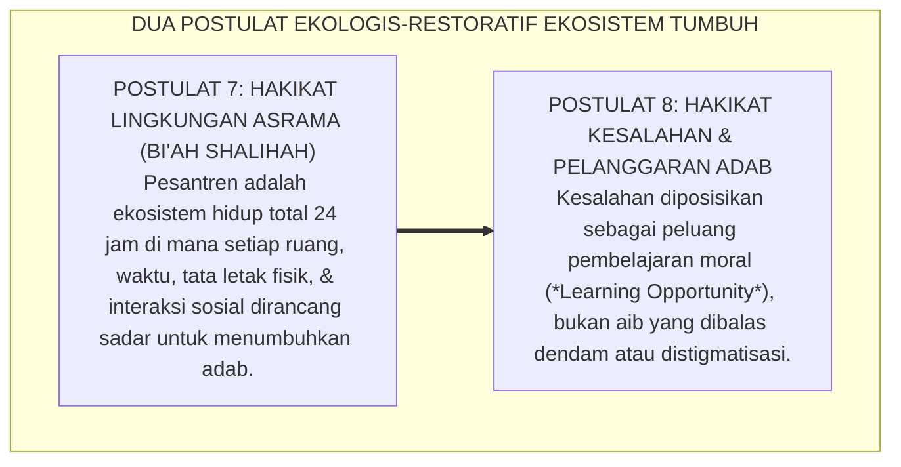
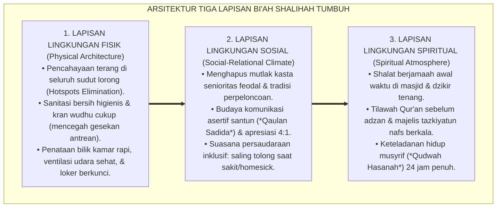
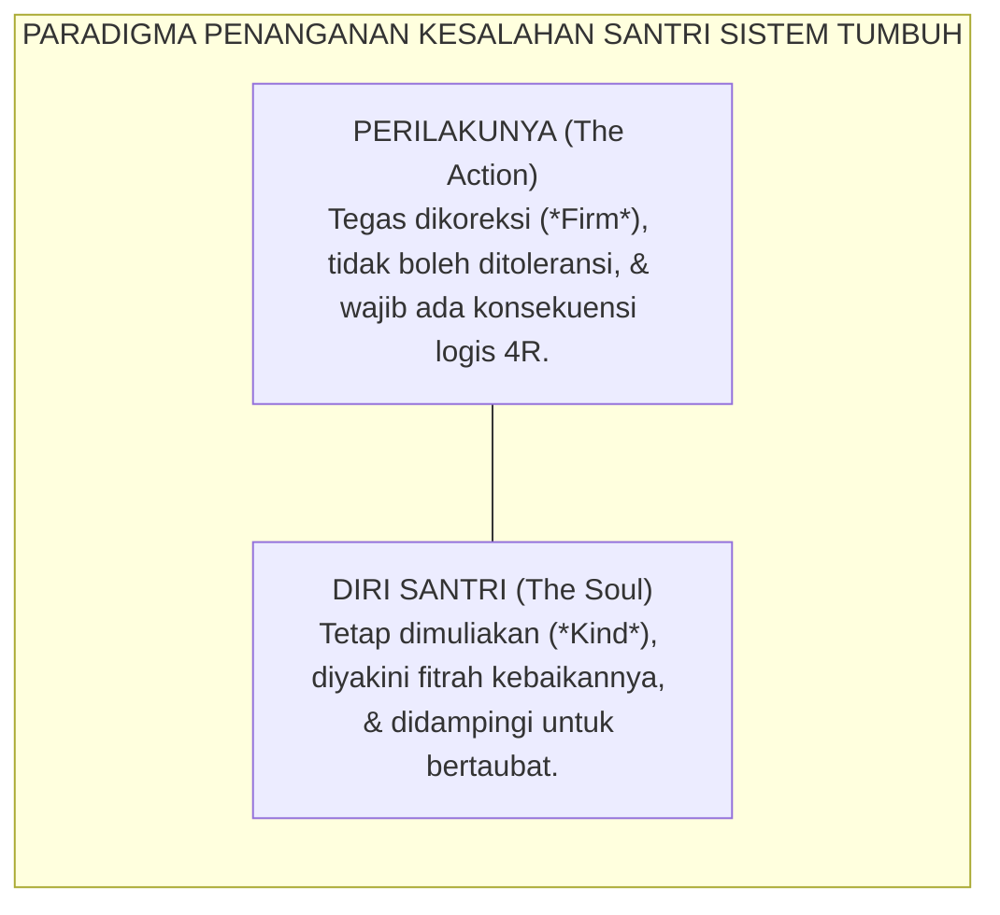

# SUB-BAB 5.3: POSTULAT 7 & 8: EKOSISTEM TOTAL & RESTORASI KESALAHAN
## *Dua Fondasi Ekologis: Lingkungan 24-Jam Bi'ah Shalihah dan Paradigma Kesalahan sebagai Peluang Pembelajaran Moral*

**Kode Klasifikasi**: `BOOK-01/BAB-05/SUB-03/MONOGRAF-MASTER-VIBRANT`  
**Disiplin Ilmu**: Ekologi Pendidikan Pesantren, Kriminologi Restoratif Anak, & Manajemen Kasus Asrama  
**Penanggung Jawab Keilmuan**: Dewan Pakar Ekosistem TUMBUH (*Master Author, Pakar Kuratif Restoratif, & Pakar Pengasuhan Asrama*)

---

### Ekosistem yang Mengayomi dan Jiwa yang Berani Memperbaiki Diri

Dua pilar filosofis berikutnya yang sangat menentukan iklim budaya sebuah pesantren menyentuh ranah ekologi dan cara pandang terhadap manusia:

* *Bagaimana sebenarnya lingkungan fisik, sosial, dan spiritual asrama memengaruhi pembentukan karakter santri selama 24 jam penuh?*
* *Dan bagaimana cara kita memandang seorang santri tatkala ia khilaf berbuat kesalahan atau melanggar aturan pondok?*

Di banyak lembaga konvensional, lingkungan asrama kerap diposisikan sekadar sebagai "tempat penampungan raga" setelah jam sekolah usai, sementara kesalahan santri dipandang sebagai "aib yang memalukan" yang harus dibalas dengan penghukuman keras. 

Sistem **TUMBUH** menjawab kedua tantangan fundamental ini melalui **Postulat 7 dan Postulat 8**:

<b>Gambar 5.3.1:</b> Dua Postulat Ekologis-Restoratif Ekosistem TUMBUH.

---

### Postulat 7: Hakikat Lingkungan — Bi'ah Shalihah Total 24-Jam Tanpa Sekat

Teori Ekologi Perkembangan Manusia oleh **Urie Bronfenbrenner[^1]**[^1] membuktikan bahwa karakter anak dibentuk oleh interaksi simultan antara mikrosistem (kamar asrama), mesosistem (hubungan madrasah-asrama), dan makrosistem (budaya lembaga).

Dalam Sistem TUMBUH, *Bi'ah Shalihah* bukanlah slogan kosong, melainkan rekayasa lingkungan terpadu yang mencakup tiga lapisan:

<b>Gambar 5.3.2:</b> Tiga Lapisan Rekayasa Ekologi Bi'ah Shalihah Ekosistem TUMBUH.

Ketika ketiga lapisan ini berpadu harmonis, lingkungan pesantren menjadi medan energi positif yang menyirami benih fitrah santri setiap detik. Santri tidak perlu merasa waspada atau takut; sistem sarafnya berada dalam status rasa aman (*Ventral Vagal State*), memampukan otak depan (*PFC*) menyerap hafalan Al-Qur'an dan ilmu syariat dengan kapasitas maksimal.

---

### Postulat 8: Hakikat Kesalahan — Peluang Emas Pembelajaran Moral

Bagaimana seorang musyrif sejati memandang santri yang berbuat salah?

Dalam pandangan Sistem TUMBUH, manusia tidak diciptakan maksum layaknya malaikat. Rasulullah SAW bersabda:
$$\text{كُلُّ ابْنِ آدَمَ خَطَّاءٌ، وَخَيْرُ الْخَطَّائِينَ التَّوَّابُونَ}$$
*"Setiap anak cucu Adam pasti sering berbuat salah, dan sebaik-baik orang yang berbuat salah adalah mereka yang bertaubat (memperbaiki diri)."* (HR. At-Tirmidzi no. 2499 dan Ibnu Majah no. 4251).

Sistem TUMBUH membedah kesalahan santri melalui prinsip **Pemisahan Perilaku dari Hakikat Diri Santri (*Separating the Deed from the Doer*)**:

<b>Gambar 5.3.3:</b> Prinsip Pemisahan Perilaku dan Hakikat Diri Santri dalam Penanganan Pelanggaran.

1. **Kesalahan sebagai Pintu Masuk Edukasi (*Learning Opportunity*)**:  
   Tatkala seorang santri melanggar aturan (misalnya: bangun terlambat atau berselisih dengan kawan), musyrif memandangnya sebagai tanda bahwa santri tersebut sedang kekurangan keterampilan (*skill deficit*) atau sedang mengalami kelelahan emosi. Musyrif hadir untuk mengajarkan keterampilan yang belum dikuasai tersebut.
2. **Menghapus Stigmatisasi Sosial**:  
   Santri yang berbuat salah dilarang keras diberi label pejoratif seperti *"anak nakal"*, *"biang onar"*, atau *"sampah asrama"*. Pelabelan buruk hanya akan mengunci anak ke dalam identitas negatif (*Self-Fulfilling Prophecy*).
3. **Fokus pada Tanggung Jawab Restoratif**:  
   Alih-alih menenggelamkan santri dalam rasa bersalah yang destruktif, musyrif membimbingnya untuk mengambil aksi nyata: *"Antum telah berbuat khilaf, dan itu manusiawi. Sekarang, apa yang bisa antum lakukan untuk memperbaiki keadaan dan mengembalikan kepercayaan kawan-kawan sekamar?"*

Dengan menyatukan lingkungan Bi'ah Shalihah 24-jam yang menyejukkan dan paradigma kesalahan yang memulihkan, Sistem TUMBUH mentransformasikan asrama pesantren menjadi kawah candradimuka peradaban: tempat di mana setiap kekhilafan diubah menjadi hikmah kedewasaan, dan setiap jiwa dibimbing kembali kepada jalan fitrah yang suci.

---

## 📌 Catatan Kaki & Rujukan Primer

[^1]: **Urie Bronfenbrenner**, *The Ecology of Human Development: Experiments by Nature and Design* (Cambridge: Harvard University Press, 1979), hlm. 16–48.
[^2]: **Howard Zehr**, *Changing Lenses: A New Focus for Crime and Justice* (Scottsdale: Herald Press, 1990), Bab 10: "Restorative Justice", hlm. 175–214.
