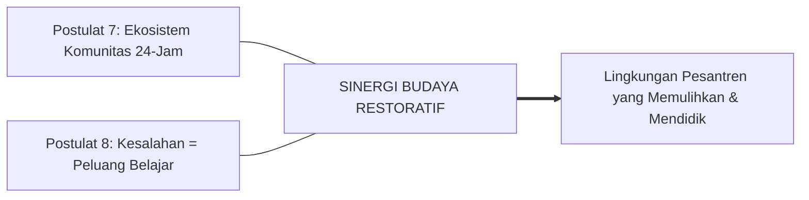

# SUB-BAB 5.3: POSTULAT 7–8: TOTAL ECOSYSTEM & RESTORASI KESALAHAN
## *Manifesto tentang Keterlibatan Seluruh Warga Pesantren dan Pergeseran dari Hukuman Menuju Peluang Belajar*

**Kode Modul**: `BOOK-01/BAB-05/SUB-03`  
**Kategori**: Postulat Komunitas & Intervensi  
**Fokus Keilmuan**: Whole-School PBIS & Restorative Justice

---

### Postulat 7: Peran Komunitas sebagai Total Ecosystem
Seluruh elemen warga pesantren (pimpinan, dewan guru, musyrif, wali kelas, staf kebersihan, koki dapur, petugas keamanan, dan sesama santri) adalah satu kesatuan ekosistem pembelajaran (*Total Community Engagement*). Tidak ada sudut pondok yang netral dari pendidikan adab.

### Postulat 8: Posisi Kesalahan sebagai Peluang Belajar (Learning Opportunity)
Kesalahan dan pelanggaran disiplin dipandang sebagai proses alami dalam tumbuh kembang moral santri. Penanganannya tidak menggunakan penghakiman atau balas dendam, melainkan melalui **Disiplin Restoratif**: menyadarkan dampak perbuatan, menumbuhkan muhasabah, dan melakukan tindakan pemulihan hak (*Restitution & Ishlah al-Bain*).

