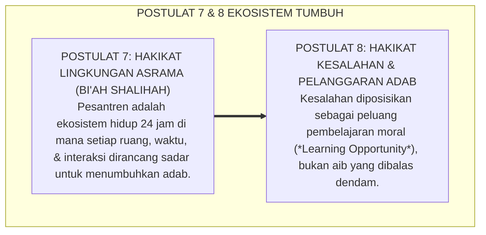

# SUB-BAB 5.3: POSTULAT 7 & 8: EKOSISTEM TOTAL & RESTORASI KESALAHAN
## *Dua Fondasi Ekologis: Lingkungan 24-Jam Bi'ah Shalihah dan Paradigma Kesalahan sebagai Peluang Pembelajaran Moral*

**Kode Klasifikasi**: `BOOK-01/BAB-05/SUB-03/MONOGRAF-MASTER-VIBRANT`  
**Disiplin Ilmu**: Ekologi Pendidikan Pesantren, Kriminologi Restoratif Anak, & Manajemen Kasus Asrama  
**Penanggung Jawab Keilmuan**: Dewan Pakar Ekosistem TUMBUH (*Master Author, Pakar Kuratif Restoratif, & Pakar Pengasuhan Asrama*)

---

### I. Pintu Masuk: Ekosistem yang Mengayomi dan Jiwa yang Berani Memperbaiki Diri

Dua pertanyaan krusial yang menentukan iklim budaya sebuah pesantren adalah:
* *Bagaimana lingkungan asrama memengaruhi pertumbuhan akhlak santri?*
* *Dan bagaimana cara kita memandang seorang santri tatkala ia berbuat kesalahan atau melanggar aturan pondok?*

Ekosistem **TUMBUH** menjawab kedua pertanyaan ini melalui **Postulat 7 dan Postulat 8**:

<b>Gambar 5.3.1:</b> Postulat 7 (Ekosistem Total) dan Postulat 8 (Restorasi Kesalahan) Sistem TUMBUH.

---

### II. Postulat 7: Hakikat Lingkungan — Bi'ah Shalihah 24-Jam Tanpa Sekat

Sistem TUMBUH memandang asrama bukan sekadar tempat tidur, melainkan laboratorium pembiasaan adab:
1. **Penyatuan Madrasah dan Asrama**: Menghubungkan Wali Kelas dan Musyrif melalui pertukaran data harian 15 menit, memastikan tidak ada ruang hampa pendampingan.
2. **Rekayasa Tiga Lapis Lingkungan**: Lingkungan fisik yang bersih dan terang, lingkungan sosial tanpa perundungan, dan lingkungan spiritual yang dipenuhi dzikir dan shalat khusyuk.

---

### III. Postulat 8: Hakikat Kesalahan — Peluang Emas Pembelajaran Moral

Dalam Sistem TUMBUH, ketika seorang santri melanggar aturan (seperti terlambat atau berselisih dengan kawan), respons pertama pembina bukanlah amarah, melainkan **pendampingan restoratif**:
1. **Memisahkan Perilaku dari Nilai Diri Santri**: Perilakunya yang keliru dikoreksi dengan tegas (*Firm*), namun martabat dan harga diri santri tetap dimuliakan dengan penuh kasih sayang (*Kind*).
2. **Fokus pada Restitusi Nyata (*Making Things Right*)**: Mengajak santri merenungkan dampak perbuatannya, meminta maaf secara tulus, dan melakukan perbaikan nyata kepada pihak yang dirugikan melalui mekanisme *Ishlah al-Bain*.

---

### IV. Sintesis Ekologis-Restoratif Sub-Bab 5.3

Lingkungan yang aman melahirkan jiwa yang berani jujur mengakui kesalahan. 

Dengan menyatukan lingkungan 24 jam yang sehat dan pendekatan disiplin yang memulihkan, Sistem TUMBUH mentransformasikan asrama pesantren menjadi rahim kasih sayang yang menyembuhkan luka batin dan menumbuhkan karakter mulia.

---

## 📌 Catatan Kaki & Rujukan Primer

[^1]: **Urie Bronfenbrenner**, *The Ecology of Human Development: Experiments by Nature and Design* (Cambridge: Harvard University Press, 1979), hlm. 16–42.
[^2]: **Howard Zehr**, *Changing Lenses: A New Focus for Crime and Justice* (Scottsdale: Herald Press, 1990), Bab 10: "Restorative Justice", hlm. 175–214.
