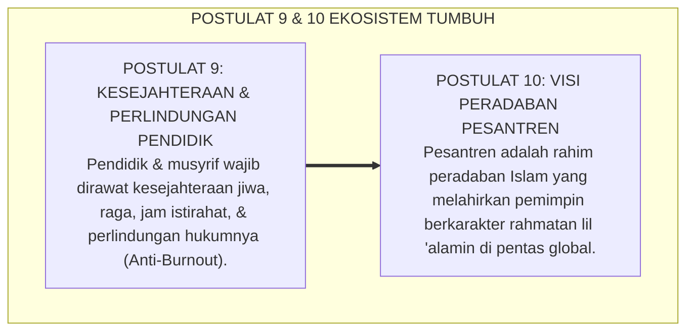

# SUB-BAB 5.4: POSTULAT 9 & 10: KESEJAHTERAAN PENDIDIK & VISI GLOBAL
## *Dua Mahkota Terakhir: Perlindungan Musyrif dari Kelelahan Kronis dan Visi Pesantren sebagai Rahmatan lil 'Alamin*

**Kode Klasifikasi**: `BOOK-01/BAB-05/SUB-04/MONOGRAF-MASTER-VIBRANT`  
**Disiplin Ilmu**: Manajemen Kesejahteraan Pendidik (*Teacher Well-Being*), Psikologi Burnout, & Visi Peradaban Islam  
**Penanggung Jawab Keilmuan**: Dewan Pakar Ekosistem TUMBUH (*Master Author, Pakar Tata Kelola Qudwah, & Pakar Filosofi TUMBUH*)

---

### Merawat Sang Perawat dan Menatap Masa Depan Dunia

Sepuluh bangunan filosofis Sistem TUMBUH ditutup oleh dua pilar mahkota yang sangat menentukan keberlanjutan institusi:
* *Bagaimana kita menjaga para musyrif dan asatidz agar tidak tumbang kelelahan (*burnout*) di tengah tugas membina santri 24 jam?*
* *Dan bagaimana visi besar pesantren untuk menjawab tantangan krisis moral peradaban dunia di masa depan?*

Ekosistem **TUMBUH** menjawab kedua pertanyaan pamungkas ini melalui **Postulat 9 dan Postulat 10**:

<b>Gambar 5.4.1:</b> Postulat 9 (Kesejahteraan Pendidik) dan Postulat 10 (Visi Peradaban Global) Sistem TUMBUH.

---

### Postulat 9: Kesejahteraan Pendidik — Pendidik yang Lelah Tidak Bisa Menyayangi

Sistem TUMBUH memegang kaidah emas: **"Hanya jiwa yang tenang dan bahagia yang mampu mengalirkan ketenangan dan kasih sayang kepada santrinya"**:
1. **Pencegahan Burnout Musyrif**: Musyrif dijamin memiliki jadwal libur berkala, waktu istirahat yang manusiawi, dan sistem pembagian shift yang adil.
2. **Kesejahteraan Finansial & Spiritual**: Menjamin nafkah yang bermartabat dan menyediakan ruang *Tazkiyatun Nafs* khusus bagi asatidz agar api keikhlasan dan semangat mengasuh selalu menyala.
3. **Triad Pertumbuhan Simbiotik**: Guru dan musyrif harus ikut bertumbuh secara kapasitas dan spiritual bersama dengan pertumbuhan santri.

---

### Postulat 10: Visi Global — Pesantren sebagai Rahmat bagi Semesta

Sistem TUMBUH menatap masa depan peradaban dengan penuh optimisme:
1. **Episentrum Moral Dunia**: Pesantren bukan sekadar lembaga lokal, melainkan model peradaban alternatif bagi dunia yang sedang dilanda krisis kemanusiaan dan kehampaan spiritual.
2. **Mencetak Pemimpin Berwawasan Global**: Santri TUMBUH dididik untuk menguasai bahasa internasional, teknologi modern, dan wawasan global, sembari tetap memegang teguh sanad akhlak nabawi sebagai rahmat bagi semesta alam (*Rahmatan lil 'Alamin*).

---

## 📌 Catatan Kaki & Rujukan Primer

[^1]: **Christina Maslach & Michael P. Leiter**, *The Truth About Burnout: How Organizations Cause Personal Stress and What to Do About It* (San Francisco: Jossey-Bass, 1997), hlm. 20–55.
[^2]: **Prof. Dr. Syed Muhammad Naquib al-Attas**, *Islam and Secularism* (Kuala Lumpur: ABIM, 1978; ISTAC, 1993), Bab 4, hlm. 120–150.
