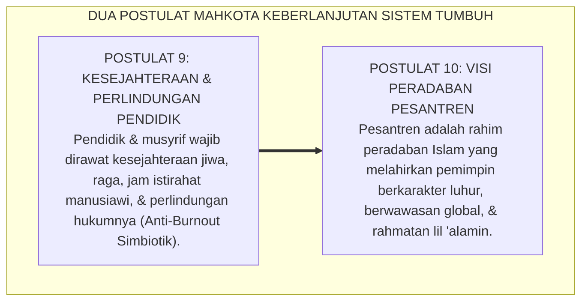
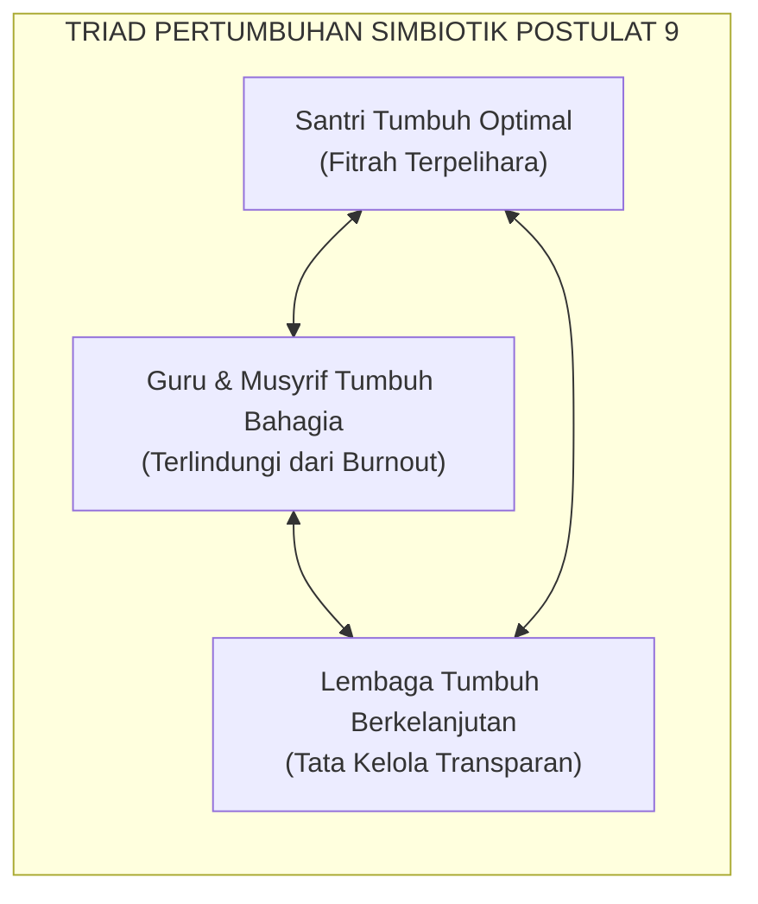
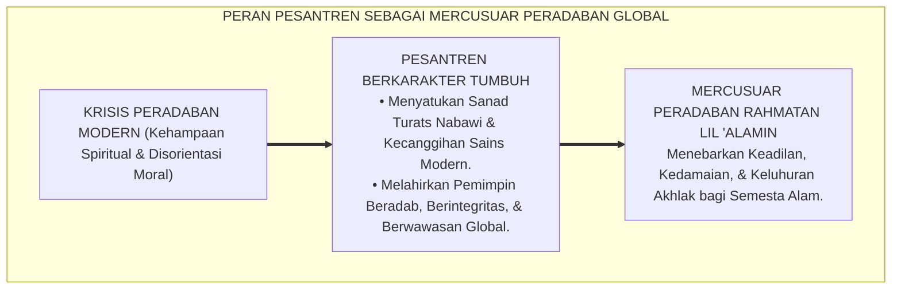

# POSTULAT 9 & 10: KESEJAHTERAAN PENDIDIK & VISI GLOBAL

---
### Merawat Sang Perawat dan Menatap Masa Depan Dunia

Sepuluh bangunan filosofis Ekosistem TUMBUH disempurnakan oleh dua pilar pamungkas yang menjadi mahkota penentu keberlanjutan masa depan peradaban:

* *Bagaimana kita merawat, melindungi, dan menyejahterakan para pembina dan musyrif di garis depan agar tidak layu terbakar kelelahan (*burnout*) di tengah tugas suci mengasuh santri 24 jam?*
* *Dan bagaimana visi besar peradaban pesantren untuk menjawab tantangan krisis moral dan kemanusiaan global di abad ke-21?*

Ekosistem **TUMBUH** menjawab kedua pertanyaan pamungkas ini melalui **Postulat 9 dan Postulat 10**:

<b>Gambar 5.4.1:</b> Postulat 9 (Kesejahteraan Pendidik) dan Postulat 10 (Visi Peradaban Global) Sistem TUMBUH.

---

### Postulat 9: Kesejahteraan Pendidik — Pendidik yang Lelah Tidak Bisa Menyayangi

Dalam ekosistem pendidikan tradisional, pengorbanan musyrif kerap kali diromantisasi secara keliru: musyrif yang tidak pernah tidur, tidak pernah libur, dan menerima upah sangat minim dipuji sebagai *"pembina yang paling ikhlas"*.

Sistem TUMBUH mendekonstruksi mitos berbahaya ini: **keikhlasan sejati tidak pernah menuntut pengabaian terhadap hak-hak biologis dan martabat kemanusiaan pembina!**

<b>Gambar 5.4.2:</b> Triad Pertumbuhan Simbiotik: Hubungan Timbal Balik Kesejahteraan Guru dan Santri.

1. **Prinsip Kesejahteraan Fisik & Mental Pembina**:  
   Rasulullah SAW bersabda: *"Sesungguhnya tubuhmu memiliki hak atasmu, dan jiwamu memiliki hak atasmu"* (HR. Al-Bukhari). Musyrif dijamin memiliki jadwal istirahat yang cukup (minimal 6 jam per hari) dan hak libur mingguan (1x24 jam) untuk meregenerasi energinya bersama keluarga.
2. **Perlindungan Hukum & Profesionalitas Lembaga**:  
   Lembaga pesantren memberikan perlindungan hukum yang jelas, SOP kerja baku, dan pelatihan kompetensi pengasuhan bersertifikat, membebaskan pembina dari rasa cemas dan ketidakpastian.
3. **Nafkah Bermartabat**:  
   Musyrif diposisikan sebagai profesi mulia pembangun peradaban yang berhak menerima penghargaan finansial yang adil dan manusiawi, menghindarkan mereka dari beban pikiran nafkah yang mengganggu konsentrasi mengasuh.

---

### Postulat 10: Visi Global — Pesantren sebagai Episentrum Moral Dunia

Sistem TUMBUH menatap masa depan dunia dengan penuh optimisme dan rasa percaya diri peradaban (*Izzah Islamiyyah*):

Dunia modern saat ini sedang dilanda **Krisis Kemanusiaan dan Kehampaan Spiritual Akut**:
* Lonjakan kasus depresi dan bunuh diri di kalangan remaja perkotaan.
* Runtuhnya nilai-nilai keluarga dan ikatan sosial.
* Kemajuan teknologi kecerdasan buatan (*AI*) yang tidak diimbangi oleh kompas moral dan etika ketuhanan.

<b>Gambar 5.4.3:</b> Peran Strategis Ekosistem Pesantren Berbasis TUMBUH sebagai Episentrum Moral Peradaban Dunia.

Dalam konteks inilah, **pesantren berkarakter TUMBUH hadir sebagai jawaban alternatif peradaban**:
* Pesantren bukan sekadar lembaga keagamaan lokal, melainkan **laboratorium peradaban Islam mini** yang mempraktikkan bagaimana sains, adab, teknologi, dan kasih sayang ketuhanan bersatu dalam harmoni kehidupan 24 jam.
* Santri lulusan TUMBUH dididik untuk menguasai bahasa internasional, teknologi mutakhir, dan nalar kritis ilmiah, sembari tetap memegang teguh sanad akhlak nabawi sebagai duta penebar berkah bagi semesta alam (*Rahmatan lil 'Alamin*).

Dengan menyatukan perlindungan kesejahteraan pendidik di garis depan dan visi peradaban yang melintasi batas zaman, Sistem TUMBUH memastikan bahwa pesantren akan terus berdiri kokoh sebagai mercusuar moral yang menyinari kegelapan dunia hingga akhir masa.

---

## 📌 Catatan Kaki & Rujukan Primer

[^1]: **Christina Maslach & Michael P. Leiter**, *The Truth About Burnout: How Organizations Cause Personal Stress and What to Do About It* (San Francisco: Jossey-Bass, 1997), hlm. 20–58.
[^2]: **Prof. Dr. Syed Muhammad Naquib al-Attas**, *Islam and Secularism* (Kuala Lumpur: ABIM, 1978; ISTAC, 1993), Bab 4, hlm. 120–155.

---

### IV. Eksplanasi Filosofis Lanjutan & Hermeneutika Nilai Postulat 9 & 10: Kesejahteraan Pendidik & Visi Global

Penyelidikan mendalam terhadap tema **POSTULAT 9 & 10: KESEJAHTERAAN PENDIDIK & VISI GLOBAL** menuntut pemahaman integral atas relasi antara *Ontologi Fitrah* dan *Sosiologi Pembelajaran Pesantren*. Ketika seorang santri memasuki ekosistem pendidikan, ia membawa amanah perjanjian primordial (*Mithaq*) yang menuntut ruang tumbuh yang aman dari distorsi psikologis.

1. **Dialektika Keikhlasan (*Shidq an-Niyyah*) vs Formalisme Perilaku**:
   Dalam pandangan *Hujjatul Islam* Al-Imam Al-Ghazali dalam *Ihya 'Ulumiddin*, pembentukan karakter yang sejati bermula dari pembersihan batin (*Thaharatul Batin*). Ketika sebuah institusi mereduksi adab menjadi kepatuhan semu di hadapan figur otoritas, yang sesungguhnya terjadi adalah pelemahan integritas diri (*Nifaq Tarbawi*). Sistem TUMBUH menegaskan bahwa kesalehan sejati harus lahir dari kemerdekaan batin yang disinari oleh cinta kepada Allah (*Mahabbatullah*) dan kesadaran pengawasan-Nya (*Muraqabatullah*).

2. **Dinamika Neuroplastisitas & Internalisasi Nilai Ruhiyyah**:
   Sains kognitif kontemporer membuktikan bahwa pembiasaan nilai yang disertai rasa takut ekstrem mengaktifkan poros *HPA (Hypothalamic-Pituitary-Adrenal)* dan membanjiri otak dengan hormon kortisol. Kondisi ini membekukan kemampuan *Prefrontal Cortex* untuk merefleksikan nilai secara mandiri. Sebaliknya, ketika nilai **POSTULAT 9 & 10: KESEJAHTERAAN PENDIDIK & VISI GLOBAL** disampaikan dalam suasana pengasuhan yang hangat (*Warm Presence*), otak santri melepaskan *oksitosin* dan *dopamin* yang mempercepat konsolidasi sinaptik dan pembentukan memori jangka panjang (*Long-Term Potentiation*).

3. **Matriks Transformasi Praksis Pembinaan**:

| Dimensi Pengasuhan | Pola Lama (Mekanistis-Punitif) | Pola Rekonstruksi Ekosistem TUMBUH |
| :--- | :--- | :--- |
| **Sumber Motivasi** | Tekanan eksternal dan rasa takut akan sanksi fisik. | Kesadaran fitrah internal dan kerinduan pada rida ilahi. |
| **Relasi Musyrif-Santri** | Pengawasan hierarkis intimidatif (panoptikon). | Keteladanan hidup (*Qudwah Hasanah*) dan pendampingan empatik. |
| **Ketahanan Karakter** | Runtuh ketika pengawasan ditiadakan (liburan/lulus). | Melekat kokoh sebagai kompas moral seumur hidup (*Insan Adabi*). |

---

### V. Refleksi Pedagogis & Rekomendasi Aksi Lembaga

Penerapan prinsip **POSTULAT 9 & 10: KESEJAHTERAAN PENDIDIK & VISI GLOBAL** di lingkungan pesantren menuntut komitmen kelembagaan yang terstruktur:
* **Audit Budaya Pengasuhan**: Pimpinan pesantren wajib melakukan refleksi berkala atas seluruh interaksi antara asatidz, musyrif, dan santri guna memastikan tidak ada celah bagi masuknya feodalisme atau kekerasan terselubung.
* **Penguatan Kapasitas Pendidik**: Setiap pembina asrama difasilitasi dengan pelatihan literasi psikologi perkembangan dan konseling Islam agar memiliki kematangan emosi dalam menghadapi dinamika santri.
* **Integrasi Ruhiyyah 24 Jam**: Memastikan bahwa setiap detik kehidupan santri di pondok—mulai dari bangun tidur, halaqah Qur'an, mudzakarah ilmu, hingga istirahat malam—selalu dinaungi oleh nilai keikhlasan dan ukhuwah yang tulus.
