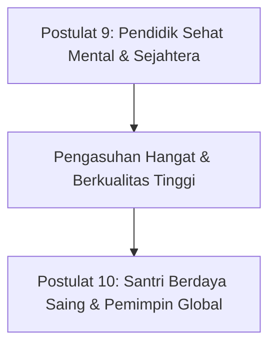

# SUB-BAB 5.4: POSTULAT 9–10: KESEJAHTERAAN PENDIDIK & VISI GLOBAL
## *Manifesto tentang Perlindungan Musyrif dari Kelelahan Emosional dan Kaderisasi Kepemimpinan Masa Depan*

**Kode Modul**: `BOOK-01/BAB-05/SUB-04`  
**Kategori**: Postulat SDM & Visi Masa Depan  
**Fokus Keilmuan**: Manajemen SDM Pesantren & Visi Peradaban Islam

---

### Postulat 9: Kesejahteraan & Ketahanan Jiwa Pendidik (Anti-Burnout)
Kualitas pengasuhan santri berbanding lurus dengan kesehatan mental, fisik, dan ruhiyah para pendidik. Lembaga wajib menjamin jam istirahat yang layak, sistem shift yang berkeadilan, supervisi klinis, dan iklim kerja yang saling memuliakan agar pendidik terhindar dari *burnout*. Pendidik yang kelelahan tidak akan mampu mengasuh dengan kesabaran.

### Postulat 10: Orientasi Masa Depan & Relevansi Peradaban Global
Santri dididik bukan untuk terasing dari realitas zaman, melainkan disiapkan menjadi pionir peradaban global yang memiliki kemandirian hidup, integritas etika di dunia digital, serta daya saing intelektual dan vokasional tingkat dunia berlandaskan keluhuran adab Islam.

