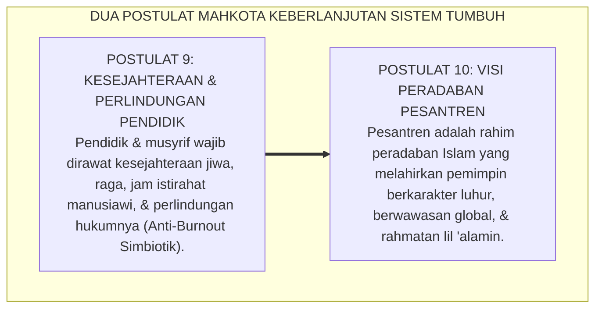
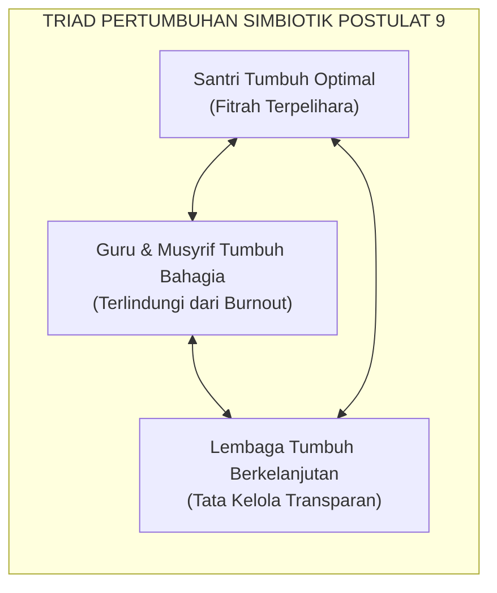
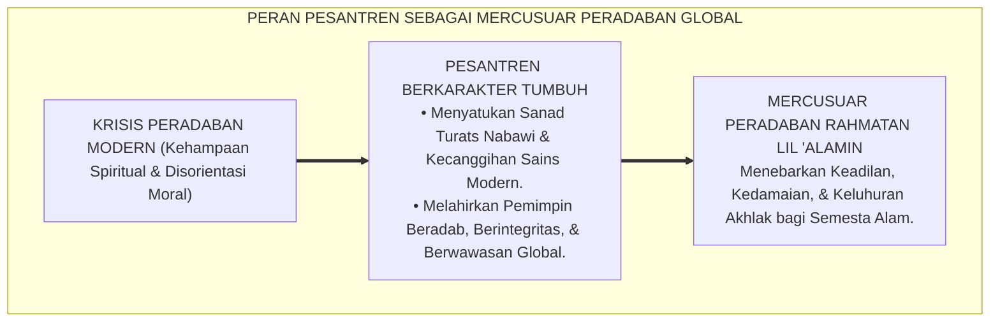

# PANDUAN OPERASIONAL 5.4: POSTULAT 9 & 10: KESEJAHTERAAN PENDIDIK & VISI GLOBAL

---

### 🧭 PETA POSISI PANDUAN DALAM SISTEM TUMBUH (DARI HULU KE HILIR)
* **Posisi Arsitektur**: `HULU EKOSISTEM (Akar Filosofis, Fitrah al-Munazzalah, & Worldview Islam)`
* **Peruntukan Pengguna**: Pimpinan Pesantren, Pengasuh Pondok, Kepala Madrasah, & Dewan Asatidz
* **Fokus Panduan**: Membangun cara pandang pengasuhan berbasis fitrah kesucian dan keteladanan nyata (Qudwah Hasanah), mengeliminasi tradisi kekerasan fisik dan feodalisme asrama.
* **Hasil Akhir yang Dituju**: Terwujudnya santri berkarakter *Insan Adabi* yang mandiri, musyrif yang mengasuh dengan kasih sayang tanpa *burnout*, dan pesantren yang aman berbasis data (*Safe Boarding School*).

---

### 🎯 Mengapa Panduan Ini Ada & Masalah Nyata yang Dipecahkan
1. **Latar Masalah di Lapangan**: Sering kali pengasuhan di pesantren berjalan tanpa SOP yang jelas atau terjebak dalam pola reaktif—menunggu santri berbuat salah baru dihukum dengan emosional.
2. **Solusi Sistem TUMBUH**: Panduan ini memberikan langkah preventif dan terstruktur agar setiap pembiasaan adab berjalan terencana, konsisten, dan terukur.
3. **Sasaran Perubahan**: Memastikan nilai-nilai Islam menyatu dalam perilaku harian santri melalui keteladanan nyata (*Qudwah Hasanah*).

---

---

### 🎯 Tujuan & Manfaat Panduan
Panduan ini dirancang sebagai petunjuk operasional terapan agar pendidik dan musyrif dapat:
1. Menjalankan pembinaan adab santri dengan pendekatan kasih sayang (*Rahmah*) dan ketegasan yang mendidik (*Firm & Kind*).
2. Menghindari cara-cara kekerasan fisik, bentakan verbal, maupun hukuman yang mempermalukan santri.
3. Menciptakan suasana asrama dan kelas yang aman, tertib, dan menumbuhkan kesadaran diri (*Bi'ah Shalihah*).

---

### 💡 Intisari Cepat (3 Menit Memahami Esensi)
* **Kunci Pengasuhan**: Karakter santri tumbuh melalui keteladanan nyata (*Qudwah Hasanah*), komunikasi empatik, dan pembiasaan terstruktur 24 jam.
* **Tindakan Utama**: Terapkan panduan langkah demi langkah di bawah ini secara konsisten, pantau perkembangan santri secara objektif, dan berikan apresiasi atas setiap perbaikan diri yang mereka capai.
* **Prinsip Disiplin**: Fokus pada pemulihan hubungan dan tanggung jawab nyata (*Restoratif*), bukan sekadar melampiaskan amarah atau menghukum.

---

### 📖 Uraian Panduan & Langkah Aksi Lapangan

---

### Merawat Sang Perawat dan Menatap Masa Depan Dunia

Sepuluh bangunan filosofis Ekosistem TUMBUH disempurnakan oleh dua pilar pamungkas yang menjadi mahkota penentu keberlanjutan masa depan peradaban:

* *Bagaimana kita merawat, melindungi, dan menyejahterakan para pembina dan musyrif di garis depan agar tidak layu terbakar kelelahan (*burnout*) di tengah tugas suci mengasuh santri 24 jam?*
* *Dan bagaimana visi besar peradaban pesantren untuk menjawab tantangan krisis moral dan kemanusiaan global di abad ke-21?*

Ekosistem **TUMBUH** menjawab kedua pertanyaan pamungkas ini melalui **Postulat 9 dan Postulat 10**:

<b>Gambar 5.4.1:</b> Postulat 9 (Kesejahteraan Pendidik) dan Postulat 10 (Visi Peradaban Global) Sistem TUMBUH.

---

### Postulat 9: Kesejahteraan Pendidik — Pendidik yang Lelah Tidak Bisa Menyayangi

Dalam ekosistem pendidikan tradisional, pengorbanan musyrif kerap kali diromantisasi secara keliru: musyrif yang tidak pernah tidur, tidak pernah libur, dan menerima upah sangat minim dipuji sebagai *"pembina yang paling ikhlas"*.

Sistem TUMBUH mendekonstruksi mitos berbahaya ini: **keikhlasan sejati tidak pernah menuntut pengabaian terhadap hak-hak biologis dan martabat kemanusiaan pembina!**

<b>Gambar 5.4.2:</b> Triad Pertumbuhan Simbiotik: Hubungan Timbal Balik Kesejahteraan Guru dan Santri.

1. **Prinsip Kesejahteraan Fisik & Mental Pembina**:  
   Rasulullah SAW bersabda: *"Sesungguhnya tubuhmu memiliki hak atasmu, dan jiwamu memiliki hak atasmu"* (HR. Al-Bukhari). Musyrif dijamin memiliki jadwal istirahat yang cukup (minimal 6 jam per hari) dan hak libur mingguan (1x24 jam) untuk meregenerasi energinya bersama keluarga.
2. **Perlindungan Hukum & Profesionalitas Lembaga**:  
   Lembaga pesantren memberikan perlindungan hukum yang jelas, SOP kerja baku, dan pelatihan kompetensi pengasuhan bersertifikat, membebaskan pembina dari rasa cemas dan ketidakpastian.
3. **Nafkah Bermartabat**:  
   Musyrif diposisikan sebagai profesi mulia pembangun peradaban yang berhak menerima penghargaan finansial yang adil dan manusiawi, menghindarkan mereka dari beban pikiran nafkah yang mengganggu konsentrasi mengasuh.

---

### Postulat 10: Visi Global — Pesantren sebagai Episentrum Moral Dunia

Sistem TUMBUH menatap masa depan dunia dengan penuh optimisme dan rasa percaya diri peradaban (*Izzah Islamiyyah*):

Dunia modern saat ini sedang dilanda **Krisis Kemanusiaan dan Kehampaan Spiritual Akut**:
* Lonjakan kasus depresi dan bunuh diri di kalangan remaja perkotaan.
* Runtuhnya nilai-nilai keluarga dan ikatan sosial.
* Kemajuan teknologi kecerdasan buatan (*AI*) yang tidak diimbangi oleh kompas moral dan etika ketuhanan.

<b>Gambar 5.4.3:</b> Peran Strategis Ekosistem Pesantren Berbasis TUMBUH sebagai Episentrum Moral Peradaban Dunia.

Dalam konteks inilah, **pesantren berkarakter TUMBUH hadir sebagai jawaban alternatif peradaban**:
* Pesantren bukan sekadar lembaga keagamaan lokal, melainkan **laboratorium peradaban Islam mini** yang mempraktikkan bagaimana sains, adab, teknologi, dan kasih sayang ketuhanan bersatu dalam harmoni kehidupan 24 jam.
* Santri lulusan TUMBUH dididik untuk menguasai bahasa internasional, teknologi mutakhir, dan nalar kritis ilmiah, sembari tetap memegang teguh sanad akhlak nabawi sebagai duta penebar berkah bagi semesta alam (*Rahmatan lil 'Alamin*).

Dengan menyatukan perlindungan kesejahteraan pendidik di garis depan dan visi peradaban yang melintasi batas zaman, Sistem TUMBUH memastikan bahwa pesantren akan terus berdiri kokoh sebagai mercusuar moral yang menyinari kegelapan dunia hingga akhir masa.

---

## 📌 Catatan Kaki & Rujukan Primer

[^1]: **Christina Maslach & Michael P. Leiter**, *The Truth About Burnout: How Organizations Cause Personal Stress and What to Do About It* (San Francisco: Jossey-Bass, 1997), hlm. 20–58.
[^2]: **Prof. Dr. Syed Muhammad Naquib al-Attas**, *Islam and Secularism* (Kuala Lumpur: ABIM, 1978; ISTAC, 1993), Bab 4, hlm. 120–155.
