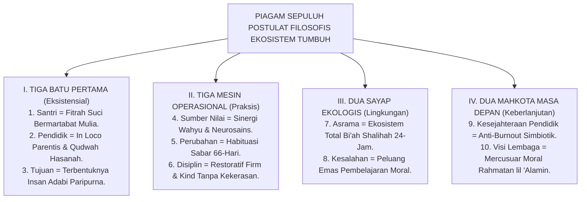

# SUB-BAB 5.5: MANIFESTO FILOSOFIS TUMBUH BAGI PESANTREN
## *Piagam Deklarasi Sepuluh Postulat Fondasional bagi Kebangkitan Ekosistem Pendidikan Karakter Pesantren Abad ke-21*

**Kode Klasifikasi**: `BOOK-01/BAB-05/SUB-05/MONOGRAF-MASTER-VIBRANT`  
**Disiplin Ilmu**: Filsafat Peradaban Islam, Kebijakan Strategis Pendidikan, & Teori Transformasi Organisasi  
**Penanggung Jawab Keilmuan**: Dewan Pakar Ekosistem TUMBUH (*Master Author, Pakar Filosofi TUMBUH, & Pakar Epistemologi Turats*)

---

### I. Pembukaan: Piagam Pembaruan Peradaban Pesantren

Bismillahir Rahmanir Rahim.

Dengan memohon taufiq, hidayah, dan ridha Allah SWT, Dewan Keilmuan dan Praktisi Pendidikan Pesantren mendeklarasikan **Piagam Sepuluh Postulat Filosofis Fondasional Ekosistem TUMBUH**:

<b>Gambar 5.5.1:</b> Peta Arsitektur Utuh Piagam Sepuluh Postulat Filosofis Ekosistem TUMBUH.

---

### II. Piagam Sepuluh Postulat Filosofis TUMBUH

Kami meyakini dan menegakkan dengan sepenuh hati:

1. **Kesucian Fitrah Santri**: Bahwa setiap santri adalah amanah suci Allah yang lahir membawa fitrah tauhid dan martabat kemanusiaan yang haram dinistakan oleh siapa pun.
2. **Keluhuran Amanah Musyrif**: Bahwa pendidik dan musyrif adalah pemegang mandat orang tua (*In Loco Parentis*) yang memimpin melalui keteladanan akhlak (*Qudwah*), bukan dengan teror rasa takut.
3. **Kemuliaan Insan Adabi**: Bahwa muara seluruh pendidikan adalah melahirkan pribadi yang berilmu luas, berhati bersih, dan mendedikasikan hidupnya untuk kemaslahatan umat.
4. **Kesatuan Wahyu dan Sains**: Bahwa ayat *Qawliyyah* dan ayat *Kauniyyah* adalah dua lentera kebenaran yang saling menyempurnakan dalam membina karakter anak.
5. **Kesabaran Neuroplastisitas 66-Hari**: Bahwa watak adab mendarah daging melalui proses pembiasaan sabar selama 66 hari, bukan lewat paksaan instan.
6. **Disiplin Restoratif Tanpa Kekerasan**: Bahwa segala bentuk hukuman fisik dan kekerasan verbal dihapus mutlak dan digantikan dengan konsekuensi logis 4R yang adil.
7. **Kehangatan Bi'ah Shalihah 24-Jam**: Bahwa asrama pesantren adalah rumah kedua yang bersih, terang, aman, dan memancarkan kasih sayang nabawi.
8. **Restorasi Kesalahan**: Bahwa kekhilafan santri adalah pintu masuk pembinaan moral melalui taubat, muhasabah batin, dan rekonsiliasi (*Ishlah al-Bain*).
9. **Perlindungan Kesejahteraan Pendidik**: Bahwa para pembina di garis depan wajib dirawat kesejahteraan jiwa, raga, dan waktu istirahatnya agar terbebas dari *burnout*.
10. **Visi Rahmatan lil 'Alamin**: Bahwa pesantren adalah rahim peradaban Islam yang memancarkan pelita keadilan dan kedamaian bagi seluruh semesta alam.

---

### Sintesis Pamungkas Bab 05

Sepuluh postulat ini bukanlah deretan teori yang membeku di atas kertas, melainkan **kompas jiwa dan cetak biru peradaban** yang menuntun seluruh transformasi nyata di bumi pesantren.

Dengan memegang teguh piagam ini, Ekosistem TUMBUH melangkah mantap menyongsong masa depan, membimbing generasi santri menggapai puncak kemuliaan dunia dan akhirat.

---

## 📌 Catatan Kaki & Rujukan Primer

[^1]: **Dewan Pakar Ekosistem TUMBUH**, *Deklarasi Filosofis Pembaruan Pendidikan Pesantren* (Bandung & Jombang: Konsorsium Riset TUMBUH, 2026).
