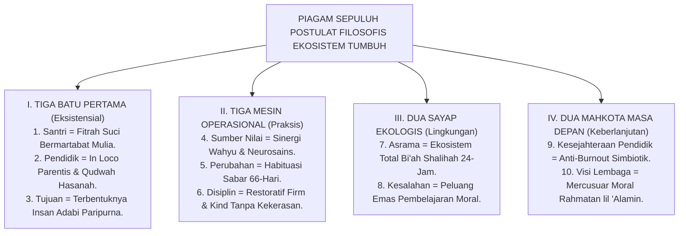

# SUB-BAB 5.5: MANIFESTO FILOSOFIS TUMBUH BAGI PESANTREN
## *Piagam Deklarasi Sepuluh Postulat Fondasional bagi Kebangkitan Ekosistem Pendidikan Karakter Pesantren Abad ke-21*

**Kode Klasifikasi**: `BOOK-01/BAB-05/SUB-05/MONOGRAF-MASTER-VIBRANT`  
**Disiplin Ilmu**: Filsafat Peradaban Islam, Kebijakan Strategis Pendidikan, & Teori Transformasi Organisasi  
**Penanggung Jawab Keilmuan**: Dewan Pakar Ekosistem TUMBUH (*Master Author, Pakar Filosofi TUMBUH, & Pakar Epistemologi Turats*)

---

### Pembukaan: Piagam Pembaruan Peradaban Pesantren

Bismillahir Rahmanir Rahim.

Dengan memohon petunjuk, taufiq, dan ridha Allah SWT, Dewan Keilmuan bersama para Pengasuh, Kiai, Asatidz, Musyrif, dan Praktisi Pendidikan Pesantren di seluruh Nusantara memproklamasikan **Piagam Sepuluh Postulat Filosofis Fondasional Ekosistem TUMBUH**[^1] sebagai landasan peradaban baru:

Sebuah piagam komitmen peradaban yang menegaskan tekad suci untuk merekonstruksi, memuliakan, dan menghidupkan kembali ruh tarbiyah nabawiyyah di bumi pesantren abad ke-21:

<b>Gambar 5.5.1:</b> Peta Arsitektur Utuh Piagam Sepuluh Postulat Filosofis Ekosistem TUMBUH.

---

### Piagam Sepuluh Postulat Filosofis TUMBUH

Kami meyakini, berikrar, dan menegakkan dengan sepenuh hati di seluruh bilik madrasah dan asrama kami:

1. **Kesucian Fitrah Santri (*Fitrah al-Munazzalah*)**:  
   Bahwa setiap santri adalah hamba Allah yang mulia, lahir membawa kesucian tauhid dan martabat kemanusiaan (*Karamah Insaniyyah*) yang haram dinistakan, dipukul, atau direndahkan oleh siapa pun.
2. **Keluhuran Amanah Pendidik (*In Loco Parentis & Qudwah*)**:  
   Bahwa pendidik dan musyrif adalah pemegang mandat suci orang tua yang memimpin melalui keteladanan akhlak nyata sebelum berkata-kata, menghadirkan rasa aman batin, dan menjauhi teror kekuasaan.
3. **Kemuliaan Insan Adabi Paripurna (*Insan Kamil*)**:  
   Bahwa muara akhir seluruh pendidikan adalah membentuk pribadi yang seimbang spiritualnya, tajam nalar intelektualnya, santun perilakunya, dan mendedikasikan ilmunya untuk kemaslahatan umat (*Nafi'un Lighairihi*).
4. **Kesatuan Wahyu dan Sains (*Epistemologi Integratif*)**:  
   Bahwa ayat *Qawliyyah* (Wahyu Turats) dan ayat *Kauniyyah* (Hukum Alam & Neurosains) adalah dua lentera kebenaran yang saling menyempurnakan dalam membina karakter anak secara presisi dan penuh berkah.
5. **Kesabaran Habituasi 66-Hari (*Sunnatullah al-Tadarruj*)**:  
   Bahwa karakter adab mendarah daging melalui proses pembiasaan sabar selama 66 hari berturut-turut di *Basal Ganglia*, bukan lewat paksaan instan atau bentakan kasar.
6. **Disiplin Restoratif Tanpa Kekerasan (*Firm & Kind*)**:  
   Bahwa segala bentuk hukuman fisik dan kekerasan verbal dihapus mutlak 100% dan digantikan dengan Konsekuensi Logis Restoratif 4R yang adil, proporsional, dan mendidik.
7. **Kehangatan Bi'ah Shalihah 24-Jam (*Total Ecological Immersion*)**:  
   Bahwa asrama pesantren adalah rumah kedua (*Baituna Jannatuna*) yang bersih, terang, higienis, aman dari perundungan, dan dipenuhi lantunan dzikir serta kasih sayang.
8. **Restorasi Kesalahan (*Learning Opportunity & Ishlah*)**:  
   Bahwa kekhilafan santri adalah pintu masuk pembinaan moral melalui taubat, tanggung jawab ganti rugi nyata (*Dhaman*), dan pemulihan persaudaraan tanpa stigma sosial (*Ishlah al-Bain*).
9. **Perlindungan & Kesejahteraan Pendidik (*Anti-Burnout Triad*)**:  
   Bahwa para musyrif dan pembina di garis depan wajib dirawat kesejahteraan jiwa, raga, jam istirahat manusiawi, dan kehormatan hidupnya agar terbebas dari *burnout*.
10. **Visi Rahmatan lil 'Alamin**:  
   Bahwa pesantren adalah kawah candradimuka peradaban Islam yang memancarkan pelita keadilan, kedamaian, dan keluhuran budi pekerti bagi seluruh semesta alam.

---

### Ikrar Komitmen Bersama Transformasi Lembaga

Sepuluh postulat ini bukanlah sekadar tulisan yang membeku di atas lembaran kertas, melainkan **janji suci di hadapan Allah SWT** yang mengikat setiap kebijakan, setiap kata yang terucap di ruang kelas, dan setiap sentuhan pengasuhan di bilik asrama.

Dengan memegang teguh piagam ini, Ekosistem TUMBUH melangkah mantap menyongsong masa depan peradaban, mengembalikan kemuliaan pesantren sebagai rumah suci penumbuh akhlak nabawi yang dicintai umat dan diridhai Allah SWT.

---

## 📌 Catatan Kaki & Rujukan Primer

[^1]: **Dewan Pakar Ekosistem TUMBUH**, *Deklarasi Filosofis Pembaruan Pendidikan Pesantren Abad ke-21* (Bandung & Jombang: Konsorsium Riset TUMBUH, 2026).
