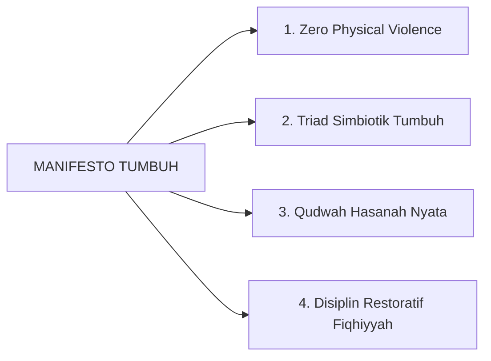

# SUB-BAB 5.5: MANIFESTO FILOSOFIS TUMBUH BAGI PESANTREN
## *Deklarasi Bersama Transformasi Budaya Pesantren Nusantara Berbasis Keberkahan dan Keunggulan Ilmiah*

**Kode Modul**: `BOOK-01/BAB-05/SUB-05`  
**Kategori**: Sintesis Filosofis Bab 5  
**Fokus Keilmuan**: Kebijakan Transformasi Pesantren

---

### 1. Naskah Deklarasi Manifesto Filosofis TUMBUH
Kami meyakini dengan penuh kesadaran dan keimanan bahwa:
1. Setiap santri adalah amanah agung dari Allah SWT yang berhak mendapatkan perlindungan fisik, kemuliaan martabat, dan pendidikan adab tanpa kekerasan.
2. Tradisi pesantren adalah khazanah emas peradaban yang harus dijaga keberkahannya dengan mengikis feodalisme dan mengintegrasikannya dengan sains modern.
3. Kualitas pendidikan karakter pesantren tidak diukur dari seberapa keras hukuman yang dijatuhkan, melainkan dari seberapa kokoh internalisasi adab dan kemandirian santri yang terbentuk.

