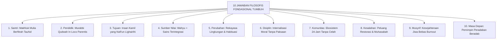

# BAB 5: SEPULUH JAWABAN FILOSOFIS FONDASIONAL EKOSISTEM TUMBUH
## *Manifesto Paradigma Baru: Hakikat Insan, Otoritas Moral, Kehendak Bebas, Rekayasa Bi'ah Shalihah, dan Masa Depan Peradaban*

**Nomor Identifikasi**: `BOOK-01/BAB-05/10-JAWABAN-FILOSOFIS/2026`  
**Volume**: Buku 01 — *Akar Filosofis & Epistemologi Pendidikan Karakter Pesantren*  
**Dewan Pakar**: `pakar-filosofi-tumbuh`, `pakar-epistemologi-turats`, `pakar-tata-kelola-qudwah`

---

## 📑 DAFTAR ISI SUB-BAB 5

1. [5.1 Urgensi Landasan Filosofis Utuh bagi Pendidikan Pesantren](#51-urgensi-landasan-filosofis-utuh-bagi-pendidikan-pesantren)
2. [5.2 Deklarasi Sepuluh Jawaban Filosofis Fondasional](#52-deklarasi-sepuluh-jawaban-filosofis-fondasional)
   - [Jawaban 1: Hakikat Insan Pembelajar (Santri)](#jawaban-1-hakikat-insan-pembelajar-santri)
   - [Jawaban 2: Hakikat Pendidik dan Peran In Loco Parentis](#jawaban-2-hakikat-pendidik-dan-peran-in-loco-parentis)
   - [Jawaban 3: Tujuan Tertinggi Pendidikan Pesantren](#jawaban-3-tujuan-tertinggi-pendidikan-pesantren)
   - [Jawaban 4: Sumber Kebenaran dan Otoritas Moral](#jawaban-4-sumber-kebenaran-dan-otoritas-moral)
   - [Jawaban 5: Dinamika Perubahan Perilaku dan Adab](#jawaban-5-dinamika-perubahan-perilaku-dan-adab)
   - [Jawaban 6: Hakikat Disiplin dan Regulasi Diri](#jawaban-6-hakikat-disiplin-dan-regulasi-diri)
   - [Jawaban 7: Peran Komunitas Pesantren sebagai Total Ecosystem](#jawaban-7-peran-komunitas-pesantren-sebagai-total-ecosystem)
   - [Jawaban 8: Posisi Kesalahan sebagai Peluang Belajar (Learning Opportunity)](#jawaban-8-posisi-kesalahan-sebagai-peluang-belajar-learning-opportunity)
   - [Jawaban 9: Kesejahteraan dan Ketahanan Jiwa Pendidik (Anti-Burnout)](#jawaban-9-kesejahteraan-dan-ketahanan-jiwa-pendidik-anti-burnout)
   - [Jawaban 10: Orientasi Masa Depan dan Relevansi Peradaban Global](#jawaban-10-orientasi-masa-depan-dan-relevansi-peradaban-global)
3. [5.3 Sintesis Filosofis: Dari Teori Menuju Budaya Hidup Pesantren](#53-sintesis-filosofis-dari-teori-menuju-budaya-hidup-pesantren)

---

## 5.1 Urgensi Landasan Filosofis Utuh bagi Pendidikan Pesantren

Pendidikan tanpa arah filosofis yang jelas akan mudah terombang-ambing oleh tren sesaat atau terjebak dalam romantisme masa lalu tanpa kontekstualisasi. Sepuluh Jawaban Filosofis TUMBUH dirumuskan untuk menjawab pertanyaan eksistensial paling mendasar: *Mengapa pesantren mendidik? Siapa yang dididik? Bagaimana cara mendidik yang diridhai Allah dan sesuai dengan hukum penciptaan manusia?*

---

## 5.2 Deklarasi Sepuluh Jawaban Filosofis Fondasional

### Jawaban 1: Hakikat Insan Pembelajar (Santri)
Santri adalah hamba Allah yang memiliki fitrah kesucian primordial (*hanif*). Santri bukan objek mekanik yang harus dibentuk secara paksa, melainkan subjek hidup yang memiliki akal budi, emosi, dan potensi kebaikan intrinsik yang harus ditumbuhkembangkan dengan penuh kasih sayang.

### Jawaban 2: Hakikat Pendidik dan Peran In Loco Parentis
Pendidik (Kiai, Asatidz, Musyrif, Walas) adalah pemegang amanah pengasuhan pengganti orang tua (*in loco parentis*). Pendidik memimpin melalui keteladanan akhlak nyata (*Qudwah Hasanah*) dengan pendekatan **Firm & Kind** (teguh dalam memegang standar adab, namun penuh kehangatan dalam interaksi relasional).

### Jawaban 3: Tujuan Tertinggi Pendidikan Pesantren
Melahirkan **Insan Kamil**: generasi berkarakter adab luhur yang mandiri, teguh aqidahnya, fasih ilmunya, sehat jasmaninya, dan memberikan manfaat seluas-luasnya bagi kemaslahatan ummat manusia (*Nafi'un Lighairihi*).

### Jawaban 4: Sumber Kebenaran dan Otoritas Moral
Al-Qur'an dan As-Sunnah sebagai sumber nilai transendental mutlak, diperkaya dengan warisan khazanah *Turats* ulama salafush shalih, serta dipadukan secara harmonis dengan konsensus sains perkembangan dan psikologi modern yang sahih.

### Jawaban 5: Dinamika Perubahan Perilaku dan Adab
Perubahan perilaku sejati lahir dari kombinasi: pemahaman kognitif yang bermakna, latihan berulang selama 66 hari hingga membentuk otomatisasi saraf (*habit loop*), dan berada di dalam lingkungan sosial yang aman dan saling menguatkan (*Bi'ah Shalihah*).

### Jawaban 6: Hakikat Disiplin dan Regulasi Diri
Disiplin bukanlah ketakutan akan ancaman sanksi eksternal, melainkan kemampuan santri untuk mengendalikan hawa nafsu dan mengatur diri sendiri secara otonom (*internalized self-discipline*) didorong oleh kesadaran *muraqabatullah* (merasa diawasi oleh Allah SWT).

### Jawaban 7: Peran Komunitas Pesantren sebagai Total Ecosystem
Seluruh elemen warga pesantren (pimpinan, dewan guru, musyrif, wali kelas, staf kebersihan, koki dapur, petugas keamanan, dan sesama santri) adalah satu kesatuan ekosistem pembelajaran (*Total Community Engagement*). Tidak ada sudut pondok yang netral dari pendidikan adab.

### Jawaban 8: Posisi Kesalahan sebagai Peluang Belajar (Learning Opportunity)
Kesalahan dan pelanggaran disiplin dipandang sebagai proses alami dalam tumbuh kembang moral santri. Penanganannya tidak menggunakan penghakiman atau balas dendam, melainkan melalui **Disiplin Restoratif**: menyadarkan dampak perbuatan, menumbuhkan muhasabah, dan melakukan tindakan pemulihan hak (*Restitution & Ishlah al-Bain*).

### Jawaban 9: Kesejahteraan dan Ketahanan Jiwa Pendidik (Anti-Burnout)
Kualitas pengasuhan santri berbanding lurus dengan kesehatan mental, fisik, dan ruhiyah para pendidik. Lembaga wajib menjamin jam istirahat yang layak, sistem shift yang berkeadilan, supervisi klinis, dan iklim kerja yang saling memuliakan agar pendidik terhindar dari *burnout*.

### Jawaban 10: Orientasi Masa Depan dan Relevansi Peradaban Global
Santri dididik bukan untuk terasing dari realitas zaman, melainkan disiapkan menjadi pionir peradaban global yang memiliki kemandirian hidup, integritas etika di dunia digital, serta daya saing intelektual dan vokasional tingkat dunia.

---

## 5.3 Sintesis Filosofis: Dari Teori Menuju Budaya Hidup Pesantren

Sepuluh jawaban filosofis ini menjadi kompas bagi seluruh penyusunan kurikulum, instrumen asesmen, pedoman PBIS, dan SOP pengasuhan di volume-volume berikutnya.
