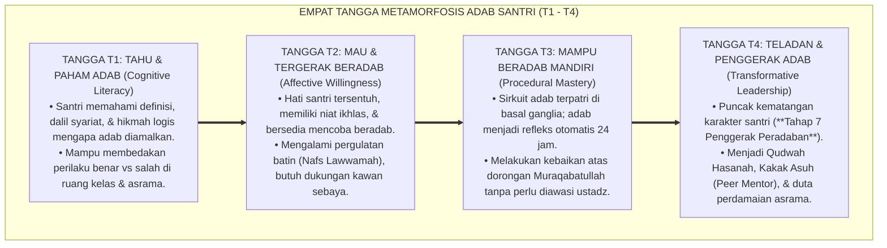
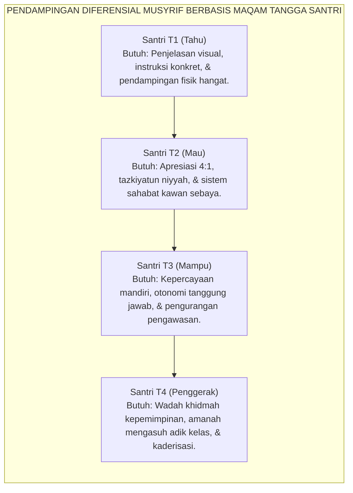

# SANTRI BERTUMBUH: TANGGA KAPASITAS T1 S.D. T4

---
### Karakter adalah Perjalanan Menapaki Anak Tangga

Sering kali kita menjumpai sebuah ekspektasi yang tidak realistis di kalangan pendidik pesantren:

Seorang santri baru yang baru saja dua pekan menginjakkan kaki di pondok sudah dituntut untuk memiliki ketenangan batin, kemandirian bangun malam, dan kehalusan budi pekerti setara dengan santri senior yang telah dibina selama lima tahun. Tatkala santri baru tersebut lupa menata sandalnya, terlambat bangun subuh, atau menangis rindu orang tuanya, sebagian pembina langsung memberikan vonis keras: *"Anak ini memang pemalas!", "Tidak punya adab!", "Sulit diatur!"*

Sikap terburu-buru menuntut kesempurnaan instan ini bertentangan dengan hukum alam (*Sunnatullah al-Tadarruj*) dan sains perkembangan kognitif anak.

Pembentukan karakter manusia bukanlah peristiwa sulap yang terjadi dalam semalam. Jiwa manusia bertumbuh layaknya sebatang pohon: ia berawal dari benih yang berkecambah di dalam tanah, merintis tunas hijau yang rapuh, mengokohkan batang dan cabangnya melintasi badai, hingga akhirnya berbuah manis yang menaungi semesta.

Sistem **TUMBUH** merumuskan trajektori perkembangan karakter santri ke dalam **Empat Tangga Kapasitas Adab (Jenjang J1 s.d. T4)**:

<b>Gambar 6.1.1:</b> Empat Tangga Metamorfosis Kapasitas Adab Santri (T1 s.d. T4) Ekosistem TUMBUH.

---

### Bedah Komprehensif Karakteristik & Kebutuhan Santri di Setiap Tangga

Mari kita telusuri anatomi psikologis, indikator perilaku nyata di asrama, serta strategi pendampingan yang tepat untuk masing-masing anak tangga:

<b>Gambar 6.1.2:</b> Alur Pendampingan Diferensial Musyrif Berdasarkan Maqam Tangga Santri.

#### 1. Jenjang J1: Tahu & Paham Adab (*Cognitive Literacy & Conceptual Awareness*)
* **Kondisi Psiko-Spiritual**: Santri baru berada pada level penguasaan konsep kognitif di memori kerja (*working memory*). Ia telah menghafal hadits kebersihan (*An-Nazhafatu minal Iman*) dan mengetahui larangan ghashab, namun keterampilan motorik dan kebiasaan fisiknya belum terlatih secara otomatis.
* **Gejala di Asrama**: Santri sering lupa menaruh gayung mandi di tempatnya, menaruh sepatu tidak pada rak yang ditentukan, atau terlambat bersiap saat bel berbunyi. Kesalahan ini terjadi bukan karena niat jahat, melainkan karena jalur saraf di otaknya masih berupa "jalur setapak baru".
* **Strategi Musyrif**: 
  - Memberikan penanda visual yang jelas (*Visual Cues*) di rak sepatu dan kamar mandi.
  - Memperagakan cara merapikan lemari secara langsung di hadapan santri (*Guided Modeling*).
  - Melarang keras bentakan; menggunakan teguran lembut dan instruksi yang terarah (*"Akhi, ingat posisi sandal menghadap keluar ya"*).

#### 2. Jenjang J2: Mau & Tergerak Beradab (*Affective Willingness & Niyyah Awakening*)
* **Kondisi Psiko-Spiritual**: Kalbu santri mulai tergerak oleh keikhlasan niat (*Tazkiyatun Niyyah*). Santri mulai merasakan rasa malu kepada Allah ketika berbuat salah (*Nafs Lawwamah*), namun ketahanan mentalnya masih rapuh terhadap godaan kawan sekamar atau rasa lelah fisik.
* **Gejala di Asrama**: Santri bersemangat shalat berjamaah, namun jika diajak temannya untuk mengobrol saat jam malam, ia kadang masih ikut larut. Begitu ditegur, ia langsung merasa bersalah dan menyesal.
* **Strategi Musyrif**:
  - Menerapkan **Rasio Apresiasi Positif 4:1**: memberikan 4 pengakuan atas kebaikan santri untuk setiap 1 koreksi kesalahan.
  - Menghubungkan santri dengan **Sistem Sahabat Kawan Sebaya (*Peer Buddy System*)** agar saling menyemangati dalam ibadah.
  - Membimbing muhasabah batin secara personal tanpa mempermalukan anak di depan kawan-kawannya.

#### 3. Jenjang J3: Mampu Beradab Mandiri (*Procedural Mastery & Internalized Habit*)
* **Kondisi Psiko-Spiritual**: Proses mielinisasi sirkuit adab di *Basal Ganglia* telah selesai (telah melintasi siklus habituasi 66 hari). Adab telah mendarah daging menjadi gerak refleks otomatis yang dilakukan dengan ringan dan penuh kenikmatan (*Thab'an wa 'Aadah*).
* **Gejala di Asrama**: Santri secara spontan bangun sebelum subuh, menata loker pakaian dengan rapi, antre wudhu dengan sabar, dan menjaga lisannya dari kata-kata kotor—bahkan ketika musyrif sedang tidak berada di asrama.
* **Strategi Musyrif**:
  - Memberikan otonomi dan kepercayaan penuh kepada santri (*fading support*).
  - Melibatkan santri dalam tugas-tugas pengelolaan kebersihan kamar secara mandiri.
  - Menanamkan kedalaman penghayatan *Muraqabatullah* (merasa selalu diawasi oleh Allah SWT).

#### 4. Jenjang J4: Teladan & Penggerak Adab (*Transformative Leadership & Qudwah Hasanah*)
* **Kondisi Psiko-Spiritual**: Puncak tertinggi kematangan karakter santri (**Tahap 7 Penggerak Peradaban**). Santri tidak hanya saleh untuk dirinya sendiri (*Shalih linafsihi*), melainkan telah menjadi agen perbaikan bagi lingkungannya (*Mushlih lighairihi*).
* **Gejala di Asrama**: Santri secara sukarela mendampingi adik kelas yang sedang menangis rindu rumah (*homesick*), mengajari adik kelas cara mencuci pakaian dengan benar, melerai perselisihan kawan dengan santun, dan menjadi teladan hidup di shaf pertama masjid.
* **Strategi Musyrif**:
  - Mengangkat santri sebagai **Kakak Asuh (*Peer Mentor*)** dan **Duta Restoratif Asrama**.
  - Memberikan pelatihan kepemimpinan pelayan (*Servant Leadership Training*).
  - Melibatkan santri dalam merumuskan ide-ide kreatif kegiatan sosial dan kemakmuran masjid pondok.

---

### Matriks Pemantauan Perkembangan Karakter Santri dalam sistem TUMBUH

Ekosistem TUMBUH menyediakan instrumen rubrik observasi perilaku harian[^2] (*Daily PBIS Behavior Rubric*) yang memetakan posisi tangga setiap santri secara objektif:

| Dimensi Karakter | Jenjang J1 (Tahu) | Jenjang J2 (Mau) | Jenjang J3 (Mampu Mandiri) | Jenjang J4 (Teladan Penggerak) |
| :--- | :--- | :--- | :--- | :--- |
| **Ibadah Shalat** | Tahu rukun shalat, butuh dipanggil berulang kali untuk ke masjid. | Bergegas ke masjid saat mendengar adzan, kadang masih terdistraksi. | Hadir di masjid sebelum adzan selesai berkumandang secara mandiri. | Mengajak dan membangunkan adik kelas shalat dengan penuh kelembutan. |
| **Kebersihan Diri & Kamar** | Mengetahui aturan loker, namun baju masih sering berantakan. | Berusaha merapikan loker, namun sesekali masih butuh diingatkan. | Loker dan tempat tidur selalu rapi, pakaian kotor tertata di keranjang. | Menjadi pelopor kerja bakti kamar dan membantu merapikan area bersama. |
| **Pergaulan Ukhuwah** | Mengetahui larangan mengejek, kadang masih keceplosan mencela. | Menahan diri dari mencela kawan, segera meminta maaf jika khilaf. | Tutur kata selalu santun, menghormati hak milik kawan (anti-ghashab). | Aktif merangkul kawan yang terisolasi dan memediasi konflik damai. |

Dengan memandu santri mendaki tangga T1 s.d. T4 ini secara sabar dan terukur, Sistem TUMBUH memastikan bahwa setiap santri mengalami metamorfosis karakter yang sejati: bertransformasi dari anak baru yang canggung menjadi kesatria teladan yang siap menjadi mercusuar kebaikan di tengah umat.

---

## 📌 Catatan Kaki & Rujukan Primer

[^1]: **Benjamin S. Bloom (Ed.)**, *Taxonomy of Educational Objectives: The Classification of Educational Goals* (New York: David McKay Company, 1956).
[^2]: **Al-Imam ar-Raghib al-Isfahani**, *Adz-Dzari'ah ila Makarim asy-Syari'ah*, Tahqiq: Dr. Abu al-Yazid Abu Zaid al-'Ajami (Kairo: Dar as-Salam, 2007), hlm. 85–112.

---

### IV. Eksplanasi Filosofis Lanjutan & Hermeneutika Nilai Santri Bertumbuh: Tangga Kapasitas T1 S.D. T4

Penyelidikan mendalam terhadap tema **SANTRI BERTUMBUH: TANGGA KAPASITAS T1 S.D. T4** menuntut pemahaman integral atas relasi antara *Ontologi Fitrah* dan *Sosiologi Pembelajaran Pesantren*. Ketika seorang santri memasuki ekosistem pendidikan, ia membawa amanah perjanjian primordial (*Mithaq*) yang menuntut ruang tumbuh yang aman dari distorsi psikologis.

1. **Dialektika Keikhlasan (*Shidq an-Niyyah*) vs Formalisme Perilaku**:
   Dalam pandangan *Hujjatul Islam* Al-Imam Al-Ghazali dalam *Ihya 'Ulumiddin*, pembentukan karakter yang sejati bermula dari pembersihan batin (*Thaharatul Batin*). Ketika sebuah institusi mereduksi adab menjadi kepatuhan semu di hadapan figur otoritas, yang sesungguhnya terjadi adalah pelemahan integritas diri (*Nifaq Tarbawi*). Sistem TUMBUH menegaskan bahwa kesalehan sejati harus lahir dari kemerdekaan batin yang disinari oleh cinta kepada Allah (*Mahabbatullah*) dan kesadaran pengawasan-Nya (*Muraqabatullah*).

2. **Dinamika Neuroplastisitas & Internalisasi Nilai Ruhiyyah**:
   Sains kognitif kontemporer membuktikan bahwa pembiasaan nilai yang disertai rasa takut ekstrem mengaktifkan poros *HPA (Hypothalamic-Pituitary-Adrenal)* dan membanjiri otak dengan hormon kortisol. Kondisi ini membekukan kemampuan *Prefrontal Cortex* untuk merefleksikan nilai secara mandiri. Sebaliknya, ketika nilai **SANTRI BERTUMBUH: TANGGA KAPASITAS T1 S.D. T4** disampaikan dalam suasana pengasuhan yang hangat (*Warm Presence*), otak santri melepaskan *oksitosin* dan *dopamin* yang mempercepat konsolidasi sinaptik dan pembentukan memori jangka panjang (*Long-Term Potentiation*).

3. **Matriks Transformasi Praksis Pembinaan**:

| Dimensi Pengasuhan | Pola Lama (Mekanistis-Punitif) | Pola Rekonstruksi Ekosistem TUMBUH |
| :--- | :--- | :--- |
| **Sumber Motivasi** | Tekanan eksternal dan rasa takut akan sanksi fisik. | Kesadaran fitrah internal dan kerinduan pada rida ilahi. |
| **Relasi Musyrif-Santri** | Pengawasan hierarkis intimidatif (panoptikon). | Keteladanan hidup (*Qudwah Hasanah*) dan pendampingan empatik. |
| **Ketahanan Karakter** | Runtuh ketika pengawasan ditiadakan (liburan/lulus). | Melekat kokoh sebagai kompas moral seumur hidup (*Insan Adabi*). |

---

### V. Refleksi Pedagogis & Rekomendasi Aksi Lembaga

Penerapan prinsip **SANTRI BERTUMBUH: TANGGA KAPASITAS T1 S.D. T4** di lingkungan pesantren menuntut komitmen kelembagaan yang terstruktur:
* **Audit Budaya Pengasuhan**: Pimpinan pesantren wajib melakukan refleksi berkala atas seluruh interaksi antara asatidz, musyrif, dan santri guna memastikan tidak ada celah bagi masuknya feodalisme atau kekerasan terselubung.
* **Penguatan Kapasitas Pendidik**: Setiap pembina asrama difasilitasi dengan pelatihan literasi psikologi perkembangan dan konseling Islam agar memiliki kematangan emosi dalam menghadapi dinamika santri.
* **Integrasi Ruhiyyah 24 Jam**: Memastikan bahwa setiap detik kehidupan santri di pondok—mulai dari bangun tidur, halaqah Qur'an, mudzakarah ilmu, hingga istirahat malam—selalu dinaungi oleh nilai keikhlasan dan ukhuwah yang tulus.
