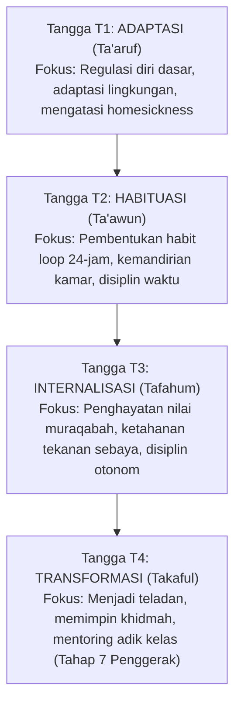

# SUB-BAB 6.1: SANTRI BERTUMBUH: MENAPAKI TANGGA T1 HINGGA T4
## *Trajektori Kemandirian Karakter: Dari Ketergantungan Adaptatif Menuju Agen Perubahan Berdaya*

**Kode Modul**: `BOOK-01/BAB-06/SUB-01`  
**Kategori**: Trajektori Santri  
**Fokus Keilmuan**: Psikologi Perkembangan Karakter & Self-Determination Theory

---

### 1. Empat Tangga Pertumbuhan Karakter Santri
Pertumbuhan karakter santri dalam ekosistem TUMBUH tidak terjadi secara acak, melainkan terstruktur dalam empat tangga capaian:

---

### 2. Kriteria Kenaikan Tangga yang Obyektif
Kenaikan tangga santri tidak diukur dari hafalan semata, melainkan dari portofolio asesmen ipsatif:
* Kestabilan kedisiplinan shalat dan kebersihan kamar selama minimal 60 hari berturut-turut.
* Kemampuan menyelesaikan konflik tanpa agresi verbal/fisik.
* Inisiatif membantu teman sekamar (*altruisme sosial*).
