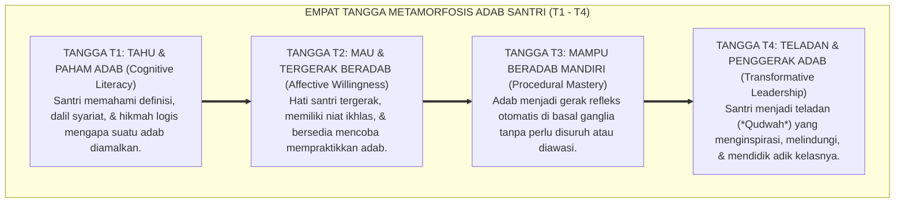

# SUB-BAB 6.1: SANTRI BERTUMBUH: TANGGA KAPASITAS T1 S.D. T4
## *Peta Jalan Empat Tangga Metamorfosis Adab Santri: Dari Mengetahui hingga Menjadi Teladan Penggerak*

**Kode Klasifikasi**: `BOOK-01/BAB-06/SUB-01/MONOGRAF-MASTER-VIBRANT`  
**Disiplin Ilmu**: Psikologi Perkembangan Karakter, Taksonomi Pendidikan Islam, & Teori Pembelajaran Berjenjang  
**Penanggung Jawab Keilmuan**: Dewan Pakar Ekosistem TUMBUH (*Master Author, Pakar Desain Kurikulum Adab, & Pakar Filosofi TUMBUH*)

---

### Karakter adalah Perjalanan Menapaki Anak Tangga

Sering kali kita menuntut hasil instan dari seorang santri: baru satu bulan masuk pondok, kita sudah mengharapkan ia bersikap sesaleh santri yang sudah belajar lima tahun. Ketika anak belum mampu, kita langsung melabelinya sebagai "santri bermasalah".

Sistem **TUMBUH** menegaskan bahwa pertumbuhan adab adalah sebuah **proses menapaki anak tangga kapasitas secara bertahap (*Graduated Capacity Ladder*)**:

<b>Gambar 6.1.1:</b> Empat Tangga Metamorfosis Pertumbuhan Karakter Santri (T1 s.d. T4) Ekosistem TUMBUH.

---

### Bedah Empat Anak Tangga Karakter Santri

Mari kita telusuri karakteristik dan kebutuhan santri di setiap anak tangga:

1. **Tangga T1: Tahu & Paham Adab (*Cognitive Literacy*)**:  
   * **Kondisi Santri**: Santri baru memahami aturan di level akal kognitif (*knowing that*). Ia tahu dalil kebersihan dan larangan ghashab, namun tangannya belum terbiasa mempraktikkannya.
   * **Kebutuhan**: Penjelasan aturan yang jelas (*visual cues*), contoh peragaan fisik langsung, dan bimbingan yang sabar tanpa bentakan.
2. **Tangga T2: Mau & Tergerak Beradab (*Affective Willingness*)**:  
   * **Kondisi Santri**: Kalbu santri mulai disentuh oleh keikhlasan niat. Ia ingin menjadi anak baik, namun sesekali masih tergoda hawa nafsu atau pengaruh kawan sekamar.
   * **Kebutuhan**: Apresiasi relasional 4:1 dari musyrif, muhasabah niat (*Tazkiyatun Niyyah*), dan pendampingan kawan sebaya (*Peer Buddy*).
3. **Tangga T3: Mampu Beradab Mandiri (*Procedural Mastery*)**:  
   * **Kondisi Santri**: Sirkuit adab telah mendarah daging di *Basal Ganglia*. Santri merapikan kamar, antre wudhu, dan bangun tahajjud secara mandiri atas kesadaran *Muraqabatullah*.
   * **Kebutuhan**: Pemberian ruang tanggung jawab otonom dan pengurangan pengawasan melekat secara bertahap.
4. **Tangga T4: Teladan & Penggerak Adab (*Transformative Leadership*)**:  
   * **Kondisi Santri**: Puncak kematangan karakter santri (**Tahap 7 Penggerak**). Santri tidak hanya saleh untuk dirinya sendiri, melainkan aktif melayani dan mengayomi adik kelasnya sebagai *Peer Mentor* dan duta perdamaian asrama.
   * **Kebutuhan**: Amanah kepemimpinan pelayan (*Servant Leadership*) dan pembinaan kepemimpinan tingkat lanjut.

---

### Sintesis Sub-Bab 6.1

Dengan memahami peta empat tangga T1–T4 ini, para pembina santri tidak akan lagi terjebak dalam penghakiman buta. Setiap santri dipandu mendaki anak tangganya masing-masing dengan penuh cinta, hingga kelak ia mencapai puncak kemuliaan sebagai insan teladan yang menebar manfaat bagi peradaban umat.

---

## 📌 Catatan Kaki & Rujukan Primer

[^1]: **Benjamin S. Bloom (Ed.)**, *Taxonomy of Educational Objectives: The Classification of Educational Goals* (New York: David McKay Company, 1956).
[^2]: **Dewan Pakar Ekosistem TUMBUH**, *Taksonomi Sepuluh Kapasitas Karakter Santri TUMBUH* (Bandung & Jombang: Konsorsium Riset TUMBUH, 2026).
